class: inverse,middle,center
```{css echo=FALSE}
.purpleb {
  font-weight: bold;
  color: #4F2683;
  font-size: 1.25em;
}

.purplebL {
  font-weight: bold;
  color: #4F2683;
  font-size: 1.5em;
}

.footnote {
  position: absolute;
  bottom: 60px;
  padding-right: 4em;
  font-size: .75em;
}

.large {
  font-size:1.5rem;
}

.Small {
  font-size:.9rem;
}

.small {
  font-size:.75rem;
}
.tiny {
  font-size:.25rem;
}
.shift { 
  position:relative; 
  top: -40px;
  }

.plot-callout {
  height: 225px;
  width: 450px;
  bottom: 5%;
  right: 5%;
  position: absolute;
  padding: 0px;
  z-index: 100;
}
.plot-callout img {
  width: 100%;
  border: 4px solid
  #  23373B;
}

.remark-slide table tr:nth-child(even) {
  background: none !important;
}
.remark-slide table thead {
  background: none !important;
}
.remark-slide table thead th {
  border-bottom: 1px solid #666;
}

.pull-leftL {
  float: left;
  width: 57%;
}
.pull-rightS {
  float: right;
  width: 37%;
}

.footer {
    font-size: .75rem;
    position: fixed;
    bottom: -8px; 
    left: 0;
    width: 100%;
    text-align: center;
    padding: 1rem 0;
    color: #4F2683;
}

.footer a {
    margin: 0 3rem;
    text-decoration: none;
    color: #4F2683;
    font-weight: 500;
}

.footer a:visited {
    color: #4F2683;
}

.footer a strong,
.footer a b {
    color: #4F2683;
    font-weight: 700;
}

.footer a:hover {
    text-decoration: underline;
}


```


```{r setup, include=FALSE}
# install.packages("here")
# install.packages("RefManageR")
# install.packages("pdftools)
# install.packages("magick)

options(htmltools.dir.version = FALSE)
knitr::opts_chunk$set(
  fig.width=9, fig.height=3.5, fig.retina=3,
  out.width = "100%",
  cache = FALSE,
  echo = FALSE,
  message = FALSE, 
  warning = FALSE,
  hiline = TRUE
)
xaringanExtra::use_panelset()

source("helper.R")
library(RefManageR)
BibOptions(check.entries = FALSE, 
           bib.style = "authoryear", 
           style = "markdown",
           dashed = TRUE)

bib <- ReadBib("thesisProposal.bib")
```

```{r xaringan-themer, include=FALSE, warning=FALSE}
library(xaringanthemer)
style_duo_accent(
  primary_color = "#4F2683",
  secondary_color = "#201436",
  inverse_header_color = "#ffffff",
  inverse_background_color = "#4F2683",
  inverse_text_color = "#ffffff"
)
```

# Once a Lounger, Always a Lounger? 
## Tracking Inattention in Longitudinal Panel Data

### William Poirier

2026-06-02

```{r  fig.align="center", out.width="30%",include=TRUE}

```

---

## Plan of presentation

00. Introduction

1. Puzzle

2. Design

3. Results

4. Conclusion

---
layout: true

.footer[[**Introduction**](#intro) [Puzzle](#puzzle) [Design](#design) [Results](#res) [Conclusion ](#conclu) ]

---
name: intro
## Why should I care? 1/2

.pull-left[  
#### Descriptive Inference
  - Conditional IRes $\rightarrow$ upward/downward bias.
  - Random IRes $\rightarrow$ increased variance.
  - IR:
    - Bias towards non-attitudes;
    - Scale reliability;
    - Random sampling not quite random.
  - Can think of it as a missing data problem (MCAR, MAR, NMAR).

.small[`r AutoCite(bib, c("huang2015insufficient","curran2016methods","silber2019impact","pyo2021cognitive"))`]
    
]
.pull-right[

```{r  fig.align="center", out.width="100%",fig.dim=c(4.8, 4.5),include=TRUE}
library(tidyverse)
library(ggsci)
library(simstudy)

sim <- defData(varname = "X", dist = "normal", formula = 0, variance = 1)
sim <- defData(sim, varname = "I_r", dist = "binomial", formula = .2, variance = 1,link="identity")
sim <- defData(sim, varname = "I_neg", dist = "negBinomial", formula = "-1*X",variance=1,link="log")
sim <- defData(sim, varname = "I_pos", dist = "negBinomial", formula = "X",variance=1,link="log")
sim <- defData(sim, varname = "Z", dist = "negBinomial", formula = "X",variance=1,link="log")
sim <- defData(sim, varname = "D", dist = "binomial", formula = .5, variance = 1, link = "identity")
sim <- defData(sim, varname = "Y", dist = "normal", formula = "3*D",variance = 1)
sim <- defData(sim, varname = "A", dist = "normal", formula = 0,variance = 1)

set.seed(122)

dat <- genData(1000, sim) |>
  mutate(I_pos = ifelse(I_pos >= 5,1,0),
         I_neg = ifelse(I_neg >= 5,1,0),
         Z = rbinom(1000,1,.5),
         Z_I = ifelse(Z==0,"Pop.",
                      ifelse(Z==1&I_neg==0,"Sample (A)","Sample (IR)"))) |> 
  arrange(Z_I)

colors <- c("#0073C2FF","#EFC000FF","#CD534CFF","#868686FF")

tmp <- dat |> mutate(W=0,
                     W=factor(W,levels=c(0,1,2),labels=c("Pop.","Sample (A)","Sample (IR)")))
ggplot(tmp,aes(X,A,color=W))+
  geom_point(show.legend = T)+
  scale_color_manual(values=colors,labels=c("Pop.","Sample (A)","Sample (IR)"),drop=F)+
  coord_fixed()+
  theme_void()+
  theme(legend.position = "top",
        legend.title= element_blank(),
        plot.margin=unit(c(0,0,0,0),"cm"))

```
]

---

## Why should I care? 1/2

.pull-left[  
#### Descriptive Inference
  - Conditional IRes $\rightarrow$ upward/downward bias.
  - Random IRes $\rightarrow$ increased variance.
  - IR:
    - Bias towards non-attitudes;
    - Scale reliability;
    - Random sampling not quite random.
  - Can think of it as a missing data problem (MCAR, MAR, NMAR).
  
.small[`r AutoCite(bib, c("huang2015insufficient","curran2016methods","silber2019impact","pyo2021cognitive"))`]
]
.pull-right[

```{r  fig.align="center", out.width="100%",fig.dim=c(4.8, 4.5),include=TRUE}
tmp <- dat |> mutate(Z=factor(Z,levels=c(0,1,2),labels=c("Pop.","Sample (A)","Sample (IR)")))
ggplot(tmp,aes(X,A,color=Z))+
  geom_point(show.legend = T)+
  scale_color_manual(values=colors,drop=F)+
  coord_fixed()+
  theme_void()+
  theme(legend.position = "top",
        legend.title= element_blank(),
        plot.margin=unit(c(0,0,0,0),"cm"))
```


]

---

## Why should I care? 1/2

.pull-left[  
#### Descriptive Inference
  - Conditional IRes $\rightarrow$ upward/downward bias.
  - Random IRes $\rightarrow$ increased variance.
  - IR:
    - Bias towards non-attitudes;
    - Scale reliability;
    - Random sampling not quite random.
  - Can think of it as a missing data problem (MCAR, MAR, NMAR).
    
.small[`r AutoCite(bib, c("huang2015insufficient","curran2016methods","silber2019impact","pyo2021cognitive"))`]  
]
.pull-right[

```{r  fig.align="center", out.width="100%",fig.dim=c(4.8, 4.5),include=TRUE}
ggplot(dat,aes(X,A,color=Z_I))+
  geom_point()+
  scale_color_manual(values=colors)+
  coord_fixed()+
  theme_void()+
  theme(legend.position = "top",
        legend.title= element_blank(),
        plot.margin=unit(c(0,0,0,0),"cm"))
```
]

---

## Why should I care? 2/2

.pull-left[  
#### Causal Inference
  - Even random distribution of IRes is problematic: 
    - Control group permeates to the treatment group; 
    - Treatment effect biased toward 0.
    
.small[`r AutoCite(bib, c("kane2025more","bruhlmann2020quality","desimone2018dirty","abbey2017attention","berinsky2014separating","maniaci2014caring"))`]  
]
.pull-right[
```{r  fig.align="center", out.width="100%",fig.dim=c(4.8, 4.5),include=TRUE}
tmp <- dat |> mutate(W=0,
                     W=factor(W,levels=c(0,1,2),labels=c("Control","Treatment","IR")))
ggplot(tmp,aes(X,A,color=W))+
  geom_point(show.legend = T)+
  scale_color_manual(values=colors,labels=c("Control","Treatment","IR"),drop=F)+
  coord_fixed()+
  theme_void()+
  theme(legend.position = "top",
        legend.title= element_blank(),
        plot.margin=unit(c(0,0,0,0),"cm"))

```
]

---

## Why should I care? 2/2

.pull-left[  
#### Causal Inference
  - Even random distribution of IRes is problematic: 
    - Control group permeates to the treatment group; 
    - Treatment effect biased toward 0.
    
.small[`r AutoCite(bib, c("kane2025more","bruhlmann2020quality","desimone2018dirty","abbey2017attention","berinsky2014separating","maniaci2014caring"))`]  
]
.pull-right[
```{r  fig.align="center", out.width="100%",fig.dim=c(4.8, 4.5),include=TRUE}
tmp <- dat |> mutate(D=factor(D,levels=c(0,1,2),labels=c("Control","Treatment","IR"))) |>
  arrange(D)

ggplot(tmp,aes(X,A,color=D))+
  geom_point(show.legend = T)+
  scale_color_manual(values=colors,labels=c("Control","Treatment","IR"),drop=F)+
  coord_fixed()+
  theme_void()+
  theme(legend.position = "top",
        legend.title= element_blank(),
        plot.margin=unit(c(0,0,0,0),"cm"))
```
]

---

## Why should I care? 2/2

.pull-left[  
#### Causal Inference
  - Even random distribution of IRes is problematic: 
    - Control group permeates to the treatment group; 
    - Treatment effect biased toward 0.
    
.small[`r AutoCite(bib, c("kane2025more","bruhlmann2020quality","desimone2018dirty","abbey2017attention","berinsky2014separating","maniaci2014caring"))`]  
]
.pull-right[
```{r  fig.align="center", out.width="100%",fig.dim=c(4.8, 4.5),include=TRUE}
tmp <- dat |>
  mutate(Y2 = ifelse(D==1 & I_r==1,Y-3,Y),
         D2 = ifelse(I_r==1,2,
                     ifelse(D==1 & I_r==0,1,0)),
         D2=factor(D2,levels=c(0,1,2),labels=c("Control","Treatment","IR"))) |>
  arrange(D2)

ggplot(tmp,aes(X,A,color=D2))+
  geom_point(show.legend = T)+
  scale_color_manual(values=colors,labels=c("Control","Treatment","IR"),drop=F)+
  coord_fixed()+
  theme_void()+
  theme(legend.position = "top",
        legend.title= element_blank(),
        plot.margin=unit(c(0,0,0,0),"cm"))
```
]

---

## Why should I care? 2/2

.pull-left[  
#### Causal Inference
  - Even random distribution of IRes is problematic: 
    - Control group permeates to the treatment group; 
    - Treatment effect biased toward 0.
    
.small[`r AutoCite(bib, c("kane2025more","bruhlmann2020quality","desimone2018dirty","abbey2017attention","berinsky2014separating","maniaci2014caring"))`]  
]
.pull-right[
```{r  fig.align="center", out.width="100%",fig.dim=c(4.8, 4.5),include=TRUE}
tmp2 <- tmp |> mutate(D=factor(D,levels=c(0,1,2),labels=c("Control","Treatment","IR")))
ggplot(tmp2,aes(x=D,y=Y,color=D))+
  geom_point(position = position_jitter(seed = 122),show.legend = T)+
  scale_color_manual(values=colors,drop=F)+
  scale_y_continuous("Y")+
  theme_minimal()+
  theme(legend.position = "top",
        legend.title = element_blank(),
        axis.text.x = element_blank(),
        axis.title.x = element_blank())
```
]

---

## Why should I care? 2/2

.pull-left[  
#### Causal Inference
  - Even random distribution of IRes is problematic: 
    - Control group permeates to the treatment group; 
    - Treatment effect biased toward 0.
    
.small[`r AutoCite(bib, c("kane2025more","bruhlmann2020quality","desimone2018dirty","abbey2017attention","berinsky2014separating","maniaci2014caring"))`]  
]
.pull-right[
```{r  fig.align="center", out.width="100%",fig.dim=c(4.8, 4.5),include=TRUE}
ggplot(tmp,aes(x=D,y=Y,color=factor(D2)))+
  geom_point(position = position_jitter(seed = 122))+
  scale_color_manual(values=colors)+
  scale_y_continuous("Y")+
  theme_minimal()+
  theme(legend.position = "top",
        legend.title = element_blank(),
        axis.text.x = element_blank(),
        axis.title.x = element_blank())
```
]

---

## Why should I care? 2/2

.pull-left[  
#### Causal Inference
  - Even random distribution of IRes is problematic: 
    - Control group permeates to the treatment group; 
    - Treatment effect biased toward 0.
    
.small[`r AutoCite(bib, c("kane2025more","bruhlmann2020quality","desimone2018dirty","abbey2017attention","berinsky2014separating","maniaci2014caring"))`]  
]
.pull-right[
```{r  fig.align="center", out.width="100%",fig.dim=c(4.8, 4.5),include=TRUE}
ggplot(tmp,aes(x=D,y=Y2,color=factor(D2)))+
  geom_point(position = position_jitter(seed = 122))+
  scale_color_manual(values=colors)+
  scale_y_continuous("Y")+
  theme_minimal()+
  theme(legend.position = "top",
        legend.title = element_blank(),
        axis.text.x = element_blank(),
        axis.title.x = element_blank())
```
]

---

## Why should I care? 2/2

.pull-left[  
#### Causal Inference
  - Even random distribution of IRes is problematic: 
    - Control group permeates to the treatment group; 
    - Treatment effect biased toward 0.
    
.small[`r AutoCite(bib, c("kane2025more","bruhlmann2020quality","desimone2018dirty","abbey2017attention","berinsky2014separating","maniaci2014caring"))`]  
]
.pull-right[
```{r  fig.align="center", out.width="100%",fig.dim=c(4.8, 4.5),include=TRUE}
mean_D1_ir <- mean(tmp$Y2[tmp$D==1])
mean_D0 <- mean(tmp$Y2[tmp$D==0])
mean_D1 <- mean(tmp$Y2[tmp$D==1 & tmp$I_r==0])
prmtr <- 3

ggplot(tmp,aes(x=D,y=Y2,color=factor(D2)))+
  geom_hline(yintercept = prmtr,color=colors[4])+
  geom_hline(yintercept = mean_D1_ir,color=colors[3], linetype="dashed")+
  geom_hline(yintercept = mean_D1,color=colors[2], linetype="dashed")+
  geom_hline(yintercept = mean_D0,color=colors[1], linetype="dashed")+
  geom_point(position = position_jitter(seed = 122))+
  scale_color_manual(values=colors)+
  scale_y_continuous("Y")+
  theme_minimal()+
  theme(legend.position = "top",
        legend.title = element_blank(),
        axis.text.x = element_blank(),
        axis.title.x = element_blank())
```
]

---

## Inattention as a concept

Theory of optimal answering `r AutoCite(bib, "tourangeau1988cognitive")`:

---

## Inattention as a concept

Theory of optimal answering `r AutoCite(bib, "tourangeau1988cognitive")`:

```{r  fig.align="center", out.width="100%",include=TRUE}
magick::image_read_pdf("images/pictograms.pdf",pages=10)
```

---

## Inattention as a concept

Theory of optimal answering `r AutoCite(bib, "tourangeau1988cognitive")`:

```{r  fig.align="center", out.width="100%",include=TRUE}
magick::image_read_pdf("images/pictograms.pdf",pages=11)
```

---

## Inattention as a concept

Theory of optimal answering `r AutoCite(bib, "tourangeau1988cognitive")`:

```{r  fig.align="center", out.width="100%",include=TRUE}
magick::image_read_pdf("images/pictograms.pdf",pages=12)
```

---

## Inattention as a concept

Theory of optimal answering `r AutoCite(bib, "tourangeau1988cognitive")`:

```{r  fig.align="center", out.width="100%",include=TRUE}
magick::image_read_pdf("images/pictograms.pdf",pages=13)
```

---

## Inattention as a concept

Theory of optimal answering `r AutoCite(bib, "tourangeau1988cognitive")`:

```{r  fig.align="center", out.width="100%",include=TRUE}
magick::image_read_pdf("images/pictograms.pdf",pages=14)
```

(Not unlike `r Citet(bib, "zaller1992nature")`'s RAS model.)

---

## Inattention as a concept

.large[ $\boldsymbol\mapsto$ We define inattentive responding (IR) as a failing to follow one or multiple of
these steps due to a lack of **motivation** or **ability**.]

Formally:

$$IR_i = M_i\times A_i= 
\left\lbrace\begin{align}
&1 \quad \mathrm{if}\; M_i=0\lor A_i=0 \\ 
&0 \quad \mathrm{if}\; M_i=1\land A_i=1
\end{align}\right.$$

.footnote[`r AutoCite(bib, c("anduiza2017answering","berinsky2024measuring"))`]

---

## Measurement strategies

.panelset[
  .panel[.panel-name[Direct]
  - **Provide snapshot assessments!**
  - Intructional Manipulation Checks (IMC):
    - "[...] Forget previous instructions and choose 'Strongly Agree'."
    - Can be more or less overt.
  - Bogus/Infrequency items:
    - "I am paid biweekly by leprechauns."
    - Covert
  - Factual Manipulation Checks (FMC)/Mock Vignette Checks (MVC):
    - For experimental designs, to check treatment compliance.
    
  .small[`r AutoCite(bib, c("oppenheimer2009instructional","meade2012identifying","kane2019no","mancosu2019short","kane2023analyze"))`]
  ]
  .panel[.panel-name[Response time]
  - **Offers global assessment!**
  - Page time indices:
    - Ad hoc threshold (2 seconds per question);
    - Concerned with respondents going too fast.
  - **Response Time Attentiveness Clustering (RTAC)**:
    - 2 steps:  1) PCA; 2) EM clustering.
    - Gives probability of being in each of three clusters:
      1. Fast inattentive;
      2. Attentive;
      3. Slow inattentive.
      
   .small[`r AutoCite(bib, c("huang2012detecting","bowling2021quick","read2022racing"))`]
  ]
  .panel[.panel-name[Response pattern]
  - **Offers global assessment!**
  - Longest streak
  - Outlier detection
  - Individual consistency
  
$\mapsto$ Not recommended as offer poor consistency with other measures and are overreliant on strong assumptions.
  
  .small[`r AutoCite(bib, c("curran2016methods","desimone2018dirty","converse2006nature"))`]
  ]
]

---
layout: true

.footer[[Introduction](#intro) [**Puzzle**](#puzzle) [Design](#design) [Results](#res) [Conclusion ](#conclu) ]
---
name: puzzle

## Puzzle — What predicts IR?

| Source                                      | Men      | Young   | Lower educ. | <div style="width:50px"> IR<sub>t-1</sub> | Interest | Other | Data origin | Nb. waves | IRes measure |
|:--------------------------------------------|:--------:|:-------:|:-----------:|:----------------:|:--------:|:------|:-----------:|:---------:|:----------:|
| .small[`r Citet(bib, c("kapelner2010preventing"))`] | +        | +       | 0           |   |   | Motivation (0) <br> Need for cognition (0) | USA         | 1         | IMC        |
| .small[`r Citet(bib, c("berinsky2014separating"))`] | +        | +       | 0           |   |   | Non-white (+)   | USA         | 1         | IMC        |
| .small[`r Citet(bib, c("anduiza2017answering"))`]   | 0        | +       | +           | + | - | Motivation (0)  | Spain       | 6         | IMC        |
| .small[`r Citet(bib, c("paas2018instructional"))`]  | NA       |  NA     | NA          | + |   |                 | Australia   | 3         | IMC        |
| .small[`r Citet(bib, c("gummer2021using"))`]        | 0        | +       | +           | 0 | - | Habituation (-) | Germany     | 7         | IMC + RT   |

---

## Puzzle — Why the inconsistency?

### Possible explanations

--

1. Context

--

2. Measurement

--

3. Model specification

--

4. Diversity of controls

---

## Puzzle — Why the inconsistency?

### Possible explanations

1. **Context**

2. **Measurement**

3. **Model specification**

4. Diversity of controls

---

## Puzzle — Why the inconsistency?

### Possible explanations

1. **Context** $\rightarrow$ Germany, UK, USA

2. **Measurement** $\rightarrow$ RTAC (three types: fast, slow, and attentive)

3. **Model specification** $\rightarrow$ longitudinal analysis via a transition model

4. Diversity of controls

---

## Puzzle — Research question
### Who are inattentives and how do they behave over multiple survey events?

Specifically:

1. Do the profiles of RTAC-flagged inattentives differ from those flagged by alternative measures?

2. Do the profiles of fast and slow inattentives differ?

---

## Hypotheses
.pull-left[
- **H1:** Fast inattentives are less likely to persist in their inattention across waves compared to slow inattentives for which inattention comes from ability.  

- **H2:** Age, gender, and education should be associated with inattention even when measured by RTAC.  

- **H3:** Slow inattentives are more likely to have lower education levels. 
]
.pull-right[
```{r  fig.align="center", out.width="60%",include=TRUE}

```
]

---

layout: true

.footer[[Introduction](#intro) [Puzzle](#puzzle) [**Design**](#design) [Results](#res) [Conclusion ](#conclu) ]

---
name: design

## Design — Data

Needs to : 1) be a panel; 2) be publicly available; and 3) contain response time.

.panelset[
  .panel[.panel-name[GLES]
  - Internet panel with 34 waves from 2016 to 2026;
  - Response time data available for waves 1 through 21 (2016-2021);
  - Per wave sample ranges from ~7,000 to ~17,000;
  - 2,067 respondents answered all 21 waves;
  - Wave fielding rate is not constant (e.g., waves 6–8 within weeks, waves 9–10 months apart).

  .small[`r AutoCite(bib, c("ZA6838"))`]
  ]
  .panel[.panel-name[BES]
  - Internet panel running since 2014, 30 waves as of 2026;
  - Response time data for waves 25 to 29 (May 2023 to September 2024);
  - Each wave contains around 30,000 respondents;
  - 11,785 respondents answered all 5 waves.

  .small[`r AutoCite(bib, c("bes_2025"))` Shoutout to Prof. Jack Bailey who was kind enough to share the data with me.]
  ]
  .panel[.panel-name[ANES]
  - 6 survey events in a pre/post-election design (2016, 2020, 2024);
  - Per wave sample ranges from ~3,000 to ~7,000;
  - 939 respondents answered all 6 waves;
  - RTAC fitted via three-zone split due to item count and sample size instability.

  .small[`r AutoCite(bib, c("anes_2024"))`]
  ]
]
  
---

## Design — Analysis
.panelset[
.panel[.panel-name[DV = IR]
  - Response Time Attentiveness Clustering (RTAC) (Read et al., 2024):
    - Produces three clusters: 1) fast; 2) slow; 3) attentive.
    - Probabilities of being in each.
  ]
  .panel[.panel-name[IVs]
   - Sociodemographic variables:
    - Age;
    - Gender;
    - Education;
    - Income;
    - Employment status;
    - Citizenship.
  - Ideology (left-right self-placement), Ideology².
  - Big 5 personality traits (GLES, ANES).
  - Religiosity (GLES, ANES).
  - Political interest / attention to politics.
  - Turnout likelihood.
  - Strength of party identification.
  - Survey entry number.
  - Answered all waves (binary).
  - Time of day at survey start (ANES).
  ]
  .panel[.panel-name[Univariate]
Following `r Citet(bib, c("gummer2021using"))`, pooled transition probability matrices:

<table style="font-size: 70%;">
  <thead>
    <tr>
      <th></th>
      <th>To Fast (1)</th>
      <th>To Attentive (2)</th>
      <th>To Slow (3)</th>
    </tr>
  </thead>
  <tbody>
    <tr>
      <td>From Fast (1)</td>
      <td>\(Pr(y_{it}=1|y_{it-1}=1)\)</td>
      <td>\(Pr(y_{it}=2|y_{it-1}=1)\)</td>
      <td>\(Pr(y_{it}=3|y_{it-1}=1)\)</td>
    </tr>
    <tr>
      <td>From Attentive (2)</td>
      <td>\(Pr(y_{it}=1|y_{it-1}=2)\)</td>
      <td>\(Pr(y_{it}=2|y_{it-1}=2)\)</td>
      <td>\(Pr(y_{it}=3|y_{it-1}=2)\)</td>
    </tr>
    <tr>
      <td>From Slow (3)</td>
      <td>\(Pr(y_{it}=1|y_{it-1}=3)\)</td>
      <td>\(Pr(y_{it}=2|y_{it-1}=3)\)</td>
      <td>\(Pr(y_{it}=3|y_{it-1}=3)\)</td>
    </tr>
  </tbody>
</table>

- No covariates, just raw proportions pooled across all waves per country.
  ]
  .panel[.panel-name[Multivariate]
<table>
  <thead>
    <tr>
      <th>Previous state</th>
      <th>To fast (1)</th>
      <th>To attentive (2)</th>
      <th>To slow (3)</th>
    </tr>
  </thead>
  <tbody>
    <tr>
      <td>Fast (1)</td>
      <td>\(Pr(y_{it}=1|\boldsymbol{x}_{it}, y_{it-1}=1)\)</td>
      <td>\(Pr(y_{it}=2|\boldsymbol{x}_{it}, y_{it-1}=1)\)</td>
      <td>\(Pr(y_{it}=3|\boldsymbol{x}_{it}, y_{it-1}=1)\)</td>
    </tr>
    <tr>
      <td>Attentive (2)</td>
      <td>\(Pr(y_{it}=1|\boldsymbol{x}_{it}, y_{it-1}=2)\)</td>
      <td>\(Pr(y_{it}=2|\boldsymbol{x}_{it}, y_{it-1}=2)\)</td>
      <td>\(Pr(y_{it}=3|\boldsymbol{x}_{it}, y_{it-1}=2)\)</td>
    </tr>
    <tr>
      <td>Slow (3)</td>
      <td>\(Pr(y_{it}=1|\boldsymbol{x}_{it}, y_{it-1}=3)\)</td>
      <td>\(Pr(y_{it}=2|\boldsymbol{x}_{it}, y_{it-1}=3)\)</td>
      <td>\(Pr(y_{it}=3|\boldsymbol{x}_{it}, y_{it-1}=3)\)</td>
    </tr>
  </tbody>
</table>

- Transition models via multinomial logistic regression, one model per previous state $s \in \{1,2,3\}$: $$Pr(y_{it}=m|\boldsymbol{x}_{it},y_{it-1}=s)=\frac{\exp(\boldsymbol{x}_{it}\boldsymbol{\beta}_m)}{\sum_{j=1}^{3}\exp(\boldsymbol{x}_{it}\boldsymbol{\beta}_j)}, \quad m=1,2,3$$
- $\boldsymbol{\beta}_1=\mathbf{0}$ (fast inattentive is the reference category).
- MCMC simulations (10,000 draws per model) to generate posterior distributions for hypothesis testing.
.tiny[`r AutoCite(bib, c("chib1998mcmc","diggle2002analysis","hillygus2003voter","treier2008democracy","mcmcpack2011"))`]
  ]
  .panel[.panel-name[Robustness check]
  - One could alternativelly approach the analysis from a time series perspective.
  - We have a DGP of the form: $$y_{it}=\phi y_{i,t-1}+\boldsymbol\beta\boldsymbol x_{it}+\alpha_{ci}+\varepsilon_{it}$$
  - OLS-FE is a biased and inconsistent estimator due to the endogeneity between the lagged DV and the errors `r AutoCite(bib, c("nickell1981biases"))`.
  - Small T large N limits the modelling options. 
  - `r Citet(bib, c("pickup2022transformed"))` recommends the orthogonal reparameterization estimator (OPM).
  ]
]

---
layout: true

.footer[[Introduction](#intro) [Puzzle](#puzzle) [Design](#design) [**Results**](#res) [Conclusion ](#conclu) ]

---
name: res

## Results — Fitting RTAC — UK

```{r  fig.align="center", out.width="90%"}
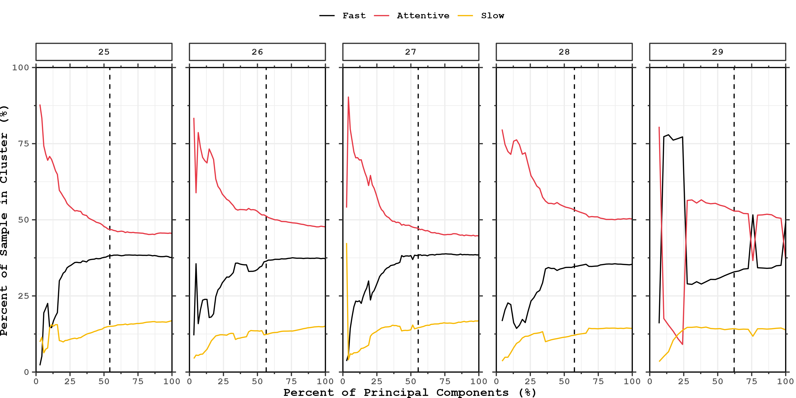
```

---

## Results — Fitting RTAC — UK

```{r  fig.align="center", out.width="90%"}
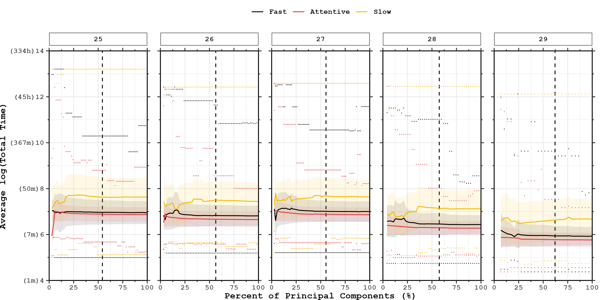
```

---

## Results — Fitting RTAC — USA

```{r  fig.align="center", out.width="90%"}
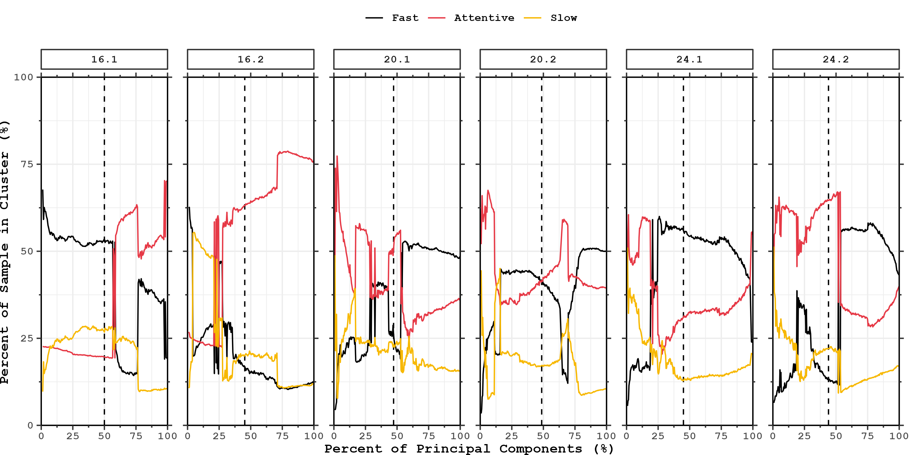
```

---

## Results — Fitting RTAC — USA

```{r  fig.align="center", out.width="90%"}
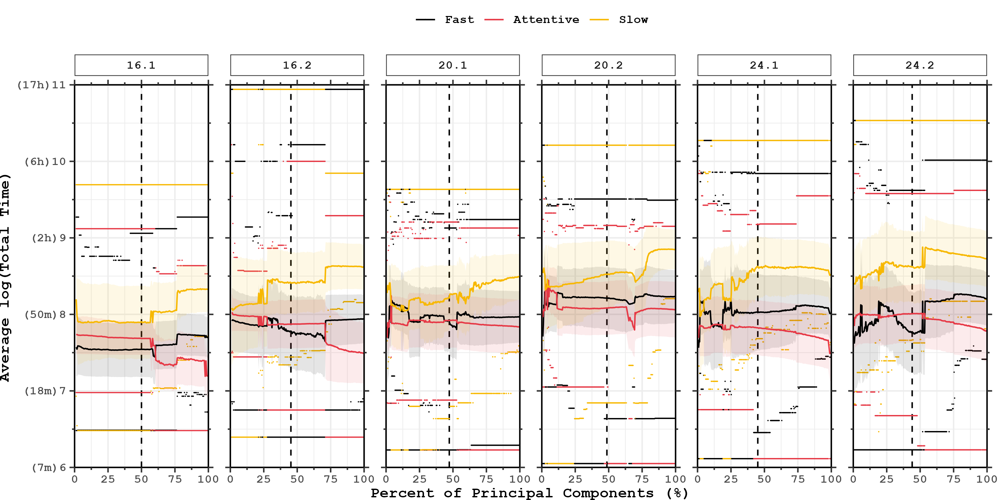
```

---

## Results — Fitting RTAC — USA 3 Split

```{r  fig.align="center", out.width="90%"}
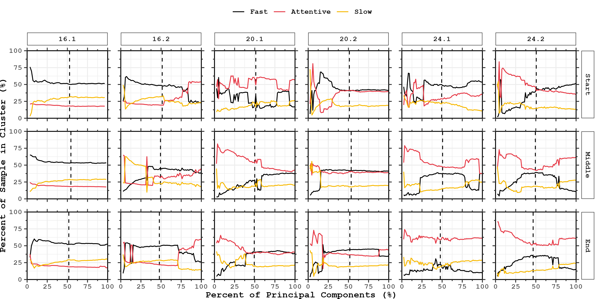
```

---

## Results — Fitting RTAC — USA 3 Split

```{r  fig.align="center", out.width="90%"}
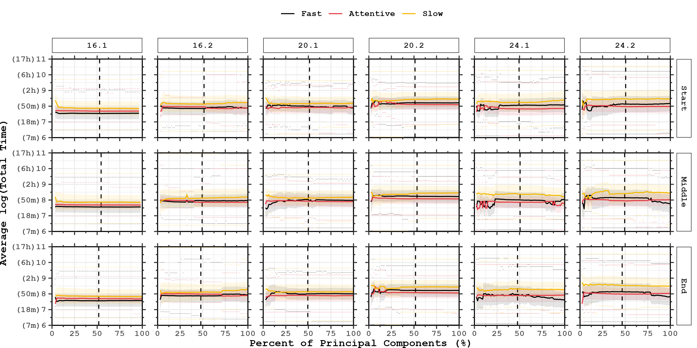
```

---

## Results — Cluster Distribution

```{r  fig.align="center", out.width="70%"}
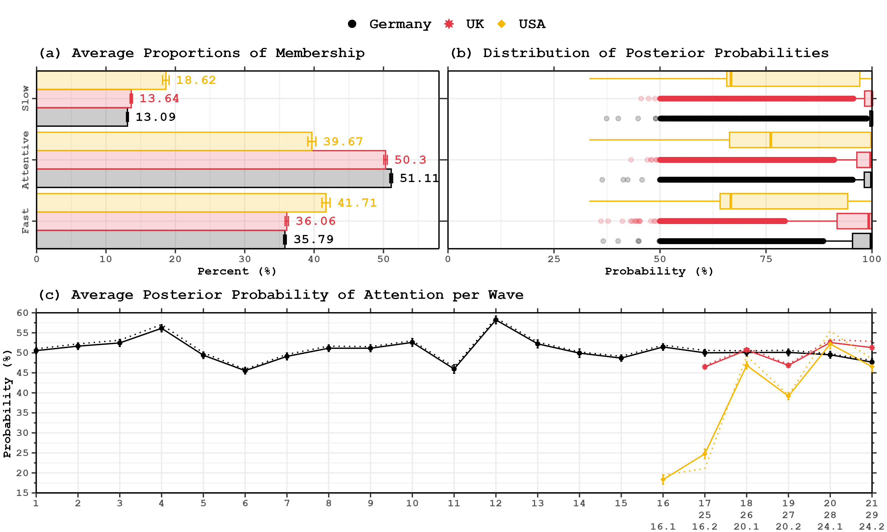
```

---

## Results — IV Distribution

```{r  fig.align="center", out.width="90%"}
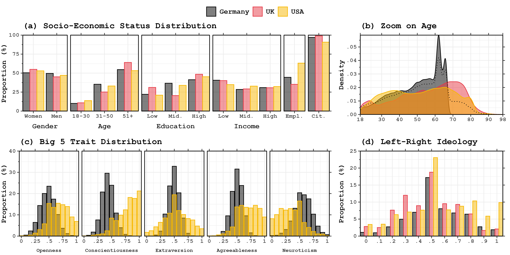
```

---

## Results — Simple Transition Probabilities

```{r  fig.align="center", out.width="90%"}
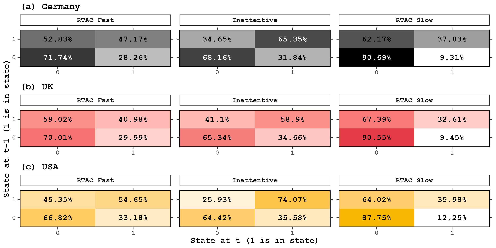
```

---

## Results — Simple Transition Probabilities

```{r  fig.align="center", out.width="90%"}
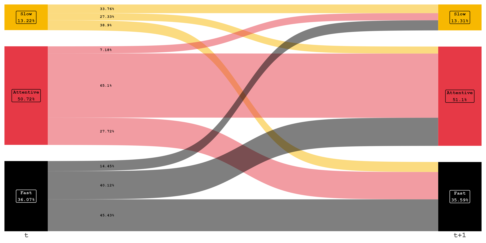
```

---

## Results — Simple Transition Probabilities (Germany)

```{r  fig.align="center", out.width="90%"}
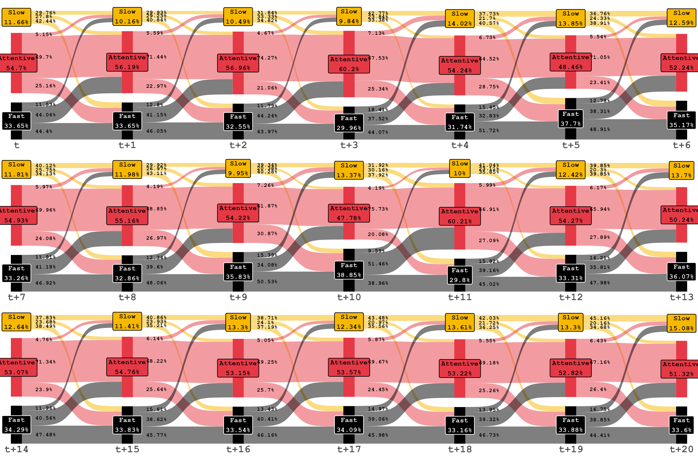
```

---

## Results — Simple Transition Probabilities (UK)

```{r  fig.align="center", out.width="90%"}
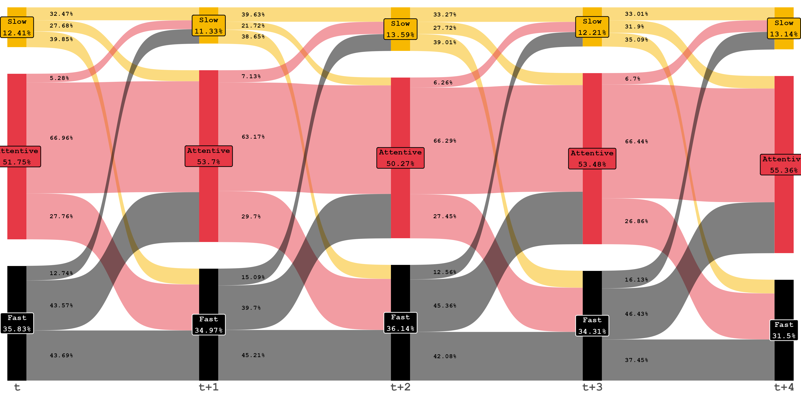
```

---

## Results — Simple Transition Probabilities (USA)

```{r  fig.align="center", out.width="90%"}
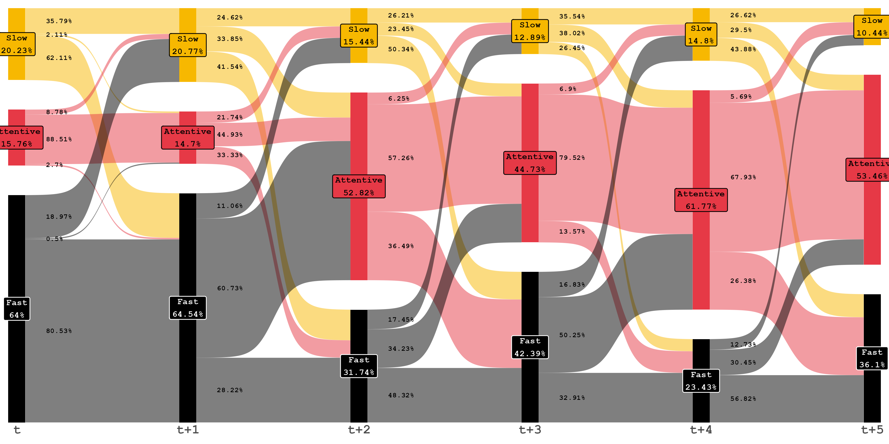
```

---

## Results — Pooled Model (FD/AME)

```{r  fig.align="center", out.width="90%"}
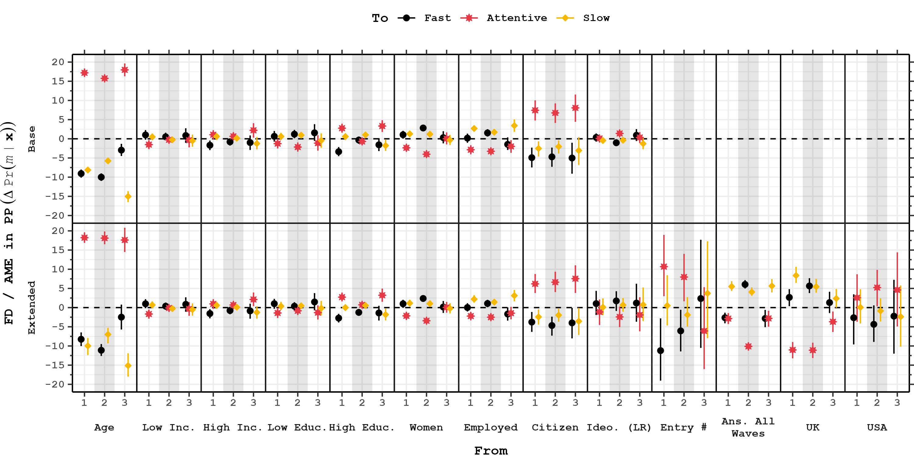
```

---

## Results — Unpooled Model (FD/AME)

```{r  fig.align="center", out.width="90%"}
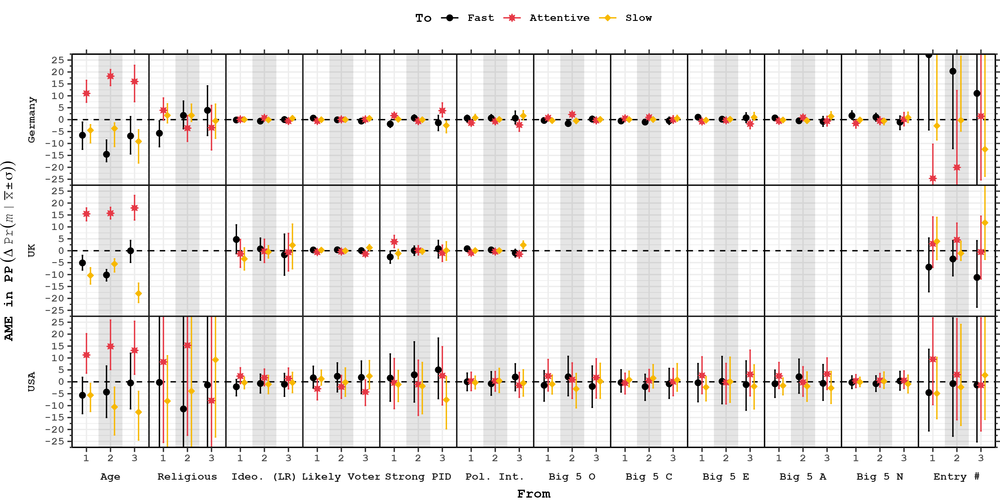
```

---

## Results — Age ME

```{r  fig.align="center", out.width="90%"}
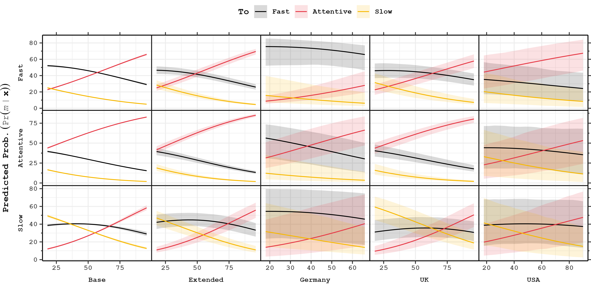
```

---

## Results — Entry # ME

```{r  fig.align="center", out.width="90%"}
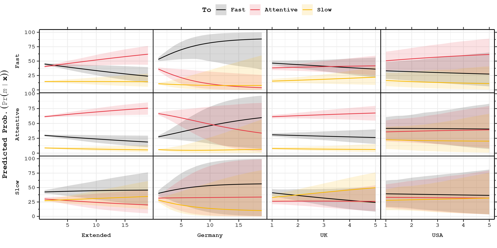
```

---
layout: true

.footer[[Introduction](#intro) [Puzzle](#puzzle) [Design](#design) [Results](#res) [**Conclusion**](#conclu) ]

---
name: conclu

## Conclusion

.panelset[
.panel[.panel-name[What have we learned?]

1. Inattention is persistent but not type-specific.
2. Age is the strongest and most consistent predictor of attention state transition.
3. Gender and education aren't as important as previously found.
4. Survey experience is not beneficial.

  ]
.panel[.panel-name[Next steps.]

1. Untangling sample composition vs real effect of age.
2. Run OPM.
3. Add more waves to the BES.
4. Fill up the appendix.

  ]
]

---


class: inverse,middle,center
<link rel="stylesheet" href="https://cdnjs.cloudflare.com/ajax/libs/font-awesome/7.0.0/css/all.min.css">
## Questions? Comments? Testimonies?

.pull-left[
### Contacts

<i class="fa-regular fa-envelope"></i> wpoirier@uwo.ca

<i class="fa-brands fa-bluesky"></i> @olsisblue.bsky.social

<i class="fa-brands fa-github"></i> WilliamPo1

Or visit my website! $\longmapsto$

]
.pull-right[
```{r  fig.align="center", out.width="70%"}
knitr::include_graphics("figs/website_rev.png")
```
]

---
## Why Germany, UK, and USA?

- CONVENIENCE!
- Perhaps effects of culture? 
  - Maybe "thighter" cultures (norm enforcing) would yield lower amounts of IRes in surveys.
  - Three countries score similarly (5.1, 6.9, and 7 respectivelly) on cultural tightness scale `r AutoCite(bib, c("gelfand2011differences"))`.
- Still, expanding the selection would be nice, especially since the literature is entirely based on western countries.


---
## Bibliography 1/11

```{r results = "asis", echo = FALSE}
PrintBibliography(bib, .opts = list(check.entries = FALSE),start=1,end=6)
```

---
## Bibliography 2/11

```{r results = "asis", echo = FALSE}
PrintBibliography(bib, .opts = list(check.entries = FALSE),start=7,end=12)
```

---
## Bibliography 3/11

```{r results = "asis", echo = FALSE}
PrintBibliography(bib, .opts = list(check.entries = FALSE),start=13,end=18)
```

---
## Bibliography 4/11

```{r results = "asis", echo = FALSE}
PrintBibliography(bib, .opts = list(check.entries = FALSE),start=19,end=24)
```

---
## Bibliography 5/11

```{r results = "asis", echo = FALSE}
PrintBibliography(bib, .opts = list(check.entries = FALSE),start=25,end=30)
```

---
## Bibliography 6/11

```{r results = "asis", echo = FALSE}
PrintBibliography(bib, .opts = list(check.entries = FALSE),start=31,end=36)
```

---
## Bibliography 7/11

```{r results = "asis", echo = FALSE}
PrintBibliography(bib, .opts = list(check.entries = FALSE),start=37,end=42)
```

---
## Bibliography 8/11

```{r results = "asis", echo = FALSE}
PrintBibliography(bib, .opts = list(check.entries = FALSE),start=43,end=48)
```

---
## Bibliography 9/11

```{r results = "asis", echo = FALSE}
PrintBibliography(bib, .opts = list(check.entries = FALSE),start=49,end=54)
```

---
## Bibliography 10/11

```{r results = "asis", echo = FALSE}
PrintBibliography(bib, .opts = list(check.entries = FALSE),start=55,end=60)
```

---
## Bibliography 11/11

```{r results = "asis", echo = FALSE}
PrintBibliography(bib, .opts = list(check.entries = FALSE),start=61,end=66)
```


<!--
## Context

- Home interviews $\rightarrow$ phone interviews $\rightarrow$ self-administered web-based interviews

.pull-left[

- Interviewer present:
  - Higher social desirability bias;
  - Higher respondent engagement;
  - Assessment questions.
- Interviewer farther away:
  - Less social desirability bias;
  - Less respondent engagement;
  - More inattention.
]
.pull-right[
```{r  fig.align="center", out.width="60%",include=TRUE}

```
]

.footnote[`r AutoCite(bib, c("alvarez2019paying","francavilla2019social","kreuter2008social","oberschall2008historical","tourangeau2000psychology"))`] 

## Inattention as a concept — Manifestations
.pull-left[
### Satisficing

1. Selecting the first reasonable answer;
2. Systematic agreement;
3. Status quo agreement;
4. Non-differentiation in question blocks;
5. Selecting "don't know";
6. Answering at random.

.footnote[`r AutoCite(bib, c("simon1957models","krosnick1991response"))`]
]
.pull-right[]


## Inattention as a concept — Manifestations
.pull-left[
### Satisficing

1. Selecting the first reasonable answer;
2. Systematic agreement;
3. Status quo agreement;
4. Non-differentiation in question blocks;
5. Selecting "don't know";
6. Answering at random.

.footnote[`r AutoCite(bib, c("simon1957models","krosnick1991response"))`]
]
.pull-right[
### Complications

- "don't know" due to lack of motivation VS. lack of ability.
- IR likely to vary across the survey.

]
-->

$$\Pr(IR_{it} = 1) = \sigma\left(\beta_0 - \beta_1 \alpha_i - \beta_2 \left[M_{i0} - g(t)\right]\right)$$

$$\Pr(IR_{it} = 1) = \sigma\left(\underbrace{(\beta_0 - \beta_2 M_{i0})}_{\text{respondent intercept}} -
  \beta_1 \alpha_i + \beta_2 \cdot g(t)\right)$$