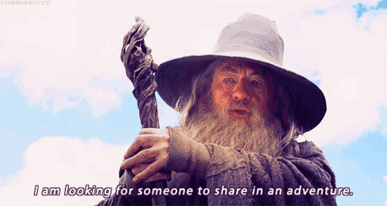
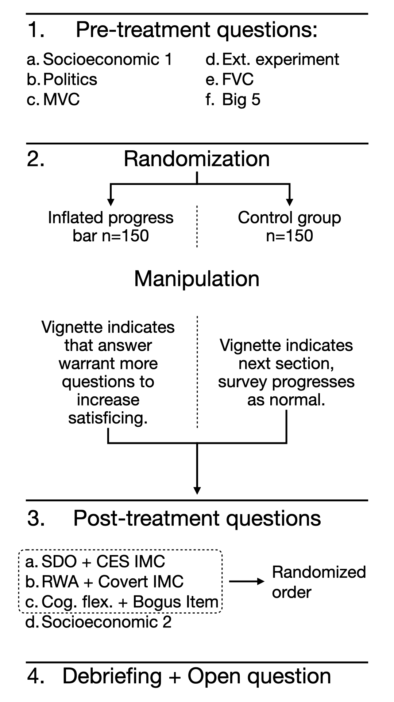
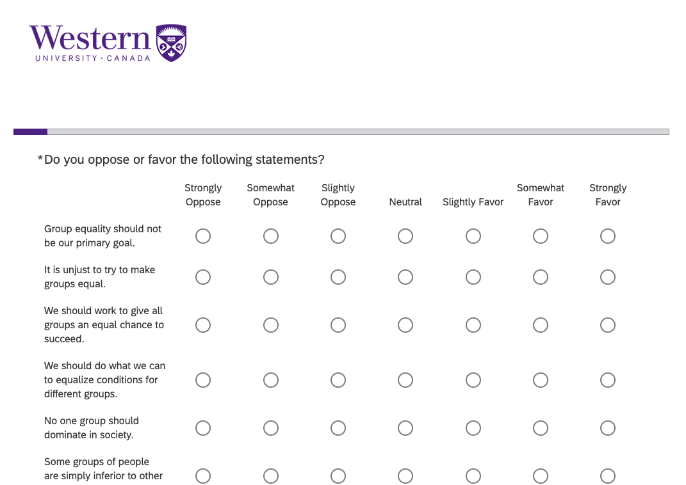
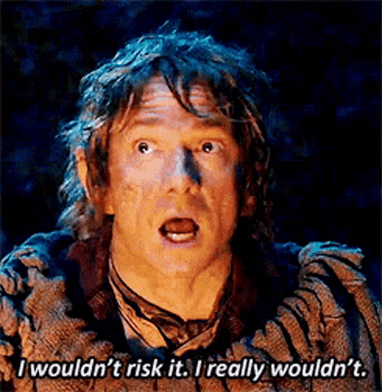
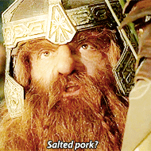

class: inverse,middle,center
```{css echo=FALSE}
.purpleb {
  font-weight: bold;
  color: #4F2683;
  font-size: 1.25em;
}

.purplebL {
  font-weight: bold;
  color: #4F2683;
  font-size: 1.5em;
}

.footnote {
  position: absolute;
  bottom: 60px;
  padding-right: 4em;
  font-size: .75em;
}

.large {
  font-size:1.5rem;
}

.Small {
  font-size:.9rem;
}

.small {
  font-size:.75rem;
}
.tiny {
  font-size:.25rem;
}
.shift { 
  position:relative; 
  top: -40px;
  }

.plot-callout {
  height: 225px;
  width: 450px;
  bottom: 5%;
  right: 5%;
  position: absolute;
  padding: 0px;
  z-index: 100;
}
.plot-callout img {
  width: 100%;
  border: 4px solid
  #  23373B;
}

.remark-slide table tr:nth-child(even) {
  background: none !important;
}
.remark-slide table thead {
  background: none !important;
}
.remark-slide table thead th {
  border-bottom: 1px solid #666;
}

.pull-leftL {
  float: left;
  width: 57%;
}
.pull-rightS {
  float: right;
  width: 37%;
}

.footer {
    font-size: .75rem;
    position: fixed;
    bottom: -8px; 
    left: 0;
    width: 100%;
    text-align: center;
    padding: 1rem 0;
    color: #4F2683;
}

.footer a {
    margin: 0 3rem;
    text-decoration: none;
    color: #4F2683;
    font-weight: 500;
}

.footer a:visited {
    color: #4F2683;
}

.footer a strong,
.footer a b {
    color: #4F2683;
    font-weight: 700;
}

.footer a:hover {
    text-decoration: underline;
}


```


```{r setup, include=FALSE}
# install.packages("here")
# install.packages("RefManageR")
# install.packages("pdftools)
# install.packages("magick)

options(htmltools.dir.version = FALSE)
knitr::opts_chunk$set(
  fig.width=9, fig.height=3.5, fig.retina=3,
  out.width = "100%",
  cache = FALSE,
  echo = FALSE,
  message = FALSE, 
  warning = FALSE,
  hiline = TRUE
)
xaringanExtra::use_panelset()

source("helper.R")
library(RefManageR)
BibOptions(check.entries = FALSE, 
           bib.style = "authoryear", 
           style = "markdown",
           dashed = TRUE)

bib <- ReadBib("thesisProposal.bib")
```

```{r xaringan-themer, include=FALSE, warning=FALSE}
library(xaringanthemer)
style_duo_accent(
  primary_color = "#4F2683",
  secondary_color = "#201436",
  inverse_header_color = "#ffffff",
  inverse_background_color = "#4F2683",
  inverse_text_color = "#ffffff"
)
```

## Assessing Construct and Measurement Validity of Inattentive Responding in Survey Research

Proposal Defense by

### William <span style="text-decoration:underline">Poirier</span>

Supervisory Committee: 

#### David A. Armstrong II, Matthew Lebo, Amanda Friesen

`r Sys.Date()`

```{r  fig.align="center", out.width="30%",include=TRUE}

```

---

## Plan of Presentation
.pull-left[
00. Introduction

0. Overarching literature

1. Article 1: Longitudinal properties of inattentive respondents

2. Article 2: Validation of the measures of IR with an experiment

3. Article 3: Creation of a holistic measure of IR

4. Conclusion
]
.pull-right[
```{r  fig.align="center", out.width="100%",include=TRUE}

```
]

---
class: inverse,middle,center
name: intro

# Introduction

---
layout: true

.footer[[**Introduction**](#intro) [Literature](#lit) [Article 1](#A1) [Article 2](#A2) [Article 3](#A3) [Conclusion ](#conclu) ]

---

## Why should I care? 1/2

.pull-left[  
#### Descriptive Inference
  - Conditional IR $\rightarrow$ upward/downward bias.
  - Random IR $\rightarrow$ increased variance.
  - IR:
    - Bias towards non-attitudes;
    - Scale reliability;
    - Random sampling not quite random.
  - Can think of it as a missing data problem (MCAR, MAR, NMAR).

.small[`r AutoCite(bib, c("huang2015insufficient","curran2016methods","silber2019impact","pyo2021cognitive"))`]
    
]
.pull-right[

```{r  fig.align="center", out.width="100%",fig.dim=c(4.8, 4.5),include=TRUE}
library(tidyverse)
library(ggsci)
library(simstudy)

sim <- defData(varname = "X", dist = "normal", formula = 0, variance = 1)
sim <- defData(sim, varname = "I_r", dist = "binomial", formula = .2, variance = 1,link="identity")
sim <- defData(sim, varname = "I_neg", dist = "negBinomial", formula = "-1*X",variance=1,link="log")
sim <- defData(sim, varname = "I_pos", dist = "negBinomial", formula = "X",variance=1,link="log")
sim <- defData(sim, varname = "Z", dist = "negBinomial", formula = "X",variance=1,link="log")
sim <- defData(sim, varname = "D", dist = "binomial", formula = .5, variance = 1, link = "identity")
sim <- defData(sim, varname = "Y", dist = "normal", formula = "3*D",variance = 1)
sim <- defData(sim, varname = "A", dist = "normal", formula = 0,variance = 1)

set.seed(122)

dat <- genData(1000, sim) |>
  mutate(I_pos = ifelse(I_pos >= 5,1,0),
         I_neg = ifelse(I_neg >= 5,1,0),
         Z = rbinom(1000,1,.5),
         Z_I = ifelse(Z==0,"Pop.",
                      ifelse(Z==1&I_neg==0,"Sample (A)","Sample (IR)"))) |> 
  arrange(Z_I)

colors <- c("#0073C2FF","#EFC000FF","#CD534CFF","#868686FF")

tmp <- dat |> mutate(W=0,
                     W=factor(W,levels=c(0,1,2),labels=c("Pop.","Sample (A)","Sample (IR)")))
ggplot(tmp,aes(X,A,color=W))+
  geom_point(show.legend = T)+
  scale_color_manual(values=colors,labels=c("Pop.","Sample (A)","Sample (IR)"),drop=F)+
  coord_fixed()+
  theme_void()+
  theme(legend.position = "top",
        legend.title= element_blank(),
        plot.margin=unit(c(0,0,0,0),"cm"))

```
]

---

## Why should I care? 1/2

.pull-left[  
#### Descriptive Inference
  - Conditional IR $\rightarrow$ upward/downward bias.
  - Random IR $\rightarrow$ increased variance.
  - IR:
    - Bias towards non-attitudes;
    - Scale reliability;
    - Random sampling not quite random.
  - Can think of it as a missing data problem (MCAR, MAR, NMAR).
  
.small[`r AutoCite(bib, c("huang2015insufficient","curran2016methods","silber2019impact","pyo2021cognitive"))`]
]
.pull-right[

```{r  fig.align="center", out.width="100%",fig.dim=c(4.8, 4.5),include=TRUE}
tmp <- dat |> mutate(Z=factor(Z,levels=c(0,1,2),labels=c("Pop.","Sample (A)","Sample (IR)")))
ggplot(tmp,aes(X,A,color=Z))+
  geom_point(show.legend = T)+
  scale_color_manual(values=colors,drop=F)+
  coord_fixed()+
  theme_void()+
  theme(legend.position = "top",
        legend.title= element_blank(),
        plot.margin=unit(c(0,0,0,0),"cm"))
```


]

---

## Why should I care? 1/2

.pull-left[  
#### Descriptive Inference
  - Conditional IR $\rightarrow$ upward/downward bias.
  - Random IR $\rightarrow$ increased variance.
  - IR:
    - Bias towards non-attitudes;
    - Scale reliability;
    - Random sampling not quite random.
  - Can think of it as a missing data problem (MCAR, MAR, NMAR).
    
.small[`r AutoCite(bib, c("huang2015insufficient","curran2016methods","silber2019impact","pyo2021cognitive"))`]  
]
.pull-right[

```{r  fig.align="center", out.width="100%",fig.dim=c(4.8, 4.5),include=TRUE}
ggplot(dat,aes(X,A,color=Z_I))+
  geom_point()+
  scale_color_manual(values=colors)+
  coord_fixed()+
  theme_void()+
  theme(legend.position = "top",
        legend.title= element_blank(),
        plot.margin=unit(c(0,0,0,0),"cm"))
```
]

---

## Why should I care? 1/2

.pull-left[  
#### Descriptive Inference
  - Conditional IR $\rightarrow$ upward/downward bias.
  - Random IR $\rightarrow$ increased variance.
  - IR:
    - Bias towards non-attitudes;
    - Scale reliability;
    - Random sampling not quite random.
  - Can think of it as a missing data problem (MCAR, MAR, NMAR).
    
.small[`r AutoCite(bib, c("huang2015insufficient","curran2016methods","silber2019impact","pyo2021cognitive"))`]  
]
.pull-right[

```{r  fig.align="center", out.width="100%",fig.dim=c(4.8, 4.5),include=TRUE}
ggplot(dat,aes(X,A,color=Z_I))+
  geom_point()+
  scale_alpha_manual(values=c(0.25,1,1))+
  scale_color_manual(values=colors)+
  scale_x_continuous(breaks=seq(-10,10,0.5))+
  coord_fixed()+
  theme_bw()+
  theme(legend.position = "top",
        legend.title= element_blank(),
        panel.grid = element_blank(),
        panel.border = element_blank(),
        axis.line.y = element_blank(),
        axis.ticks.y = element_blank(),
        axis.text = element_blank(),
        axis.title.y=element_blank(),
        axis.title.x = element_text(),
        plot.margin=unit(c(0,0,0,0),"cm"))
```
]

---

## Why should I care? 2/2

.pull-left[  
#### Causal Inference
  - Even random distribution of IR is problematic: 
    - Control group permeates to the treatment group; 
    - Treatment effect biased toward 0.
    
.small[`r AutoCite(bib, c("kane2025more","bruhlmann2020quality","desimone2018dirty","abbey2017attention","berinsky2014separating","maniaci2014caring"))`]  
]
.pull-right[
```{r  fig.align="center", out.width="100%",fig.dim=c(4.8, 4.5),include=TRUE}
tmp <- dat |> mutate(W=0,
                     W=factor(W,levels=c(0,1,2),labels=c("Control","Treatment","IR")))
ggplot(tmp,aes(X,A,color=W))+
  geom_point(show.legend = T)+
  scale_color_manual(values=colors,labels=c("Control","Treatment","IR"),drop=F)+
  coord_fixed()+
  theme_void()+
  theme(legend.position = "top",
        legend.title= element_blank(),
        plot.margin=unit(c(0,0,0,0),"cm"))

```
]

---

## Why should I care? 2/2

.pull-left[  
#### Causal Inference
  - Even random distribution of IR is problematic: 
    - Control group permeates to the treatment group; 
    - Treatment effect biased toward 0.
    
.small[`r AutoCite(bib, c("kane2025more","bruhlmann2020quality","desimone2018dirty","abbey2017attention","berinsky2014separating","maniaci2014caring"))`]  
]
.pull-right[
```{r  fig.align="center", out.width="100%",fig.dim=c(4.8, 4.5),include=TRUE}
tmp <- dat |> mutate(D=factor(D,levels=c(0,1,2),labels=c("Control","Treatment","IR"))) |>
  arrange(D)

ggplot(tmp,aes(X,A,color=D))+
  geom_point(show.legend = T)+
  scale_color_manual(values=colors,labels=c("Control","Treatment","IR"),drop=F)+
  coord_fixed()+
  theme_void()+
  theme(legend.position = "top",
        legend.title= element_blank(),
        plot.margin=unit(c(0,0,0,0),"cm"))
```
]

---

## Why should I care? 2/2

.pull-left[  
#### Causal Inference
  - Even random distribution of IR is problematic: 
    - Control group permeates to the treatment group; 
    - Treatment effect biased toward 0.
    
.small[`r AutoCite(bib, c("kane2025more","bruhlmann2020quality","desimone2018dirty","abbey2017attention","berinsky2014separating","maniaci2014caring"))`]  
]
.pull-right[
```{r  fig.align="center", out.width="100%",fig.dim=c(4.8, 4.5),include=TRUE}
tmp <- dat |>
  mutate(Y2 = ifelse(D==1 & I_r==1,Y-3,Y),
         D2 = ifelse(I_r==1,2,
                     ifelse(D==1 & I_r==0,1,0)),
         D2=factor(D2,levels=c(0,1,2),labels=c("Control","Treatment","IR"))) |>
  arrange(D2)

ggplot(tmp,aes(X,A,color=D2))+
  geom_point(show.legend = T)+
  scale_color_manual(values=colors,labels=c("Control","Treatment","IR"),drop=F)+
  coord_fixed()+
  theme_void()+
  theme(legend.position = "top",
        legend.title= element_blank(),
        plot.margin=unit(c(0,0,0,0),"cm"))
```
]

---

## Why should I care? 2/2

.pull-left[  
#### Causal Inference
  - Even random distribution of IR is problematic: 
    - Control group permeates to the treatment group; 
    - Treatment effect biased toward 0.
    
.small[`r AutoCite(bib, c("kane2025more","bruhlmann2020quality","desimone2018dirty","abbey2017attention","berinsky2014separating","maniaci2014caring"))`]  
]
.pull-right[
```{r  fig.align="center", out.width="100%",fig.dim=c(4.8, 4.5),include=TRUE}
tmp2 <- tmp |> mutate(D=factor(D,levels=c(0,1,2),labels=c("Control","Treatment","IR")))
ggplot(tmp2,aes(x=D,y=Y,color=D))+
  geom_point(position = position_jitter(seed = 122),show.legend = T)+
  scale_color_manual(values=colors,drop=F)+
  scale_y_continuous("Y")+
  theme_minimal()+
  theme(legend.position = "top",
        legend.title = element_blank(),
        axis.text.x = element_blank(),
        axis.title.x = element_blank())
```
]

---

## Why should I care? 2/2

.pull-left[  
#### Causal Inference
  - Even random distribution of IR is problematic: 
    - Control group permeates to the treatment group; 
    - Treatment effect biased toward 0.
    
.small[`r AutoCite(bib, c("kane2025more","bruhlmann2020quality","desimone2018dirty","abbey2017attention","berinsky2014separating","maniaci2014caring"))`]  
]
.pull-right[
```{r  fig.align="center", out.width="100%",fig.dim=c(4.8, 4.5),include=TRUE}
ggplot(tmp,aes(x=D,y=Y,color=factor(D2)))+
  geom_point(position = position_jitter(seed = 122))+
  scale_color_manual(values=colors)+
  scale_y_continuous("Y")+
  theme_minimal()+
  theme(legend.position = "top",
        legend.title = element_blank(),
        axis.text.x = element_blank(),
        axis.title.x = element_blank())
```
]

---

## Why should I care? 2/2

.pull-left[  
#### Causal Inference
  - Even random distribution of IR is problematic: 
    - Control group permeates to the treatment group; 
    - Treatment effect biased toward 0.
    
.small[`r AutoCite(bib, c("kane2025more","bruhlmann2020quality","desimone2018dirty","abbey2017attention","berinsky2014separating","maniaci2014caring"))`]  
]
.pull-right[
```{r  fig.align="center", out.width="100%",fig.dim=c(4.8, 4.5),include=TRUE}
ggplot(tmp,aes(x=D,y=Y2,color=factor(D2)))+
  geom_point(position = position_jitter(seed = 122))+
  scale_color_manual(values=colors)+
  scale_y_continuous("Y")+
  theme_minimal()+
  theme(legend.position = "top",
        legend.title = element_blank(),
        axis.text.x = element_blank(),
        axis.title.x = element_blank())
```
]

---

## Why should I care? 2/2

.pull-left[  
#### Causal Inference
  - Even random distribution of IR is problematic: 
    - Control group permeates to the treatment group; 
    - Treatment effect biased toward 0.
    
.small[`r AutoCite(bib, c("kane2025more","bruhlmann2020quality","desimone2018dirty","abbey2017attention","berinsky2014separating","maniaci2014caring"))`]  
]
.pull-right[
```{r  fig.align="center", out.width="100%",fig.dim=c(4.8, 4.5),include=TRUE}
mean_D1_ir <- mean(tmp$Y2[tmp$D==1])
mean_D0 <- mean(tmp$Y2[tmp$D==0])
mean_D1 <- mean(tmp$Y2[tmp$D==1 & tmp$I_r==0])
prmtr <- 3

ggplot(tmp,aes(x=D,y=Y2,color=factor(D2)))+
  geom_hline(yintercept = prmtr,color=colors[4])+
  geom_hline(yintercept = mean_D1_ir,color=colors[3], linetype="dashed")+
  geom_hline(yintercept = mean_D1,color=colors[2], linetype="dashed")+
  geom_hline(yintercept = mean_D0,color=colors[1], linetype="dashed")+
  geom_point(position = position_jitter(seed = 122))+
  scale_color_manual(values=colors)+
  scale_y_continuous("Y")+
  theme_minimal()+
  theme(legend.position = "top",
        legend.title = element_blank(),
        axis.text.x = element_blank(),
        axis.title.x = element_blank())
```
]

---
## Research questions

- Mitigating and identifying IR is of high importance for all survey-based research.

---
## Research questions

- Mitigating and **identifying IR** is of high importance for all survey-based research.

--

### 3 Questions

- Article 1: Who are inattentives and how do they behave over multiple survey events?
- Article 2: What is the validity of current measures of inattention in survey research?
- Article 3: How can we holistically assess survey-wide inattention?


---

class: inverse,middle,center
name: lit

# Overarching literature

---
layout: true

.footer[[Introduction](#intro) [**Literature**](#lit) [Article 1](#A1) [Article 2](#A2) [Article 3](#A3) [Conclusion ](#conclu) ]

---

## Inattention as a concept

Theory of optimal answering `r AutoCite(bib, "tourangeau1988cognitive")`:


---

## Inattention as a concept

Theory of optimal answering `r AutoCite(bib, "tourangeau1988cognitive")`:

```{r  fig.align="center", out.width="100%",include=TRUE}
magick::image_read_pdf("images/pictograms.pdf",pages=10)
```

---

## Inattention as a concept

Theory of optimal answering `r AutoCite(bib, "tourangeau1988cognitive")`:

```{r  fig.align="center", out.width="100%",include=TRUE}
magick::image_read_pdf("images/pictograms.pdf",pages=11)
```

---

## Inattention as a concept

Theory of optimal answering `r AutoCite(bib, "tourangeau1988cognitive")`:

```{r  fig.align="center", out.width="100%",include=TRUE}
magick::image_read_pdf("images/pictograms.pdf",pages=12)
```

---

## Inattention as a concept

Theory of optimal answering `r AutoCite(bib, "tourangeau1988cognitive")`:

```{r  fig.align="center", out.width="100%",include=TRUE}
magick::image_read_pdf("images/pictograms.pdf",pages=13)
```

---

## Inattention as a concept

Theory of optimal answering `r AutoCite(bib, "tourangeau1988cognitive")`:

```{r  fig.align="center", out.width="100%",include=TRUE}
magick::image_read_pdf("images/pictograms.pdf",pages=14)
```

(Not unlike `r Citet(bib, "zaller1992nature")`'s RAS model.)

---

## Inattention as a concept

.large[ $\boldsymbol\mapsto$ We define inattentive responding (IR) as a failing to follow one or multiple of
these steps due to a lack of **motivation** or **ability**.]

Formally:

$$IR_i = M_i\times A_i= 
\left\lbrace\begin{align}
&1 \quad \mathrm{if}\; M_i=0\lor A_i=0 \\ 
&0 \quad \mathrm{if}\; M_i=1\land A_i=1
\end{align}\right.$$

.footnote[`r AutoCite(bib, c("anduiza2017answering","berinsky2024measuring"))`]

---

## Inattention as a concept — Motivation

```{r  fig.align="center", out.width="100%",include=TRUE}
magick::image_read_pdf("images/pictograms.pdf",pages=14)
```

---

## Inattention as a concept — Motivation

```{r  fig.align="center", out.width="100%",include=TRUE}
magick::image_read_pdf("images/pictograms.pdf",pages=15)
```

---

## Inattention as a concept — Motivation


```{r  fig.align="center", out.width="100%",include=TRUE}
magick::image_read_pdf("images/pictograms.pdf",pages=16)
```

---

## Inattention as a concept — Motivation

```{r  fig.align="center", out.width="100%",include=TRUE}
magick::image_read_pdf("images/pictograms.pdf",pages=17)
```

---

## Inattention as a concept — Motivation

```{r  fig.align="center", out.width="100%",include=TRUE}
magick::image_read_pdf("images/pictograms.pdf",pages=18)
```

---

## Inattention as a concept — Ability

### What am I refering to?

- Capacity of individuals to truely represent themselves:
  - Reading level;
  - Understanding of the conclusions of the linguistic acts;
  - Working memory `r AutoCite(bib, c("johnson2005ascertaining","bishop2001response"))`.

```{r  fig.align="center", out.width="80%",include=TRUE}
magick::image_read_pdf("images/pictograms.pdf",pages=14)
```

---

## Inattention as a concept — Ability

### What am I refering to?

- Capacity of individuals to truely represent themselves:
  - **Reading level**;
  - Understanding of the conclusions of the linguistic acts;
  - Working memory `r AutoCite(bib, c("johnson2005ascertaining","bishop2001response"))`.

```{r  fig.align="center", out.width="80%",include=TRUE}
magick::image_read_pdf("images/pictograms.pdf",pages=15)
```

---

## Inattention as a concept — Ability

### What am I refering to?

- Capacity of individuals to truely represent themselves:
  - Reading level;
  - **Understanding of the conclusions of the linguistic acts**;
  - Working memory `r AutoCite(bib, c("johnson2005ascertaining","bishop2001response"))`.

```{r  fig.align="center", out.width="80%",include=TRUE}
magick::image_read_pdf("images/pictograms.pdf",pages=19)
```

---
## Inattention as a concept — Ability

### What am I refering to?

- Capacity of individuals to truely represent themselves:
  - Reading level;
  - Understanding of the conclusions of the linguistic acts;
  - **Working memory** `r AutoCite(bib, c("johnson2005ascertaining","bishop2001response"))`.

```{r  fig.align="center", out.width="80%",include=TRUE}
magick::image_read_pdf("images/pictograms.pdf",pages=16)
```

---

## Inattention as a concept — Ability

### What am I refering to?

- Capacity of individuals to truely represent themselves:
  - Reading level;
  - Understanding of the conclusions of the linguistic acts;
  - **Working memory** `r AutoCite(bib, c("johnson2005ascertaining","bishop2001response"))`.

.pull-left[
- For example: Degradation of working memory with age $\rightarrow$ higher susceptibility to response ordering effects `r AutoCite(bib, c("knauper1999impact"))`.
]
.pull-right[
```{r  fig.align="center", out.width="80%",include=TRUE}

```
]

---

## Inattention as a concept — Ability

### What am I refering to?

- Capacity of individuals to truely represent themselves:
  - Reading level;
  - Understanding of the conclusions of the linguistic acts;
  - Working memory `r AutoCite(bib, c("johnson2005ascertaining","bishop2001response"))`.

$\mapsto$ Ability is **not widely included** in definitions of IR, but integral for optimal answers.

$\mapsto$ Mostly comes from sastisficing theory. Survey taking is costly without apparent rewards, need to minimize the effort.

---

## Measurement strategies

.panelset[
  .panel[.panel-name[Direct]
  - **Provide snapshot assessments!**
  - Intructional Manipulation Checks (IMC):
    - "[...] Forget previous instructions and choose 'Strongly Agree'."
    - Can be more or less overt.
  - Bogus/Infrequency items:
    - "I am paid biweekly by leprechauns."
    - Covert
  - Factual Manipulation Checks (FMC)/Mock Vignette Checks (MVC):
    - For experimental designs, to check treatment compliance.
    
  .small[`r AutoCite(bib, c("oppenheimer2009instructional","meade2012identifying","kane2019no","mancosu2019short","kane2023analyze"))`]
  ]
  .panel[.panel-name[Response time]
  - **Offers global assessment!**
  - Page time indices:
    - Ad hoc threshold (2 seconds per question);
    - Concerned with respondents going too fast.
  - Response Time Attentiveness Clustering (RTAC):
    - 2 steps:  1) PCA; 2) EM clustering.
    - Gives probability of being in each of three clusters:
      1. Fast inattentive;
      2. Attentive;
      3. Slow inattentive.
      
   .small[`r AutoCite(bib, c("huang2012detecting","bowling2021quick","read2022racing"))`]
  ]
  .panel[.panel-name[Response pattern]
  - **Offers global assessment!**
  - Longest streak
  - Outlier detection
  - Individual consistency
  
$\mapsto$ Not recommended as offer poor consistency with other measures and are overreliant on strong assumptions.
  
  .small[`r AutoCite(bib, c("curran2016methods","desimone2018dirty","converse2006nature"))`]
  ]
]


---
## A tentative typology


|                      | Disengaged (0,0)       | Underachievers (0,1)              |Well-meaning (1,0)     | <div style="width:130px"> Optimal (1,1)                     |
|:---------------------|:-----------------------|:----------------------------------|:----------------------|:----------------------------------|
| Satisficing strategy | Systematic agreement <br> Non-differentiation | Selecting first reasonable answer <br> Answering at random |Status quo agreement <br> Selecting "don't know" |                                   |
| Overt IMC            | Fail                   | Pass                              |Fail                   | Pass                              |
| Covert IMC           | Fail                   | Fail                              |Fail                   | Pass                              |
| Response time        | Fast                   | Fast                              |Slow                   | Average                           |
| IR                   | Yes                    | Yes                               |Yes                    | No                                |


---
class: inverse,middle,center
name: A1

# Article 1

## Once a Lounger, Always a Lounger?
### Tracking Inattention in Longitudinal Panel Data

---
layout: true

.footer[[Introduction](#intro) [Literature](#lit) [**Article 1**](#A1) [Article 2](#A2) [Article 3](#A3) [Conclusion ](#conclu) ]

---

## A1: Puzzle — What predicts IR?

| Source                                      | Men      | Young   | Lower educ. | <div style="width:50px"> IR<sub>t-1</sub> | Interest | Other | Data origin | Nb. waves | IR measure |
|:--------------------------------------------|:--------:|:-------:|:-----------:|:----------------:|:--------:|:------|:-----------:|:---------:|:----------:|
| .small[`r Citet(bib, c("kapelner2010preventing"))`] | +        | +       | 0           |   |   | Motivation (0) <br> Need for cognition (0) | USA         | 1         | IMC        |
| .small[`r Citet(bib, c("berinsky2014separating"))`] | +        | +       | 0           |   |   | Non-white (+)   | USA         | 1         | IMC        |
| .small[`r Citet(bib, c("anduiza2017answering"))`]   | 0        | +       | +           | + | - | Motivation (0)  | Spain       | 6         | IMC        |
| .small[`r Citet(bib, c("paas2018instructional"))`]  | NA       |  NA     | NA          | + |   |                 | Australia   | 3         | IMC        |
| .small[`r Citet(bib, c("gummer2021using"))`]        | 0        | +       | +           | 0 | - | Habituation (-) | Germany     | 7         | IMC + RT   |

---

## A1: Puzzle — Why the inconsistency?

### Possible explanations

--

1. Context

--

2. Measurement

--

3. Model specification

--

4. Diversity of controls

---

## A1: Puzzle — Why the inconsistency?

### Possible explanations

1. **Context**

2. **Measurement**

3. **Model specification**

4. Diversity of controls

---

## A1: Puzzle — Why the inconsistency?

### Possible explanations

1. **Context** $\rightarrow$ UK, USA, Germany

2. **Measurement** $\rightarrow$ RTAC (three types: fast, slow, and attentive)

3. **Model specification** $\rightarrow$ longitudinal analysis via a transition model

4. Diversity of controls

---

## A1: Puzzle — Research question
### Who are inattentives and how do they behave over multiple survey events?

Specifically:

1. Do the profiles of RTAC-flagged inattentives differ from those flagged by alternative measures?

2. Do the profiles of fast and slow inattentives differ?

---

## A1: Hypotheses
.pull-left[
- **H1:** Fast inattentives are less likely to persist in their inattention across waves compared to slow inattentives for which inattention comes from ability.  

- **H2:** Age, sex, and education should be associated with inattention even when measured by RTAC.  

- **H3:** Slow inattentives are more likely to have lower education levels. 
]
.pull-right[
```{r  fig.align="center", out.width="60%",include=TRUE}

```
]


---

## A1: Design — Data

Needs to : 1) be a panel; 2) be publicly available; and 3) contain response time. 3 options:

.panelset[
  .panel[.panel-name[British Election Study (BES)]
  - 29 survey events (waves);
  - Response time data for waves 25 to 29 (May 2023 to September 2024);
  - Each wave contains about 31,000 respondents;
  - 9,340 respondents answered all 5 waves.
  
  .small[`r AutoCite(bib, c("bes_2024"))` Shoutout to Prof. Jack Bailey who was kind enough to share the data with me.]
  ]
  .panel[.panel-name[American National Election Studies (ANES)]
  - 6 survey events;
  - Ran in 2016, 2020, and 2024 (pre/post survey design);
  - Response time data only available for 2016 and 2020 for now;
  - 2,670 respondents answered both the 2016 and 2020 waves;
  - Should drop to 2,070 once 2024 is included.
  
  .small[`r AutoCite(bib, c("anes_2024"))`]
  ]
  .panel[.panel-name[Bavaria Panel Study (BPS)]
  - Part of Making Electoral Democracy Work project `r Citet(bib, c("blais2010making"))`;
  - 5 survey events;
  - 2013 state and federal elections (pre state; between the two; post federal);
  - 2014 European elections (pre/post);
  - 1,870 respondents across all waves.
  
  .small[`r AutoCite(bib, c("bavaria_2017"))`]
  ]
]
  
---

## A1: Design — Analysis
.panelset[
.panel[.panel-name[DV = IR]
  - Response Time Attentiveness Clustering (RTAC) (Read et al., 2024):
    - Produces three clusters: 1) fast; 2) slow; 3) attentive.
    - Probabilities of being in each.
  - Straightlining:
    - None of the panels contain usable IMCs.
    - Based on the feeling thermometers contained in each panels.
    - Whether or not respondents answered the same thing for all of them.
    - Boolean, whether they straightlined or not.
    - Expect reported levels of IR to be lower using this measure.
  ]
  .panel[.panel-name[IVs]
  - Sociodemographic variables:
    - Age;
    - Gender;
    - Education;
    - Income.
  - Party Id.
  - Interest in politics.
  - No personnality batteries available, yet.
  ]
  .panel[.panel-name[Univariate]
Following `r Citet(bib, c("gummer2021using"))`, produce transition probability matrix.

```{r  fig.align="center", out.width="70%",include=TRUE}
magick::image_read_pdf("figs/prob_matrix.pdf",pages=1)
```
  ]
  .panel[.panel-name[Multivariate]
<table>
  <thead>
    <tr>
      <th>Previous state</th>
      <th>To fast (1)</th>
      <th>To attentive (2)</th>
      <th>To slow (3)</th>
    </tr>
  </thead>
  <tbody>
    <tr>
      <td>Fast (1)</td>
      <td>\(Pr(y_i=1|\boldsymbol{X}_i, y_{t-1}=1)\)</td>
      <td>\(Pr(y_i=2|\boldsymbol{X}_i, y_{t-1}=1)\)</td>
      <td>\(Pr(y_i=3|\boldsymbol{X}_i, y_{t-1}=1)\)</td>
    </tr>
    <tr>
      <td>Attentive (2)</td>
      <td>\(Pr(y_i=1|\boldsymbol{X}_i, y_{t-1}=2)\)</td>
      <td>\(Pr(y_i=2|\boldsymbol{X}_i, y_{t-1}=2)\)</td>
      <td>\(Pr(y_i=3|\boldsymbol{X}_i, y_{t-1}=2)\)</td>
    </tr>
    <tr>
      <td>Slow (3)</td>
      <td>\(Pr(y_i=1|\boldsymbol{X}_i, y_{t-1}=3)\)</td>
      <td>\(Pr(y_i=2|\boldsymbol{X}_i, y_{t-1}=3)\)</td>
      <td>\(Pr(y_i=3|\boldsymbol{X}_i, y_{t-1}=3)\)</td>
    </tr>
  </tbody>
</table>

- Transition models via multinomial logistic regression. One for each $m$ categories in IR: $$Pr(y_i=m|\boldsymbol{x}_i,y_{i,t-1}=1)=\frac{exp(\boldsymbol{x}_i\beta_m)}{\sum_{m=0}^{3}exp(\boldsymbol{x}_i\beta_m)}, m=1,2,3.$$
- Perform Marcov-chain Monte Carlo simulations (MCMC) to be able to do hypothesis tests between models. 
  
  .small[`r AutoCite(bib, c("chib1998mcmc","diggle2002analysis","hillygus2003voter","treier2008democracy"))`]
  ]
  .panel[.panel-name[Robustness check]
  - One could alternativelly approach the analysis from a time series perspective.
  - We have a DGP of the form: $$y_{it}=\phi y_{i,t-1}+\boldsymbol\beta\boldsymbol x_{it}+\alpha_{ci}+\varepsilon_{it}$$
  - OLS-FE is a biased and inconsistent estimator due to the endogeneity between the lagged DV and the errors `r AutoCite(bib, c("nickell1981biases"))`.
  - Small T large N limits the modelling options. 
  - `r Citet(bib, c("pickup2022transformed"))` recommends the orthogonal reparameterization estimator (OPM).
  ]
]

---

## A1: Contribution

.pull-left[
1. Further our understanding of respondents who choose to complete a survey, while not paying attention to its content.

2. Make recommendations on when to booth respondents out of panels.

3. Finer grained understanding of IR profiles implies better characterization of sensitivity of results.

]
.pull-right[
```{r  fig.align="center", out.width="80%",include=TRUE}

```
]


---
class: inverse,middle,center
name: A2

# Article 2
## Do IMCs and Time Measure Inattention?
### Testing Established Measures Against Physiological Markers of Inattentive Responding

---
layout: true

.footer[[Introduction](#intro) [Literature](#lit) [Article 1](#A1) [**Article 2**](#A2) [Article 3](#A3) [Conclusion ](#conclu) ]

---

## A2: Puzzle

--

1. Poor fit between the different measures of inattention (IMC, response time, response pattern) `r AutoCite(bib, c("dunn2018intra","desimone2018dirty"))`;

--

2. Validation of measures is done via nomological validity, testing against established measures `r AutoCite(bib, c("adcock2001measurement"))`;

--

3. Conceptual confusion among foundational studies `r AutoCite(bib, c("oppenheimer2009instructional","meade2012identifying","huang2012detecting"))`;

--

4. Advice is to carpet bomb the survey `r AutoCite(bib, c("curran2016methods","huang2015detecting","meade2012identifying"))`;

--

5. At the end of the day, we still can't say whether the poor fit is due to the measures capturing different concepts, or because they are inappropriate.

--

.purplebL[What is the validity of current measures of inattention in survey research?] **... and what would be an appropriate test?**

---

## A2: Puzzle — Physiological Measures of Attention

.panelset[
  .panel[.panel-name[Eye-tracking]
  - Infrared sensors used to track gaze time in area of interest.
  - Assumption that where you look is where attention is.
  - Used to measure task engagement `r AutoCite(bib, c("fortenbaugh2017recent","baumgartner2018misresponse"))`.
  - Used to investigate answer ordering effects, and conjoint experiment assumptions `r AutoCite(bib, c("galesic2008eye","jenke2021using"))`.
  - `r Citet(bib, c("babakhani2023instructional"))` provides the only study that directly tests the validity of IMCs on physiological manifestations of attention (n=21). 
    - Find that task miscomprehension is also to blame for IMC failure.
```{r  fig.align="center", out.width="60%",include=TRUE}
magick::image_read_pdf("images/pictograms.pdf",pages=20)
```
  ]
  .panel[.panel-name[EDA]
  - Electrodermal activity (skin conductance) varies as a function of sweat production.
  - Eccrine sweat gland activation part of sympathetic nervous system (the fight-or-flight response).
  - Associated with a wide array of states: arousal, stress, motivation, vigilance, etc. `r AutoCite(bib, c("andreassi2000activity"))`.
  - If treatement produces stress response, might be difficult to parse out what exactly made EDA increase.
  - Successfully used to measure vigilance `r AutoCite(bib, c("eason1965performance","krupski1971physiological","tao2019systematic","brishtel2020mind"))`.
```{r  fig.align="center", out.width="60%",include=TRUE}
magick::image_read_pdf("images/pictograms.pdf",pages=21)
```  
  ]
  .panel[.panel-name[HRV]
  - Heart rate variation corresponds to the variation in the interval between heart beats, is it consistent or not.
  - Associated with global cognitive performance, memory, language, **attention**, executive functions, visuospatial skills, and processing speed `r AutoCite(bib, c("forte2019heart"))`.
  - Lower HRV during attention phases `r AutoCite(bib, c("richards1991heart","chen2010detecting","williams2016resting","griffiths2017sustained"))`.
```{r  fig.align="center", out.width="60%",include=TRUE}
magick::image_read_pdf("images/pictograms.pdf",pages=22)
``` 
  ]
]

---

## A2: Puzzle — Physiological Measures of Attention

```{r  fig.align="center", out.width="60%",include=TRUE}
magick::image_read_pdf("images/pictograms.pdf",pages=23)
```

```{r  fig.align="center", out.width="90%",include=TRUE}
magick::image_read_pdf("images/pictograms.pdf",pages=14)
```

---

## A2: Puzzle — Physiological Measures of Attention

```{r  fig.align="center", out.width="60%",include=TRUE}
magick::image_read_pdf("images/pictograms.pdf",pages=24)
```

```{r  fig.align="center", out.width="90%",include=TRUE}
magick::image_read_pdf("images/pictograms.pdf",pages=26)
```

---

## A2: Puzzle — Physiological Measures of Attention

```{r  fig.align="center", out.width="60%",include=TRUE}
magick::image_read_pdf("images/pictograms.pdf",pages=25)
```

```{r  fig.align="center", out.width="90%",include=TRUE}
magick::image_read_pdf("images/pictograms.pdf",pages=27)
```

---

## A2: Hypotheses

Recall our definition of IR:

$$IR_i = M_i\times A_i= 
\left\lbrace\begin{align}
&1 \quad \mathrm{if}\; M_i=0\lor A_i=0 \\ 
&0 \quad \mathrm{if}\; M_i=1\land A_i=1
\end{align}\right.$$

--

Let's describe a model of attention as a function of an external stimuli:

$$IR_{mi}=\beta_m D_{i}+\mathbf{X}\boldsymbol{\gamma_{m}}+\varepsilon_{mi}$$

---

## A2: Hypotheses

Recall our definition of IR:

$$IR_i = M_i\times A_i= 
\left\lbrace\begin{align}
&1 \quad \mathrm{if}\; M_i=0\lor A_i=0 \\ 
&0 \quad \mathrm{if}\; M_i=1\land A_i=1
\end{align}\right.$$

Let's describe a model of attention as a function of an external stimuli:

$$\color{#FF0000}{IR_{mi}}=\beta_m D_{i}+\mathbf{X}\boldsymbol{\gamma_{m}}+\varepsilon_{mi}$$
- $\color{#FF0000}{m}$:
  1. HRV;
  2. Eye-tracking;
  3. EDA;
  4. IMC index (overt, covert, bogus item);
  5. Response time index;
  6. RTAC.

---

## A2: Hypotheses

Recall our definition of IR:

$$IR_i = M_i\times A_i= 
\left\lbrace\begin{align}
&1 \quad \mathrm{if}\; M_i=0\lor A_i=0 \\ 
&0 \quad \mathrm{if}\; M_i=1\land A_i=1
\end{align}\right.$$

Let's describe a model of attention as a function of an external stimuli:

$$IR_{mi}=\color{#FF0000}{\beta_m D_{i}}+\mathbf{X}\boldsymbol{\gamma_{m}}+\varepsilon_{mi}$$
- $\color{#FF0000}{D_{i}}$: some stimuli that would instigate inattention.

---

## A2: Hypotheses

.panelset[
  .panel[.panel-name[**Sanity checks**]
**H0.1**. Effective treatment—treatment increases inattentive responding:
- $\beta_m > 0 \forall m$
    
**H0.2**. Validity of baseline—the estimated ITT will not be statistically different whether inattention is measured by eye-tracking, HRV, or EDA:
- $\beta_1\approx\beta_2\approx\beta_3$
  ]
  .panel[.panel-name[**Actual ones**]
**H1** The IMC index will properly capture IR as ability is included in our conceptualization:
- $\beta_1\approx\beta_2\approx\beta_3\approx\beta_4$

**H2** The response time index will present with downward bias as it doesn't capture ability:
- $\beta_5<\beta_1\approx\beta_2\approx\beta_3$
  
**H3** The RTAC will properly capture IR as it accounts for ability in its categorization:
- $\beta_1\approx\beta_2\approx\beta_3\approx\beta_6$
  
**H4** Treatment should affect motivation based IR, hence the ITT should be higher for fast inattentives than for slow inattentives:
- $\beta_{6f}>\beta_{6s}$
  ]
]

---

## A2: Design — Experiment

.pull-leftL[
- Blinding: double-blind.
- Randomization: block randomized on age and gender.
- Treatment: betweem subject 2x2.
- Variables:
  - Socioeconomic (age,gender, income, etc.);
  - Politics (interst, pid, 2025 vote);
  - Personnality (big 5, RWA, SDO, cognitive flexibility);
  - Response time for each survey page;
  - IMC (overt, covert, bogus);
  - Open question.
- Indices:
  - RTAC: probability of being in each cluster transformed via additive log-ratio;
  - Response time index: average of pages under 2 seconds;
  - IMC index: average of IMC failures. 

]
.pull-rightS[
```{r  fig.align="center", out.width="65%",include=TRUE}

```
]

---

## A2: Design — Experiment

.pull-leftL[
- **Blinding: double-blind.**
- **Randomization: block randomized on age and gender.**
- Treatment: betweem subject 2x2.
- Variables:
  - Socioeconomic (age,gender, income, etc.);
  - Politics (interst, pid, 2025 vote);
  - Personnality (big 5, RWA, SDO, cognitive flexibility);
  - Response time for each survey page;
  - IMC (overt, covert, bogus);
  - Open question.
- Indices:
  - RTAC: probability of being in each cluster transformed via additive log-ratio;
  - Response time index: average of pages under 2 seconds;
  - IMC index: average of IMC failures. 

]
.pull-rightS[
```{r  fig.align="center", out.width="65%",include=TRUE}

```
]

---

## A2: Design — Experiment

.pull-leftL[
- Blinding: double-blind.
- Randomization: block randomized on age and gender.
- **Treatment: betweem subject 2x2.**
- Variables:
  - Socioeconomic (age,gender, income, etc.);
  - Politics (interst, pid, 2025 vote);
  - Personnality (big 5, RWA, SDO, cognitive flexibility);
  - Response time for each survey page;
  - IMC (overt, covert, bogus);
  - Open question.
- Indices:
  - RTAC: probability of being in each cluster transformed via additive log-ratio;
  - Response time index: average of pages under 2 seconds;
  - IMC index: average of IMC failures. 

]
.pull-rightS[

.purpleb[Control]

```{r  fig.align="center", out.width="100%",include=TRUE}

```
]

---

## A2: Design — Experiment

.pull-leftL[
- Blinding: double-blind.
- Randomization: block randomized on age and gender.
- **Treatment: betweem subject 2x2.**
- Variables:
  - Socioeconomic (age,gender, income, etc.);
  - Politics (interst, pid, 2025 vote);
  - Personnality (big 5, RWA, SDO, cognitive flexibility);
  - Response time for each survey page;
  - IMC (overt, covert, bogus);
  - Open question.
- Indices:
  - RTAC: probability of being in each cluster transformed via additive log-ratio;
  - Response time index: average of pages under 2 seconds;
  - IMC index: average of IMC failures. 

]
.pull-rightS[

.purpleb[Treatement 1/2]

```{r  fig.align="center", out.width="100%",include=TRUE}

```
]

---

## A2: Design — Experiment

.pull-leftL[
- Blinding: double-blind.
- Randomization: block randomized on age and gender.
- **Treatment: betweem subject 2x2.**
- Variables:
  - Socioeconomic (age,gender, income, etc.);
  - Politics (interst, pid, 2025 vote);
  - Personnality (big 5, RWA, SDO, cognitive flexibility);
  - Response time for each survey page;
  - IMC (overt, covert, bogus);
  - Open question.
- Indices:
  - RTAC: probability of being in each cluster transformed via additive log-ratio;
  - Response time index: average of pages under 2 seconds;
  - IMC index: average of IMC failures. 

]
.pull-rightS[

.purpleb[Treatement 2/2]

```{r  fig.align="center", out.width="100%",include=TRUE}

```
]

---

## A2: Design — Experiment

.pull-leftL[
- Blinding: double-blind.
- Randomization: block randomized on age and gender.
- Treatment: betweem subject 2x2.
- Variables:
  - Socioeconomic (age,gender, income, etc.);
  - Politics (interst, pid, 2025 vote);
  - Personnality (big 5, RWA, SDO, cognitive flexibility);
  - Response time for each survey page;
  - **IMC (overt, covert, bogus);**
  - Open question.
- Indices:
  - RTAC: probability of being in each cluster transformed via additive log-ratio;
  - Response time index: average of pages under 2 seconds;
  - IMC index: average of IMC failures. 

]
.pull-rightS[
- You probably have a favourite colour. But we are more interested in making sure you're doing the survey carefully, so please just select the colour brown here. (CES, 2021)
- In getting what you want, it is sometimes necessary to use force against other groups (ignore the instructions and choose "agree"). (Adapted from Pratto et al., 1994)
- I am paid biweekly by leprechauns. (Meade and Craig, 2012)
]

---

## A2: Design — Experiment

.pull-leftL[
- Blinding: double-blind.
- Randomization: block randomized on age and gender.
- Treatment: betweem subject 2x2.
- Variables:
  - Socioeconomic (age,gender, income, etc.);
  - Politics (interst, pid, 2025 vote);
  - Personnality (big 5, RWA, SDO, cognitive flexibility);
  - Response time for each survey page;
  - IMC (overt, covert, bogus);
  - **Open question.**
- Indices:
  - RTAC: probability of being in each cluster transformed via additive log-ratio;
  - Response time index: average of pages under 2 seconds;
  - IMC index: average of IMC failures. 

]
.pull-rightS[
- Taking a survey can be pretty boring, what types of things did you do to make it go faster? 
]

---

## A2: Design — Data


```{r  fig.align="center", out.width="70%",include=TRUE}
magick::image_read_pdf("figs/power.pdf",pages=1)
```

- With available ressources, we are aiming at 300 respondents.
- Both in-class recruitment and university-wide invitation.
- Compensation in form of extra credit or money ($10) base on recruitment type.

---

## A2: Design — Analysis

Recall the original model: $$IR_{mi}=\beta_m D_{i}+\mathbf{X}\boldsymbol{\gamma_{m}}+\varepsilon_{mi}$$

- Can be directly estimated via seemingly unrelated regression (SUR).
- This jointly estimates all $m$ models.
- Why? 
  - To account for possible relationships between the residuals of the different DVs `r AutoCite(bib, c("greene_econometric_2018"))`.
  - To produce hypothesis tests between models. 
- Estimation of SUR is implemented in `systemfit` package in R. 

---

## A2: Design — Why do it this way?

.pull-left[
1. IR isn't guarantee to happen in every survey, especially one taking place in a university laboratory.
2. The Tobii glasses, Biopac ring, and ECG will likely worsen this.
3. Can be turned into a within design to check for power related issues if treatment isn't satistically significant.
4. If both fail, I will still have great descriptive data with which I can compare eye-tracking to response time measures.

- Will pilot it as a simple survey to see if treatment works.
- Can measure eye mouvement (WebGazer) and HRV (rPPG) via a webcam, this way I could have a lot more respondents.

]
.pull-right[
```{r  fig.align="center", out.width="80%",include=TRUE}

```
]

---

## A2: Contribution

.pull-left[
1. Hard validation test for current measures of IR.

2. Offers insight as to what happens when respondents engage in satisficing behaviour.

3. Greatly inform future developpment of IR measures.

]
.pull-right[
```{r  fig.align="center", out.width="80%",include=TRUE}

```
]

---
class: inverse,middle,center
name: A3

# Article 3
## Holistic Attention Measurement:
### Leveraging Generalized Low Rank Models to Assess Global Attention in Self-Administered Surveys

---
layout: true

.footer[[Introduction](#intro) [Literature](#lit) [Article 1](#A1) [Article 2](#A2) [**Article 3**](#A3) [Conclusion ](#conclu) ]

---
## A3: Puzzle

1. Poor fit between the different measures of inattention (IMC, response time, response pattern) `r AutoCite(bib, c("dunn2018intra","desimone2018dirty"))`;

2. Validation of measures is done via nomological validity, testing against established measures `r AutoCite(bib, c("adcock2001measurement"))`;

3. Conceptual confusion among foundational studies `r AutoCite(bib, c("oppenheimer2009instructional","meade2012identifying","huang2012detecting"))`;

4. Advice is to carpet bomb the survey `r AutoCite(bib, c("curran2016methods","huang2015detecting","meade2012identifying"))`;

--

5. **Let's assume that these are all valid ways to measure the same multidimentional concept.**

--

6. **What to do when metrics disagree?**

7. **How should one weight the importance of failing and IMC over response time? **

--

.purplebL[How can we holistically assess survey-wide inattention?] 

---
## A3: Reframing the problem

--

1. You have multiple response times.

--

2. Respondent $i$ is sometimes above, sometimes below the threshold.

--

3. **What to do when metrics disagree?**

--

$\mapsto$ `r Citet(bib, c("read2022racing"))` offer a solution in the **RTAC**.

---

## A3: A solution — RTAC

```{r  fig.align="center", out.width="100%",include=TRUE}
magick::image_read_pdf("images/pictograms.pdf",pages=28)
```

---
## A3: A solution — RTAC

```{r  fig.align="center", out.width="100%",include=TRUE}
magick::image_read_pdf("images/pictograms.pdf",pages=29)
```

---

## A3: A solution — RTAC

```{r  fig.align="center", out.width="100%",include=TRUE}
magick::image_read_pdf("images/pictograms.pdf",pages=30)
```

- Principal component analysis (PCA) answer:
  - **What is the minimum amount of "dimensions" (variables) I need to explain the maximum amount of variance?**

---

## A3: A solution — RTAC

```{r  fig.align="center", out.width="100%",include=TRUE}
magick::image_read_pdf("images/pictograms.pdf",pages=31)
```

- Gaussian mixture models (GMM) answer:
  - **To which of $k$ distribution is $i$ more likely to come from?**
- Assume that each observation comes from one of $k$ multivariate-normal distribution.
- Expectation maximization (EM) answer:
  - **How many distributions are there?**
--

- `r Citet(bib, c("read2022racing"))` impose 3 clusters.

---

## A3: Remember this?

|                      | Disengaged (0,0)       | Underachievers (0,1)              |Well-meaning (1,0)     | <div style="width:130px"> Optimal (1,1)                     |
|:---------------------|:-----------------------|:----------------------------------|:----------------------|:----------------------------------|
| Satisficing strategy | Systematic agreement <br> Non-differentiation | Selecting first reasonable answer <br> Answering at random |Status quo agreement <br> Selecting "don't know" |                                   |
| Overt IMC            | Fail                   | Pass                              |Fail                   | Pass                              |
| Covert IMC           | Fail                   | Fail                              |Fail                   | Pass                              |
| Response time        | Fast                   | Fast                              |Slow                   | Average                           |
| IR                   | Yes                    | Yes                               |Yes                    | No                                |

---

## A3: Remember this?

|                      | Disengaged (0,0)       | Underachievers (0,1)              |Well-meaning (1,0)     | <div style="width:130px"> Optimal (1,1)                     |
|:---------------------|:-----------------------|:----------------------------------|:----------------------|:----------------------------------|
| Satisficing strategy | Systematic agreement <br> Non-differentiation | Selecting first reasonable answer <br> Answering at random |Status quo agreement <br> Selecting "don't know" |                                   |
| Overt IMC            | Fail                   | Pass                              |Fail                   | Pass                              |
| Covert IMC           | Fail                   | Fail                              |Fail                   | Pass                              |
| Response time        | Fast                   | Fast                              |Slow                   | Average                           |
| IR                   | Yes                    | Yes                               |Yes                    | No                                |
| **RTAC categories** | **Fast**   | **Fast** | **Slow**     | **Attentive**    |

--

$\mapsto$ Most importantly, PCA only works with **numerical data** with no missingness and produces linear components. 

---

## A3: Proposed solution — HAM

.pull-left[
- Holistic Attention Measurement:

  - Built on the logic of the RTAC;
  
  - Replace PCA with **Generalized Low Rank Model**;
  
  - Allows for the inclusion of non numerical data;
  
  - Doesn't require full information.

- HAM is kinda awesome!

]
.pull-right[
```{r  fig.align="center", out.width="80%",include=TRUE}

```
]

---
## A3: Proposed solution — HAM

```{r  fig.align="center", out.width="100%",include=TRUE}
magick::image_read_pdf("images/pictograms.pdf",pages=32)
```

---
## A3: Proposed solution — HAM

```{r  fig.align="center", out.width="100%",include=TRUE}
magick::image_read_pdf("images/pictograms.pdf",pages=33)
```

---
## A3: Proposed solution — HAM

```{r  fig.align="center", out.width="100%",include=TRUE}
magick::image_read_pdf("images/pictograms.pdf",pages=34)
```

$$r \Bigg \{ \overbrace{\Bigg [\quad A \quad \Bigg ]}^c \approx r \Bigg \{ \overbrace{\Bigg [ X \Bigg ]}^k \overbrace{\big [ \quad Y \quad \big ]}^c \big \} k$$

- Solve using alternate minimization `r AutoCite(bib, c("boehmke2019hands"))`.
- Essentially, improve prediction of each archetype in turn until convergence.

---
## A3: Proposed solution — HAM

```{r  fig.align="center", out.width="100%",include=TRUE}
magick::image_read_pdf("images/pictograms.pdf",pages=35)
```

- Maybe, this time, we try to let the model decide the number of clusters?
- Or, at least, empirically compare between 3 and 4.

---

## A3: Validation

.panelset[
  .panel[.panel-name[Step 1]
  - Data: replication files from `r Citet(bib, c("read2022racing"))`;
    - Response time;
    - 4 IMCs;
    - 2,517 respondents from September 2016 to July 2017.
  - Replicate original validation:
    1. Compare cluster assignment to length of answer to open-ended question;
    2. Compare ATE of `r Citet(bib, c("tversky1981framing"))`'s experiment between clusters;
    3. Compare $\alpha$ of ideological scale with one item flipped between clusters.
  ]
  .panel[.panel-name[Step 2]
  - Data: Experiment from article 2.
  - Hard validation test against physiological data.
  - Explore **dynamic** HAM with eye-tracking as a validation. _Maybe another article for later!_
  ]
  .panel[.panel-name[Step 3]
  - Robustness check using the 2021 Canadian Election Study `r AutoCite(bib, c("ces2021"))`:
    - IMCs;
    - Response time (page-wise);
    - Open-ended question;
    - Ideological scales with reverse items.
  ]
]

---

## A3: Contribution

.pull-left[
1. Provides a way to leverage all IR related information in a survey.

2. Validation uses established and novel techniques.

3. Higher validity in IR detection will benefit applied work in both descriptive and causal inference settings.

]
.pull-right[
```{r  fig.align="center", out.width="80%",include=TRUE}

```
]

---
class: inverse,middle,center
name: conclu

# Conclusion

---
layout: true

.footer[[Introduction](#intro) [Literature](#lit) [Article 1](#A1) [Article 2](#A2) [Article 3](#A3) [**Conclusion** ](#conclu) ]

---

## Review of the proposal

.pull-leftL[
- **Article 1**: who are inattentive? Are they always like this?
  - Longitudinal panel data (USA, UK, Germany);
  - Measure IR via RTAC;
  - Transition probabilities estimated via Markov chain transition models.
- **Article 2**: are our measures of IR valid?
  - 2x2 experimental design;
  - Treatment is vignette + reduction in progress bar;
  - Test validity of IMC, response time index, and RTAC;
  - That is against eye-tracking, EDA, and HRV;
  - ITT estimated via SUR.
- **Article 3**: how to make better use of all the measures of IR we put in our surveys?
  - HAM! $\mapsto$ GLRM followed by EM.
  - Test validity with open-ended question, experimental ATE, $\alpha$ of ideological scale, physiological measures from A2, and 2021 CES.
]
.pull-rightS[
```{r  fig.align="center", out.width="100%",include=TRUE}
knitr::include_graphics("images/done.gif")
```
]
---
class: inverse,middle,center

# Questions? Comments? Testimonies?

---
layout: true

.footer[[Introduction](#intro) [Literature](#lit) [Article 1](#A1) [Article 2](#A2) [Article 3](#A3) [Conclusion ](#conclu) ]

---

## Appendix: Definitions of IR

An extensive and recent literature review on the concept is provided by `r Citet(bib, c("berinsky2024measuring"))`. Here are some of the highlights:

.panelset[
  .panel[.panel-name[Inattentive responding]
  **Def:** Low-quality responses from participants who devote less effort and offer quick answers.
  
  **Sources:** Bowling et al. (2016); Abbey and Meloy (2017); Buchanan and Scofield (2018); Malone and Lusk (2018); Breitshol and Steidelmüller (2018); Olamijuwon (2021); Alvarez and Li (2023); Kane, Velez and Barabas (2023).
  ]
  .panel[.panel-name[Insufficient effort responding]
  **Def:** "IER may manifest itself as either random responding or as non-random response patterns, and it encompasses both unintentional, occasional careless responding, and intentional 'speeding-through' of survey items" Huang et al. (2015, p. 301).
  
  **Sources:** Huang et al. (2012; 2015); Iaconelli and Wolters (2020); Bowling et al. (2021); Toich, Schutt, and Fisher (2022).
  ]
  .panel[.panel-name[Careless responding]
  **Def:** "Respondents intentionally answer survey items in a manner that does not accurately reflect their true sentiments" (Ward and Pond, 2015, p. 554).
  
  **Sources:** Oppenheimer et al. (2009); Meade and Craig (2012); Ward and Pond (2015); Weathers and Bardakci (2015); Niessen, Meijer, and Tendeiro (2016).
  ]
  .panel[.panel-name[Careless/insufficient effort (C/IE) responding]
  **Def:** "The individual responds without sufficient attention to the content and semantic polarity of the items" (Arias et al., 2020, p. 2490).
  
  **Def:** "C/IE responders are missing data that is not actually missing. They have provided a response when they might have well left that response blank" (Curran, 2016, p. 4).
  
  **Sources:** Weathers and Bardakci (2015); Curran (2016); Arias et al. (2020).
  ]
  .panel[.panel-name[Straightlining]
  **Def:** Respondents "provide similar responses regardless of the content and direction of the item" (Arias et al., 2020, p. 2490).
  
  **Sources:** Arias et al. (2020).
  ]
  .panel[.panel-name[Random responding]
  **Def:** "Respondent does not not attend to the content of the item, but intentionally uses all response categories to appear to respond thoughtfully" (Arias et al., 2020, p. 2490).
  
  **Sources:** DeSimone and Harms (2018); Arias et al. (2020).
  ]
  .panel[.panel-name[Noncompliant responding]
  **Def:** "Individuals who show too much or too little variation in their responses" (Barends and de Vries, 2019, p. 86).
  
  **Sources:** Barends and de Vries (2019).
  ]
  .panel[.panel-name[Stereotyped responding]
  **Def:** "A response that does not accurately represent subjects' attitudes" (Abbey and Meloy, 2017, p. 63).
  
  **Sources:** Abbey and Meloy (2017).
  ]
  .panel[.panel-name[Response validity]
  **Def:** "The extend to which scores reflect the thoughts and beliefs of respondents concerning the phenomena of interest ... If reported scores are aligned with the respondent's cognitions, then response validity is high, whereas if the scores are misaligned with what the respondent actually thinks, perceives, or feels, response validity would be low" (Edwards, 2019, p. 63).
  
  **Sources:** Edwards (2019).
  ]
  .panel[.panel-name[Satisficing]
  **Def:** "When some respondents take a shortcut and do not go through the mental process of coming up with an optimal answer" (Krosnick, 1991).
  
  **Sources:** Korsnick (1991); Conrad etr al. (2017); Anduiza and Galais (2017); Liu and Wronski (2018); Morren and Paas (2020).
  ]
  .panel[.panel-name[Content nonresponsivity]
  **Def:** "[When] careless respondents give answers of bad data quality regardless of the content of the question" (Brühlmann et al., 2020, p. 2).
  
  **Sources:** Brühlmann et al. (2020).
  ]
  
]

---

Appendix: Motivation 1/2

### Why take a survey in the first place if all you're going to do is skip through it?

> "Despite the number and variety of these motives, however, they probably lose their potency relatively quickly during a survey interview. Respondents are likely to satisfy whatever desires motivate them to participate just a short way into an interview, and they are likely to become increasingly fatigued, disinterested, impatiant, and distracted as the interview progresses. This situation presents respondents with a dilemma. Their motivation to work hard has evaporated, and the cognitive costs of hard work have become increasignly burdensome."
> `r tufte::quote_footer('— Krosnick (1991)')`

<!-- Respondents are likely to satisfy whatever desires motivate them to participate just a short way into an interview, and they are likely to become increasingly fatigued, disinterested, impatiant, and distracted as the interview progresses. -->

---
## Appendix: Motivation 2/2
.panelset[
  .panel[.panel-name[Where does it come from?]
- Personality:
  - Conscientiousness;
  - Agreeableness;
  - Need for cognition `r AutoCite(bib, c("cacioppo1996dispositional","bowling2016cares"))`.
- Desire for:
  - Self expression;
  - Interpersonal response;
  - Intellectual challenge;
  - Self-understanding;
  - Gratification;
  - Helping researchers `r AutoCite(bib, c("krosnick1991response"))`.
- Rewards (cash, points, gift cards).
- Familiarity with the subject matter:
  - Receive-Accept-Sample (RAS) `r AutoCite(bib, c("zaller1992nature"))`;
  - John Q. Public (JQP) model of political information processing `r AutoCite(bib, c("lodge2007rationalizing"))`.
  ]
  .panel[.panel-name[How to mitigate its reduction?]
  
  - Reducing cost of survey taking:
  - Shorter items;
  - Shorter questionnaires;
  - Simpler language `r AutoCite(bib, c("gibson2019effects","bowling2021will"))`.
- Increasing cost of not paying attention:
  - Vignettes warning respondents of (false) consequences of being found not to be paying attention `r AutoCite(bib, c("huang2012detecting"))`.
  
  ]
]

---

## Appendix: How opinion formation model fit with IR?
.panelset[
  .panel[.panel-name[RAS]
- The model:
  1. Individuals receive information from the outside world;
  2. They either accept and internalize them or not;
  3. Respondents sample top-of-mind information to provide answer.
- How it fits:
  1. Online updating supposes a set of already formed or pre-processed opinions;
  2. Questions relating to this set are easier to answer;
  3. Hence, subject familiarity reduces cognitive load.
  ]
  .panel[.panel-name[JQP]
- The model has 2 pathways:
    1. Hot cognition:
      - Affective tags are placed on previously encountered social objects;
      - Once re-encountered, the individual's reaction will be tinted by the original affective tag;
      - This results in an immediate positive/negative reaction.
    2. Online updating:
      - Occurs when new information is encountered about a social object;
      - Running tally associated with that object is updated;
      - Results in higher cognitive load, making that pathway slower.
- How it fits:
  - Essentially an emotionally driven RAS model.
  - Helps explain why some questions produce immediate answers and why others require longer processing.
    ]  
]

---

## Appendix A1: Why USA, UK, and Germany?

- CONVENIENCE!
- Perhaps effects of culture? 
  - Maybe "thighter" cultures (norm enforcing) would yield lower amounts of IR in surveys.
  - Three countries score similarly (5.1, 6.9, and 7 respectivelly) on cultural tightness scale `r AutoCite(bib, c("gelfand2011differences"))`.
- Still, expanding the selection would be nice, especially since the literature is entirely based on western countries.

---
## Bibliography 1/11

```{r results = "asis", echo = FALSE}
PrintBibliography(bib, .opts = list(check.entries = FALSE),start=1,end=6)
```

---
## Bibliography 2/11

```{r results = "asis", echo = FALSE}
PrintBibliography(bib, .opts = list(check.entries = FALSE),start=7,end=12)
```

---
## Bibliography 3/11

```{r results = "asis", echo = FALSE}
PrintBibliography(bib, .opts = list(check.entries = FALSE),start=13,end=18)
```

---
## Bibliography 4/11

```{r results = "asis", echo = FALSE}
PrintBibliography(bib, .opts = list(check.entries = FALSE),start=19,end=24)
```

---
## Bibliography 5/11

```{r results = "asis", echo = FALSE}
PrintBibliography(bib, .opts = list(check.entries = FALSE),start=25,end=30)
```

---
## Bibliography 6/11

```{r results = "asis", echo = FALSE}
PrintBibliography(bib, .opts = list(check.entries = FALSE),start=31,end=36)
```

---
## Bibliography 7/11

```{r results = "asis", echo = FALSE}
PrintBibliography(bib, .opts = list(check.entries = FALSE),start=37,end=42)
```

---
## Bibliography 8/11

```{r results = "asis", echo = FALSE}
PrintBibliography(bib, .opts = list(check.entries = FALSE),start=43,end=48)
```

---
## Bibliography 9/11

```{r results = "asis", echo = FALSE}
PrintBibliography(bib, .opts = list(check.entries = FALSE),start=49,end=54)
```

---
## Bibliography 10/11

```{r results = "asis", echo = FALSE}
PrintBibliography(bib, .opts = list(check.entries = FALSE),start=55,end=60)
```

---
## Bibliography 11/11

```{r results = "asis", echo = FALSE}
PrintBibliography(bib, .opts = list(check.entries = FALSE),start=61,end=66)
```


<!--
## Context

- Home interviews $\rightarrow$ phone interviews $\rightarrow$ self-administered web-based interviews

.pull-left[

- Interviewer present:
  - Higher social desirability bias;
  - Higher respondent engagement;
  - Assessment questions.
- Interviewer farther away:
  - Less social desirability bias;
  - Less respondent engagement;
  - More inattention.
]
.pull-right[
```{r  fig.align="center", out.width="60%",include=TRUE}

```
]

.footnote[`r AutoCite(bib, c("alvarez2019paying","francavilla2019social","kreuter2008social","oberschall2008historical","tourangeau2000psychology"))`] 

## Inattention as a concept — Manifestations
.pull-left[
### Satisficing

1. Selecting the first reasonable answer;
2. Systematic agreement;
3. Status quo agreement;
4. Non-differentiation in question blocks;
5. Selecting "don't know";
6. Answering at random.

.footnote[`r AutoCite(bib, c("simon1957models","krosnick1991response"))`]
]
.pull-right[]


## Inattention as a concept — Manifestations
.pull-left[
### Satisficing

1. Selecting the first reasonable answer;
2. Systematic agreement;
3. Status quo agreement;
4. Non-differentiation in question blocks;
5. Selecting "don't know";
6. Answering at random.

.footnote[`r AutoCite(bib, c("simon1957models","krosnick1991response"))`]
]
.pull-right[
### Complications

- "don't know" due to lack of motivation VS. lack of ability.
- IR likely to vary across the survey.

]
-->