class: inverse,middle,center
```{css echo=FALSE}
.purpleb {
  font-weight: bold;
  color: #4F2683;
  font-size: 1.25em;
}

.purplebL {
  font-weight: bold;
  color: #4F2683;
  font-size: 1.5em;
}

.footnote {
  position: absolute;
  bottom: 60px;
  padding-right: 4em;
  font-size: .75em;
}

.large {
  font-size:1.5rem;
}

.Small {
  font-size:.9rem;
}

.small {
  font-size:.75rem;
}
.tiny {
  font-size:.25rem;
}
.shift { 
  position:relative; 
  top: -40px;
  }

.plot-callout {
  height: 225px;
  width: 450px;
  bottom: 5%;
  right: 5%;
  position: absolute;
  padding: 0px;
  z-index: 100;
}
.plot-callout img {
  width: 100%;
  border: 4px solid
  #  23373B;
}

.remark-slide table tr:nth-child(even) {
  background: none !important;
}
.remark-slide table thead {
  background: none !important;
}
.remark-slide table thead th {
  border-bottom: 1px solid #666;
}

.pull-leftL {
  float: left;
  width: 57%;
}
.pull-rightS {
  float: right;
  width: 37%;
}

.footer {
    font-size: .75rem;
    position: fixed;
    bottom: -8px; 
    left: 0;
    width: 100%;
    text-align: center;
    padding: 1rem 0;
    color: #4F2683;
}

.footer a {
    margin: 0 3rem;
    text-decoration: none;
    color: #4F2683;
    font-weight: 500;
}

.footer a:visited {
    color: #4F2683;
}

.footer a strong,
.footer a b {
    color: #4F2683;
    font-weight: 700;
}

.footer a:hover {
    text-decoration: underline;
}


```


```{r setup, include=FALSE}
# install.packages("here")
# install.packages("RefManageR")
# install.packages("pdftools)
# install.packages("magick)

options(htmltools.dir.version = FALSE)
knitr::opts_chunk$set(
  fig.width=9, fig.height=3.5, fig.retina=3,
  out.width = "100%",
  cache = FALSE,
  echo = FALSE,
  message = FALSE, 
  warning = FALSE,
  hiline = TRUE
)
xaringanExtra::use_panelset()

source("helper.R")
library(RefManageR)
BibOptions(check.entries = FALSE, 
           bib.style = "authoryear", 
           style = "markdown",
           dashed = TRUE)

bib <- ReadBib("thesisProposal.bib")
```

```{r xaringan-themer, include=FALSE, warning=FALSE}
library(xaringanthemer)
style_duo_accent(
  primary_color = "#4F2683",
  secondary_color = "#201436",
  inverse_header_color = "#ffffff",
  inverse_background_color = "#4F2683",
  inverse_text_color = "#ffffff"
)
```

# Do IMCs and Time Measure Inattention?

## Testing Established Measures Against Physiological Markers of Inattentive Responding

### William Poirier & Amanda Friesen

2026-05-06


```{r  fig.align="center", out.width="30%",include=TRUE}
knitr::include_graphics("images/social-science/PNG/SSC_Horiz_Rev.png")
```

---

## Plan of presentation

1. Puzzle
2. Concept
3. Measures
4. Design
5. Preliminary Results


---
layout: true

.footer[[**Puzzle**](#puzzle) [Concept](#concept) [Measures](#measures) [Design](#design) [Results](#results) [Conclusion](#conclusion) ]

---
name: puzzle

## Puzzle

--

1. Poor fit between the different measures of inattention (IMC, response time, response pattern) `r AutoCite(bib, c("dunn2018intra","desimone2018dirty"))`;

--

2. Validation of measures is done via nomological validity, testing against established measures `r AutoCite(bib, c("adcock2001measurement"))`;

--

3. Conceptual confusion among foundational studies `r AutoCite(bib, c("oppenheimer2009instructional","meade2012identifying","huang2012detecting"))`;

--

4. Advice is to carpet bomb the survey `r AutoCite(bib, c("curran2016methods","huang2015detecting","meade2012identifying"))`;

--

5. At the end of the day, we still can't say whether the poor fit is due to the measures capturing different concepts, or because they are inappropriate.

--

.purplebL[What is the validity of current measures of inattention in survey research?] **... and what would be an appropriate test?**

---
layout: true

.footer[[Puzzle](#puzzle) [**Concept**](#concept) [Measures](#measures) [Design](#design) [Results](#results) [Conclusion](#conclusion) ]

---
name: concept

## Concept

Theory of optimal answering `r AutoCite(bib, "tourangeau1988cognitive")`:


---

## Concept

Theory of optimal answering `r AutoCite(bib, "tourangeau1988cognitive")`:

```{r  fig.align="center", out.width="100%",include=TRUE}
magick::image_read_pdf("images/pictograms.pdf",pages=10)
```

---

## Concept

Theory of optimal answering `r AutoCite(bib, "tourangeau1988cognitive")`:

```{r  fig.align="center", out.width="100%",include=TRUE}
magick::image_read_pdf("images/pictograms.pdf",pages=11)
```

---

## Concept

Theory of optimal answering `r AutoCite(bib, "tourangeau1988cognitive")`:

```{r  fig.align="center", out.width="100%",include=TRUE}
magick::image_read_pdf("images/pictograms.pdf",pages=12)
```

---

## Concept

Theory of optimal answering `r AutoCite(bib, "tourangeau1988cognitive")`:

```{r  fig.align="center", out.width="100%",include=TRUE}
magick::image_read_pdf("images/pictograms.pdf",pages=13)
```

---

## Concept

Theory of optimal answering `r AutoCite(bib, "tourangeau1988cognitive")`:

```{r  fig.align="center", out.width="100%",include=TRUE}
magick::image_read_pdf("images/pictograms.pdf",pages=14)
```

(Not unlike `r Citet(bib, "zaller1992nature")`'s RAS model.)

---

## Concept

.large[ $\boldsymbol\mapsto$ We define inattentive responding (IR) as a failing to follow one or multiple of
these steps due to a lack of **motivation** or **ability**.]

Formally:

$$IR_i = M_i\times A_i= 
\left\lbrace\begin{align}
&1 \quad \mathrm{if}\; M_i=0\lor A_i=0 \\ 
&0 \quad \mathrm{if}\; M_i=1\land A_i=1
\end{align}\right.$$

.footnote[`r AutoCite(bib, c("anduiza2017answering","berinsky2024measuring"))`]

---

layout: true

.footer[[Puzzle](#puzzle) [Concept](#concept) [**Measures**](#measures) [Design](#design) [Results](#results) [Conclusion](#conclusion) ]

---

name: measures

## Measures — The classics

.panelset[
  .panel[.panel-name[Direct]
  - **Provide snapshot assessments!**
  - Intructional Manipulation Checks (IMC):
    - "[...] Forget previous instructions and choose 'Strongly Agree'."
    - Can be more or less overt.
  - Bogus/Infrequency items:
    - "I am paid biweekly by leprechauns."
    - Covert
  - Factual Manipulation Checks (FMC)/Mock Vignette Checks (MVC):
    - For experimental designs, to check treatment compliance.
    
  .small[`r AutoCite(bib, c("oppenheimer2009instructional","meade2012identifying","kane2019no","mancosu2019short","kane2023analyze"))`]
  ]
  .panel[.panel-name[Response time]
  - **Offers global assessment!**
  - Page time indices:
    - Ad hoc threshold (2 seconds per question);
    - Concerned with respondents going too fast.
  - Response Time Attentiveness Clustering (RTAC):
    - 2 steps:  1) PCA; 2) EM clustering.
    - Gives probability of being in each of three clusters:
      1. Fast inattentive;
      2. Attentive;
      3. Slow inattentive.
      
   .small[`r AutoCite(bib, c("huang2012detecting","bowling2021quick","read2022racing"))`]
  ]
  .panel[.panel-name[Response pattern]
  - **Offers global assessment!**
  - Longest streak
  - Outlier detection
  - Individual consistency
  
$\mapsto$ Not recommended as offer poor consistency with other measures and are overreliant on strong assumptions.
  
  .small[`r AutoCite(bib, c("curran2016methods","desimone2018dirty","converse2006nature"))`]
  ]
]

---

## Measures — Physiology

.panelset[
  .panel[.panel-name[Eye-tracking]
  - Infrared sensors used to track gaze time in area of interest.
  - Assumption that where you look is where attention is.
  - Used to measure task engagement `r AutoCite(bib, c("fortenbaugh2017recent","baumgartner2018misresponse"))`.
  - Used to investigate answer ordering effects, and conjoint experiment assumptions `r AutoCite(bib, c("galesic2008eye","jenke2021using"))`.
  - `r Citet(bib, c("babakhani2023instructional"))` provides the only study that directly tests the validity of IMCs on physiological manifestations of attention (n=21). 
    - Find that task miscomprehension is also to blame for IMC failure.
```{r  fig.align="center", out.width="60%",include=TRUE}
magick::image_read_pdf("images/pictograms.pdf",pages=20)
```
  ]
  .panel[.panel-name[EDA]
  - Electrodermal activity (skin conductance) varies as a function of sweat production.
  - Eccrine sweat gland activation part of sympathetic nervous system (the fight-or-flight response).
  - Associated with a wide array of states: arousal, stress, motivation, vigilance, etc. `r AutoCite(bib, c("andreassi2000activity"))`.
  - If treatment produces stress response, might be difficult to parse out what exactly made EDA increase.
  - Successfully used to measure vigilance `r AutoCite(bib, c("eason1965performance","krupski1971physiological","tao2019systematic","brishtel2020mind"))`.
```{r  fig.align="center", out.width="60%",include=TRUE}
magick::image_read_pdf("images/pictograms.pdf",pages=21)
```  
  ]
  .panel[.panel-name[HRV]
  - Heart rate variation corresponds to the variation in the interval between heart beats, is it consistent or not.
  - Associated with global cognitive performance, memory, language, **attention**, executive functions, visuospatial skills, and processing speed `r AutoCite(bib, c("forte2019heart"))`.
  - Lower HRV during attention phases `r AutoCite(bib, c("richards1991heart","chen2010detecting","williams2016resting","griffiths2017sustained"))`.
```{r  fig.align="center", out.width="60%",include=TRUE}
magick::image_read_pdf("images/pictograms.pdf",pages=22)
``` 
  ]
]

---

## Measures — Physiology

```{r  fig.align="center", out.width="60%",include=TRUE}
magick::image_read_pdf("images/pictograms.pdf",pages=23)
```

```{r  fig.align="center", out.width="90%",include=TRUE}
magick::image_read_pdf("images/pictograms.pdf",pages=14)
```

---

## Measures — Physiology

```{r  fig.align="center", out.width="60%",include=TRUE}
magick::image_read_pdf("images/pictograms.pdf",pages=24)
```

```{r  fig.align="center", out.width="90%",include=TRUE}
magick::image_read_pdf("images/pictograms.pdf",pages=26)
```

---

## Measures — Physiology

```{r  fig.align="center", out.width="60%",include=TRUE}
magick::image_read_pdf("images/pictograms.pdf",pages=25)
```

```{r  fig.align="center", out.width="90%",include=TRUE}
magick::image_read_pdf("images/pictograms.pdf",pages=27)
```

---
layout: true

.footer[[Puzzle](#puzzle) [Concept](#concept) [Measures](#measures) [**Design**](#design) [Results](#results) [Conclusion](#conclusion) ]

---
name: design

## Design — Ideal Scenario

Recall our definition of IR:

$$IR_i = M_i\times A_i= 
\left\lbrace\begin{align}
&1 \quad \mathrm{if}\; M_i=0\lor A_i=0 \\ 
&0 \quad \mathrm{if}\; M_i=1\land A_i=1
\end{align}\right.$$

--

Let's describe a model of attention as a function of an external stimuli:

$$IR_{mi}=\beta_m D_{i}+\mathbf{X}\boldsymbol{\gamma_{m}}+\varepsilon_{mi}$$

---

## Design — Ideal Scenario

Recall our definition of IR:

$$IR_i = M_i\times A_i= 
\left\lbrace\begin{align}
&1 \quad \mathrm{if}\; M_i=0\lor A_i=0 \\ 
&0 \quad \mathrm{if}\; M_i=1\land A_i=1
\end{align}\right.$$

Let's describe a model of attention as a function of an external stimuli:

$$\color{#FF0000}{IR_{mi}}=\beta_m D_{i}+\mathbf{X}\boldsymbol{\gamma_{m}}+\varepsilon_{mi}$$
- $\color{#FF0000}{m}$:
  1. HRV;
  2. Eye-tracking;
  3. EDA;
  4. IMC index (overt, covert, bogus item);
  5. Response time index;
  6. RTAC.

---

## Design — Ideal Scenario

Recall our definition of IR:

$$IR_i = M_i\times A_i= 
\left\lbrace\begin{align}
&1 \quad \mathrm{if}\; M_i=0\lor A_i=0 \\ 
&0 \quad \mathrm{if}\; M_i=1\land A_i=1
\end{align}\right.$$

Let's describe a model of attention as a function of an external stimuli:

$$IR_{mi}=\color{#FF0000}{\beta_m D_{i}}+\mathbf{X}\boldsymbol{\gamma_{m}}+\varepsilon_{mi}$$
- $\color{#FF0000}{D_{i}}$: some stimuli that would instigate inattention.

---

## Design — Experiment

```{r  fig.align="center", out.width="100%",include=TRUE}
magick::image_read_pdf("images/pictograms.pdf",pages=36)
```

---

## Design — Experiment

```{r  fig.align="center", out.width="100%",include=TRUE}
magick::image_read_pdf("images/pictograms.pdf",pages=37)
```

---

## Design — Experiment

```{r  fig.align="center", out.width="100%",include=TRUE}
magick::image_read_pdf("images/pictograms.pdf",pages=38)
```

---

## Design — Experiment

```{r  fig.align="center", out.width="100%",include=TRUE}
magick::image_read_pdf("images/pictograms.pdf",pages=39)
```

---

## Design — Experiment — Treatment

```{r  fig.align="center", out.width="50%",include=TRUE}
magick::image_read_pdf("images/pictograms.pdf",pages=39)
```
```{r  fig.align="center", out.width="70%",include=TRUE}

```

---

## Design — Experiment — Treatment

```{r  fig.align="center", out.width="50%",include=TRUE}
magick::image_read_pdf("images/pictograms.pdf",pages=39)
```
```{r  fig.align="center", out.width="70%",include=TRUE}

```

---

## Design — Experiment — Control

```{r  fig.align="center", out.width="50%",include=TRUE}
magick::image_read_pdf("images/pictograms.pdf",pages=39)
```
```{r  fig.align="center", out.width="70%",include=TRUE}

```

---

## Design — Experiment

```{r  fig.align="center", out.width="100%",include=TRUE}
magick::image_read_pdf("images/pictograms.pdf",pages=40)
```

---

## Design — Experiment

```{r  fig.align="center", out.width="100%",include=TRUE}
magick::image_read_pdf("images/pictograms.pdf",pages=41)
```

- You probably have a favourite colour. But we are more interested in making sure you're doing the survey carefully, so please just select the colour brown here. (CES, 2021)
- In getting what you want, it is sometimes necessary to use force against other groups (ignore the instructions and choose "agree"). (Adapted from Pratto et al., 1994)
- I am paid biweekly by leprechauns. (Meade and Craig, 2012)


---

## Design — Experiment

```{r  fig.align="center", out.width="100%",include=TRUE}
magick::image_read_pdf("images/pictograms.pdf",pages=42)
```

- Taking a survey can be pretty boring, what types of things did you do to make it go faster? 

---

## Design — Hardware & Software

.pull-left[
- Webcam based eye-tracking:
  - WebGazer.js integrated into Qualtrics.

]
.pull-right[
```{r  fig.align="center", out.width="100%",include=TRUE}
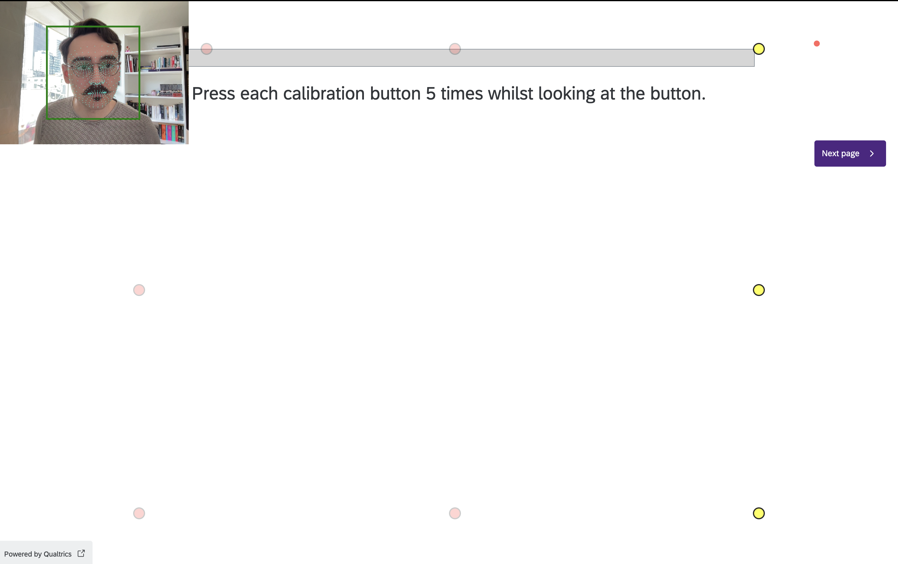
```
]

---

## Design — Hardware & Software

.pull-left[
- Webcam based eye-tracking:
  - WebGazer.js integrated into Qualtrics.

]
.pull-right[
```{r  fig.align="center", out.width="100%",include=TRUE}
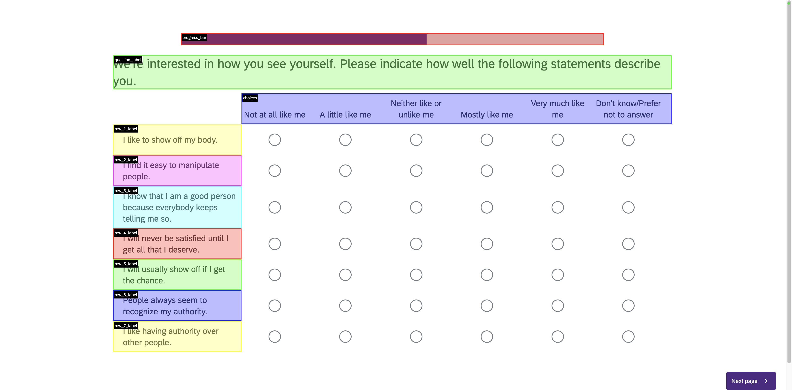
```
]

---

## Design — Hardware & Software

.pull-left[
- Webcam based eye-tracking:
  - WebGazer.js integrated into Qualtrics.
  - Advertised $\approx4°$ accuracy, translated into average error of 122px in practice.
  - Measure by Hutt et al. (2024):
      1. Global: How many points, how many areas of the screen visited, average distance of gazes from centroid.
      2. Local: How many gazes on AOIs of interest (question label, choices and progress bar).
  - Brought together via PCA -> GMM pipeline.
]
.pull-right[
```{r  fig.align="center", out.width="100%",include=TRUE}
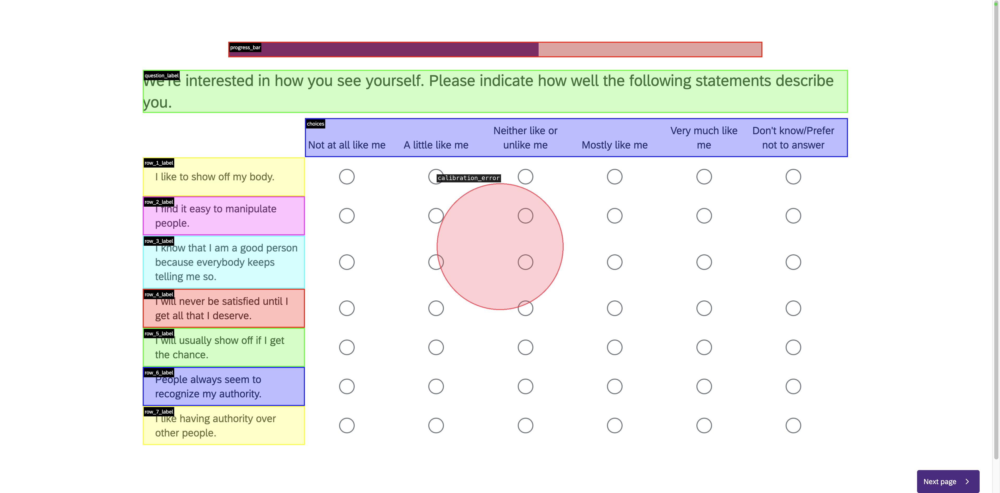
```
]

---

## Design — Hardware & Software

.pull-left[
- Webcam based eye-tracking:
  - WebGazer.js integrated into Qualtrics.
  - Advertised $\approx4°$ accuracy, translated into average error of 122px in practice.
- EDA & HRV via the Research ring from Biopac.
]
.pull-right[
```{r  fig.align="center", out.width="100%",include=TRUE}
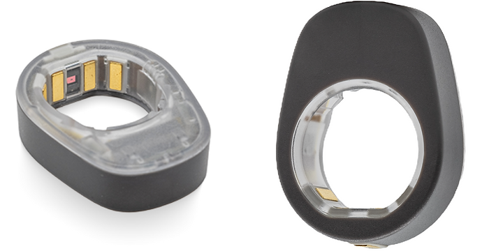
```
]

---

## Design — Hardware & Software

.pull-left[
- Webcam based eye-tracking:
  - WebGazer.js integrated into Qualtrics.
  - Advertised $\approx4°$ accuracy, translated into average error of 122px in practice.
- EDA & HRV via the Research ring from Biopac.
  - Configuration with electrode above right clavicle.
  - Allows for cleaner HRV signal.
]
.pull-right[
```{r  fig.align="center", out.width="100%",include=TRUE}
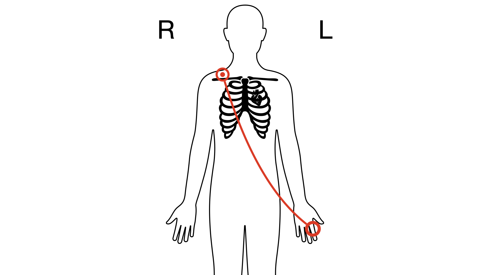
```
]
---

## Design — Hardware & Software

.pull-left[
- Webcam based eye-tracking:
  - WebGazer.js integrated into Qualtrics.
  - Advertised $\approx4°$ accuracy, translated into average error of 122px in practice.
- EDA & HRV via the Research ring from Biopac.
  - Configuration with electrode above right clavicle.
  - Allows for cleaner HRV signal.
- Final set-up.
]
.pull-right[
```{r  fig.align="center", out.width="70%",include=TRUE}
knitr::include_graphics("images/final_setup.png")
```
]

---

## Design — Data

- With available ressources, we are aiming at 300 respondents.
- Student sample via mass email recruitment.
- 10$ compensation.
- 107 participants to date.
- Collection started in May 2026.


---
layout: true

.footer[[Puzzle](#puzzle) [Concept](#concept) [Measures](#measures) [Design](#design) [**Results**](#results) [Conclusion](#conclusion) ]

---
name: results

## Results — Treatment Assignment

```{r  fig.align="center", out.width="90%",include=TRUE}
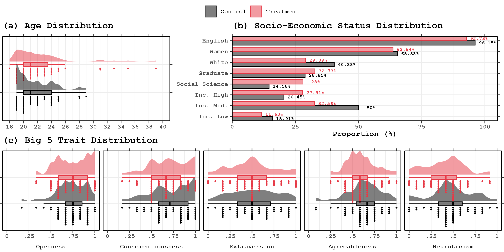
```

---

## Results — Across SUR

```{r  fig.align="center", out.width="90%",include=TRUE}
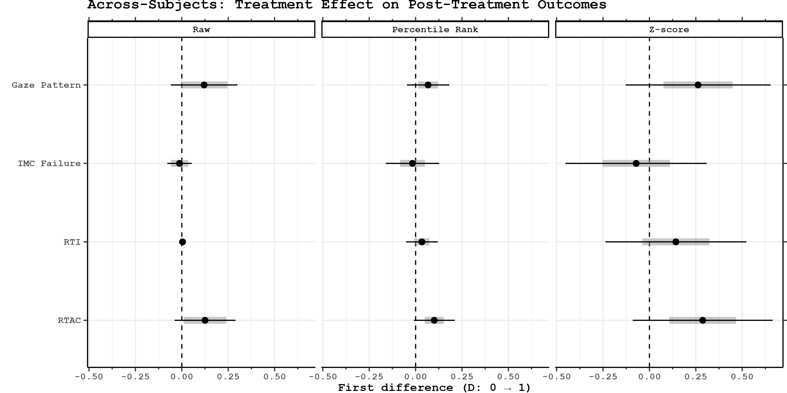
```

---

## Results — Across SUR

```{r  fig.align="center", out.width="90%",include=TRUE}
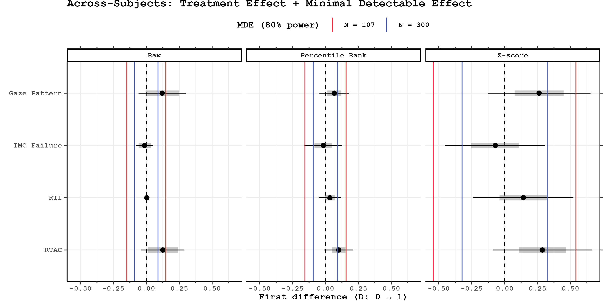
```

---

## Results — Compliance

```{r  fig.align="center", out.width="90%",include=TRUE}
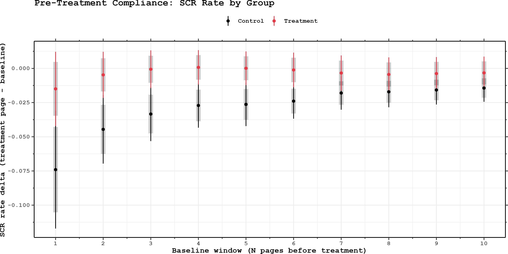
```

---

## Results — Compliance

```{r  fig.align="center", out.width="90%",include=TRUE}
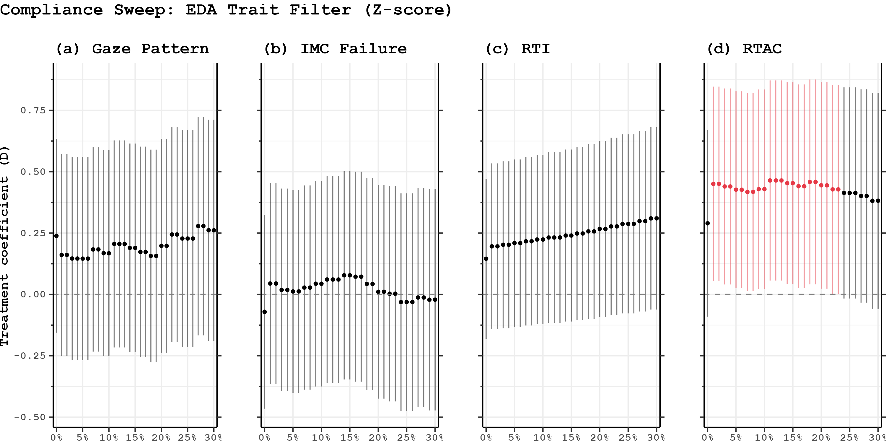
```

---

## Results — Within SUR

```{r  fig.align="center", out.width="90%",include=TRUE}
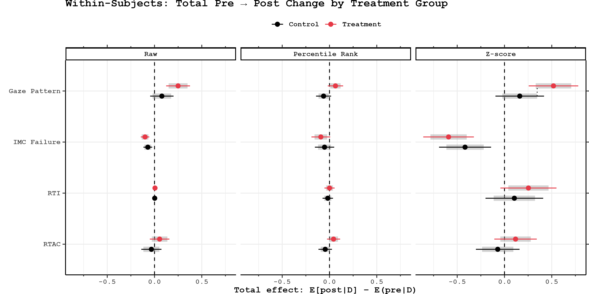
```

---

## Results — Within SUR

```{r  fig.align="center", out.width="90%",include=TRUE}
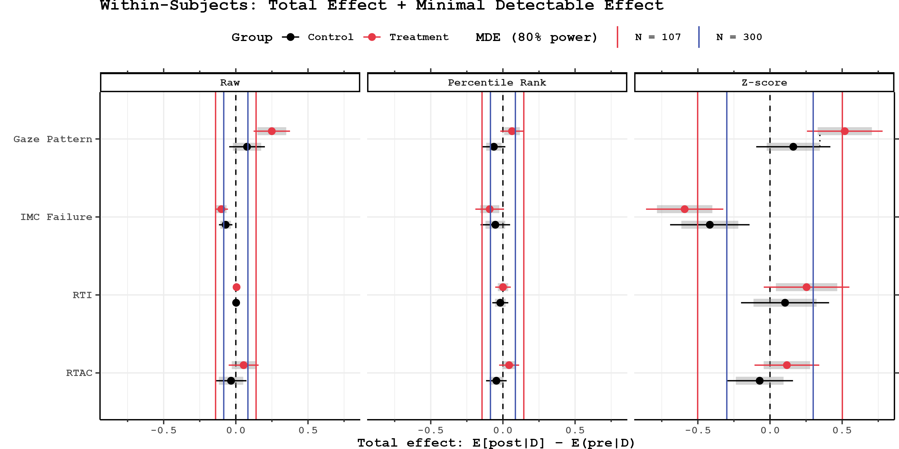
```

---

## Results — Measurement Agreement (Post)

```{r  fig.align="center", out.width="90%",include=TRUE}
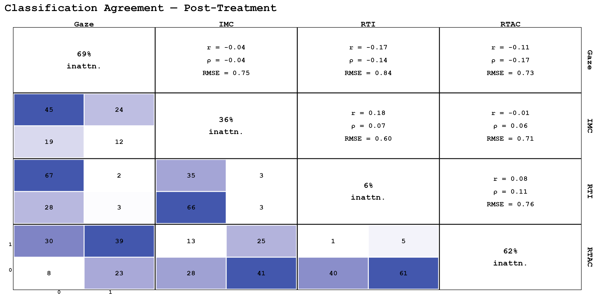
```

---

## Results — Exploratory Factor Analysis (Post)

```{r  fig.align="center", out.width="90%",include=TRUE}
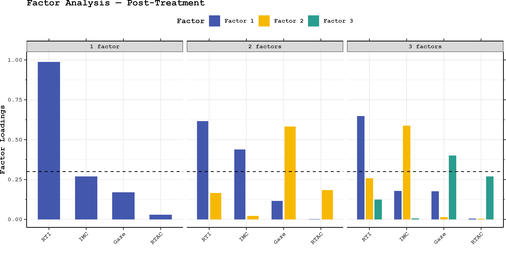
```

---
layout: true

.footer[[Puzzle](#puzzle) [Concept](#concept) [Measures](#measures) [Design](#design) [Results](#results) [**Conclusion**](#conclusion) ]

---

name: conclusion

## Conclusion — What have we learned? 

- Assuming our gaze measure is right:
  1. IMCs are a bad way to measure inattention.
  2. RTAC is the closest in terms of ATE estimation (Potentially overestimating it).
  3. Within analysis confuses this trend.
  4. None of the measures scale well together.

---


class: inverse,middle,center
<link rel="stylesheet" href="https://cdnjs.cloudflare.com/ajax/libs/font-awesome/7.0.0/css/all.min.css">
## Questions? Comments? Testimonies?

.pull-left[
### Contacts

<i class="fa-regular fa-envelope"></i> wpoirier@uwo.ca

<i class="fa-brands fa-bluesky"></i> @olsisblue.bsky.social

<i class="fa-brands fa-github"></i> WilliamPo1

Or visit my website! $\longmapsto$

]
.pull-right[
```{r  fig.align="center", out.width="70%"}

```
]

---

## Appendix — DVs Distribution

```{r  fig.align="center", out.width="90%",include=TRUE}
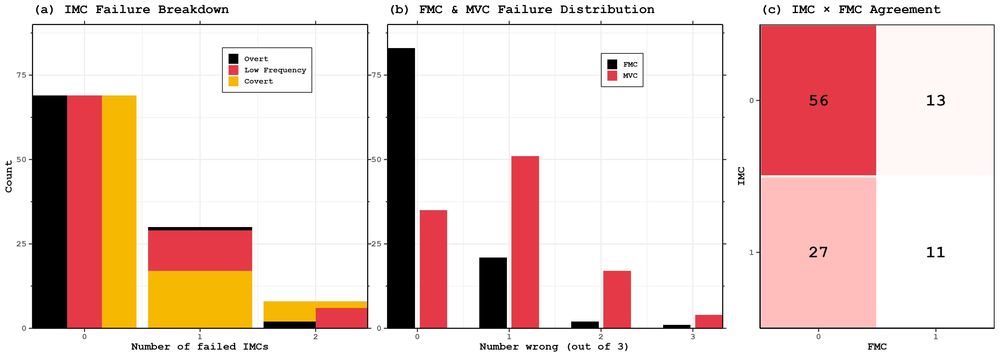
```

---

## Appendix — DVs Distribution

```{r  fig.align="center", out.width="90%",include=TRUE}
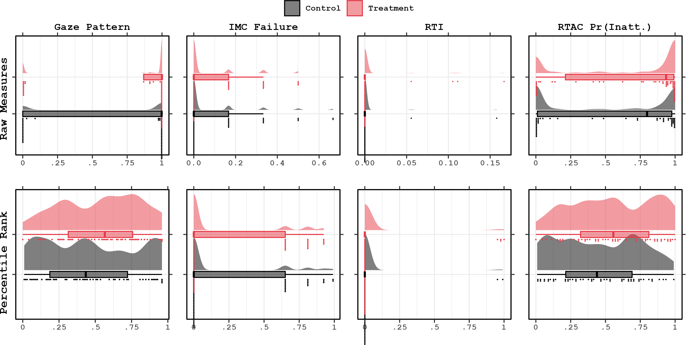
```


---

## Appendix — RTAC

```{r  fig.align="center", out.width="100%",include=TRUE}
magick::image_read_pdf("images/pictograms.pdf",pages=28)
```

---
## Appendix — RTAC

```{r  fig.align="center", out.width="100%",include=TRUE}
magick::image_read_pdf("images/pictograms.pdf",pages=29)
```

---

## Appendix — RTAC

```{r  fig.align="center", out.width="100%",include=TRUE}
magick::image_read_pdf("images/pictograms.pdf",pages=30)
```

- Principal component analysis (PCA) answer:
  - **What is the minimum amount of "dimensions" (variables) I need to explain the maximum amount of variance?**

---

## Appendix — RTAC

```{r  fig.align="center", out.width="100%",include=TRUE}
magick::image_read_pdf("images/pictograms.pdf",pages=31)
```

- Gaussian mixture models (GMM) answer:
  - **To which of $k$ distribution is $i$ more likely to come from?**
- Assume that each observation comes from one of $k$ multivariate-normal distribution.
- Expectation maximization (EM) answer:
  - **How many distributions are there?**
--

- `r Citet(bib, c("read2022racing"))` impose 3 clusters.
