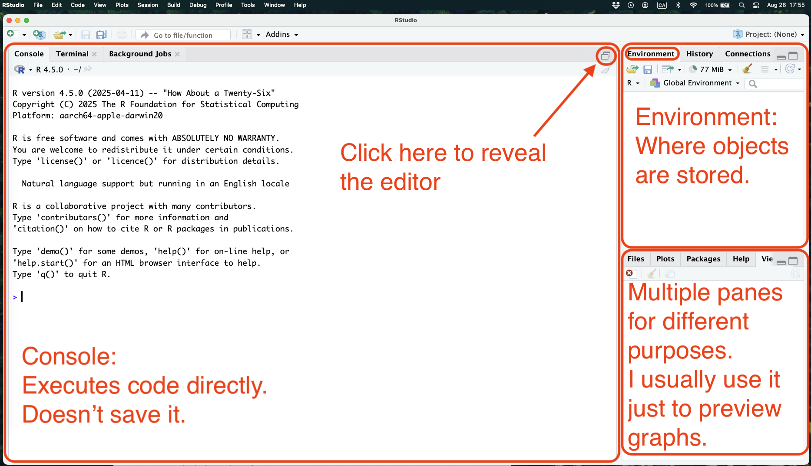
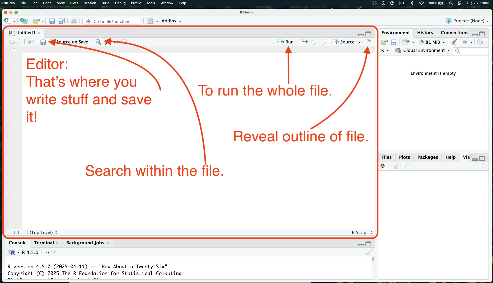
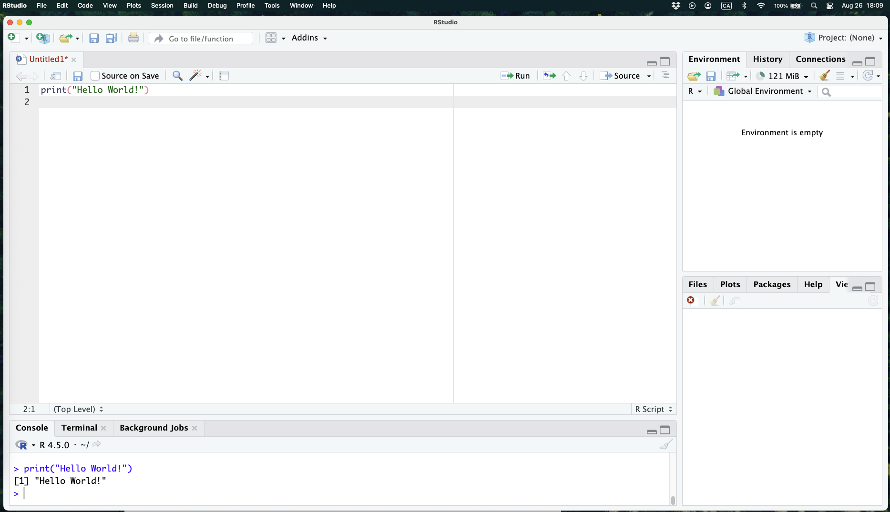

<style>
.list-group-item.active, .list-group-item.active:hover, .list-group-item.active:focus {
    z-index: 2;
    color: #ffffff;
    background-color: #4F2683;
    border-color: #4F2683;
}

a {
    color: #4F2683;
    text-decoration: none;
}
</style>

```{r setup, include=FALSE}
knitr::opts_chunk$set(echo = TRUE)
```

## 0. Bonjour/Hi!

- Office: SSC 7323 
- Email: wpoirier@uwo.ca
- Contact policy:
  - Open door = please come in, I'll be happy to help!
  - Closed door = I'm working or in a meeting! Knock if important and urgent!

## 1. R and RStudio

### 1.1 Installation

|Software  | PC | MAC |
|:---------|:---|:----|
| R        |[Here](https://cran.r-project.org/bin/windows/base/)|[There](https://cran.r-project.org/bin/macosx/)     |
| RStudio  |[Here](https://posit.co/download/rstudio-desktop/)|[There](https://posit.co/download/rstudio-desktop/)|

### 1.2 Coding languages VS IDE

- R is a **language**, like Spanish, Japanese, or French.
- RStudio is an integrated development environments (**IDE**), like paper or a word document. 
- Hence, you write a language (R) on paper (RStudio).

### 1.3 RStudio -- A Tour

1. When you open the app.
```{r  fig.align="center", out.width="100%",include=TRUE, echo=F}

```

2. Once you open the editor
```{r  fig.align="center", out.width="100%",include=TRUE, echo=F}

```

3. Running your first line of code
```{r  fig.align="center", out.width="100%",include=TRUE, echo=F}

```

- To run a line of code:
  1. Put cursor anywhere on line and press `cmd + enter`/`ctrl + enter`.
  2. Select line or multiple lines and press `cmd + enter`/`ctrl + enter`.
  2. Select line or multiple lines and click on `Run` button at top of screen.

### 1.4 Managing your directories

- **Directory**: a file system.
- **Working directory**: the folder your computer is currently pointing to.

You need to tell your computer where to look at in order for it to find the documents, datasets, or files you want to use. 

So **PLEASE**, make sure to organize your files in some way. Otherwise you are going to get lost.

- Shortcut, use when folder/file selected via the Finder (MAC) or File Explorer (PC):
  - Mac: `option + command + c`
  - PC: `shift + right click > Copy as Path`

```{r, eval=FALSE, echo=TRUE}
# Option 1: where you want
setwd("/Users/williampoirier/Dropbox/Website/files/uwo/R_Workshop_2025/rcode") # Mac
setwd("C:\Users\williampoirier\Dropbox\Website\files\uwo\R_Workshop_2025\rcode") # PC

# Option 2: where the R file is saved
setwd(dirname(rstudioapi::getSourceEditorContext()$path))
```


## 2. RMarkdown

### 2.1 What? 

- **Markup language**: a text-encoding system tailored towards the format and structure of a document. Some popular ones:
  - HTML for websites,
  - LaTeX for pdf,
  - Markdown for websites, pdf, and Word.

### 2.3 Why **R**-Markdown?

- RMarkdown is an extension of Markdown.
- Allow the integration of `code chunks`.
- Very useful for short technical reports, like the homework you'll be asked to produce.
- **This tutorial was done via an RMarkdown file!**

### 2.4 How?

First, make sure it is installed by running the following line in your console. You won't have to do this again.

```{r, echo=T, eval=F}
install.packages("rmarkdown")
```

- As with R files, *Files > New File > R Markdown...*
- Basic formatting:
  - Another bullet point.
  - Headers from largest to smallest: \#, \#\#, \#\#\#, etc.
  - Bullet points and numbered list: indentation and either \- or a number.
  - Italic: \**italic stuff*\*.
  - Bold: \*\***bold stuff**\*\*.
  - Comments: \<\!\-\- a comment \-\-\>
  - Write math: $\frac{\sum_{i=1}^{n}x_i}{n}$

## 3. Writing code in RMD files

- Code must be place within code chuncks.
- Initiate them by writing delimiters ```` ```{r}```` and ```` ``` ````.

- Or use a shortcut to initiate code chuncks:
  - PC: `Ctrl + Alt + i`
  - MAC: `Cmd + Option + i`

### 3.1 Installing and Loading Packages
- `R` Ships with many functions. But sometimes we need other functions.
- We `install` and `load` packages to add functions to our library.
- Packages are boxes filled with functions. 
- `install.packages("a package")` installs packages.
- `library(a package)` loads (or makes available) the functions from a specific package.

```{r, eval=F}
# Installing packages (you do this only once)
install.packages("tidyverse")
install.packages("rio")
install.packages("devtools")
devtools::install_github("https://github.com/davidaarmstrong/damisc.git")
install.packages("knitr")

# Loading packages
library(tidyverse)
library(rio)
library(devtools)
library(DAMisc)
library(knitr)
```

```{r, echo=F, message=F, warning=F}
library(tidyverse)
library(rio)
library(devtools)
library(DAMisc)
library(knitr)
```


### 3.2 Basic Operations

Try running those operations yourself!

```{r,eval=F}
# Assignment (putting what's on the right in the box that's on the left.)
A <- 1
B <- "1"
C <- TRUE
D <- 3L

# Add
A+A 
# [1] 2  (This is me writing what the console is going to output.)

# Substract
A-B
# Error in A - B : non-numeric argument to binary operator
# Why is this not working???

# Multiply
A*C
# [1] 1
# Why does this one work?

# Divide
A/A
# [1] 1

# Power
D^D
# [1] 27

# Square root
sqrt(D^D)
# [1] 5.196152

# Modulo
12%%5
# [1] 2
```

### 3.3 Data types

There are 4 main data types in R:

1. **Numeric**: The real numbers (-1,-.5,0,.5,1,3.141593...)
2. **Character**: Text
3. **Logical**: `TRUE` (1) or `FALSE` (0) -- abbreviate using `T` and `F`
4. **Integer**: ..., -3, -2, -1, 0, 1, 2, 3, ...

```{r, eval=F}
# Take our original objects, class() will tell you what type of object they are.

class(A)
# [1] "numeric"

class(B)
# [1] "character"
# Note here that a number like 1 can be made to be a character with ""
# That's why A+B doesn't work, you can't add numbers and letters together.

class(C)
# [1] "logical"

class(D)
# [1] "integer"
```

### 3.4 Comparison and Logic

```{r,eval=F}
# New objects
A <- 3
B <- 8
C <- 2

# Comparisons
A == B
# [1] FALSE
A != B
# [1] TRUE
A > B
# [1] FALSE
A < B
# [1] TRUE
A >= B
# [1] FALSE
A <= B
# [1] FALSE

# Logic
# The AND operator &
A > C & A < B
# [1] TRUE

# The OR operator |
A < C | A < B
# [1] TRUE

# Is A in the following?
A %in% 1:10
# [1] TRUE

# Not!
A > B
# [1] FALSE
!A > B
# [1] TRUE
```

### 3.5 Data structures

```{r}
# Vector (One dimension, one data type)
myVector <- c(1,2,3)
myVector

# Matrix (Two dimensions, one data type)
myMatrix <- matrix(seq(1:16),nrow=4,ncol=4)
myMatrix

# Dataframe (Two dimensions, one data type per column)
myDataFrame <- data.frame(Fruits=c("Apple","Banana","Cherry","Kiwi"),
                          Scores=c(7,7,9,3),
                          MakesAGoodPie=c(T,T,T,F))
myDataFrame

# Lists (A bunch of stuff)
# (Parentheses arround assigment prints it uppon execution)
(Stuff <- list(myVector,myMatrix,myDataFrame)) 
```

### 3.6 Indexing

```{r, eval=T}
# Use Square Brakets []
# For a vector
myVector <- c("A","B","C")

# Get the first element of the vector
myVector[1]

# Get the first element from the end of the vector
myVector[-1]

# Get elements 1 and 3
myVector[c(1,3)]

# Get elements 1 through 3 (1,2,3)
myVector[1:3]

# Same idea for matrices and dataframes, but they have two dimensions!
# So you need two things, the row and the column number [row,column]
# Take the following dataframe
(myDataFrame <- data.frame(Fruits=c("Apple","Banana","Cherry","Kiwi"),
                          Scores=c(7,7,9,3),
                          MakesAGoodPie=c(T,T,T,F)))


# Extract the value in the cell on the first row and third column
myDataFrame[1,3]

# Extract the first row, but with only columns from the second to last.
myDataFrame[1,2:ncol(myDataFrame)]

# Extract rows from the first till the third, and the first and second column.
myDataFrame[1:3,1:2]

# $ used to extract a column
myDataFrame$Scores

# Indexing can be used to create subsets
myDataFrame[myDataFrame$MakesAGoodPie==T,]
```

### 3.7 Usefull functions

```{r, eval=T}
# Dimensions of objects
# How many elements in the vector?
length(myVector)

# How many columns in a dataframe?
length(myDataFrame)
ncol(myDataFrame)

# How many rows in a dataframe?
nrow(myDataFrame)

# How many rows and columns? 
dim(myDataFrame)

# What's going on in the data

# First 6 rows
head(myDataFrame)
# Last 6 rows
tail(myDataFrame)
# Can use the n argument to set the number of rows you want, here it's 2
tail(myDataFrame,n = 2)

# Gives you statistics for each variable in your dataframe.
summary(myDataFrame)

# Frequency of each value contained in a variable
table(myDataFrame$MakesAGoodPie)

# A basic histogram
hist(myDataFrame$Scores)
```

### 3.8 Why do all this? (Showing off)

```{r}
## Generating data
### X from a normal distribution
X <- rnorm(1000,mean=0,sd=1) 

### W some group
W <- sample(c("Red","Blue","Orange"),size=1000,replace = T,prob=c(0.4,0.4,0.1))

### W_num the groups as numbers
W_num <- ifelse(W %in% c("Red","Blue"),0.3,-0.5)

### Y depends on X, W and some normally distributed error.
Y <- 0.6*X+W_num+X*W_num+rnorm(1000,mean=0,sd=1)

### Putting it all together
dat <- data.frame(id=1:100,X,Y,W)

## Vizualization with ggplot
ggplot(dat, aes(x=X,y=Y,color=W,fill=W))+
  geom_point(alpha=0.3)+
  geom_smooth(method="lm")+
  scale_color_manual(values=c("blue","orange","red"))+
  scale_fill_manual(values=c("blue","orange","red"))+
  scale_x_continuous("X title",breaks = seq(-5,5,1))+
  scale_y_continuous("Y title",breaks = seq(-5,5,1))+
  theme_minimal()+
  theme(legend.position = "top")
```


## 4. Exercises

1. Install and Load the `carData` package.
```{r}

```

2. How many columns and rows does the `TitanicSurvival` dataset from `carData` have?
```{r}

```

3. What is the mean age of known passenger of the titanic? (Hint: use the `mean()` function and one of its arguments to ignore the NAs.)
```{r}

```

4. Create a graph of the distribution of age of the titanic passengers. (Hint: use the `hist()` function.)
```{r}

```


## 5. What/Who can help me?

- What:
  - Check out the W3 school for their R tutorials [here](https://www.w3schools.com/R/).
  - Check out [this](https://rmarkdown.rstudio.com/authoring_quick_tour.html#Overview) ressource for RMarkdown.
  - Check out [these](https://guides.nyu.edu/c.php?g=277138&p=1847146) pages for any stats and/or data wrangling problems.
  - Stackoverflow
  - GPT-4 -> _would not be my first choice_.
  - **_Google is your best friend!_**

- Who:
  - Me
  - Any upper-year PhD student.
  
#### 5.1 An algorithm on how to solve your problems

0. You've notices that you have been stuck on a problem for a good 10-20 min.
1. STOP! Get up, take a walk.
2. Take a piece of **_paper_**.
3. Write down the **end goal**, what the thing you're looking at should look like.
  - Draw pictures/write with words/write math/whatever -> you have to know what you want!
4. Write down the state the data/analysis is in.
  - Draw pictures/write with words/write math/whatever -> you have to know where you are!
  - At this point you may notice you are not actually where you are supposed to be.
    - Go back a step in the code, and start at 3 again. Do this until you are at a point where everything is in order.
    - This might take you further up the code than you thought, don't give up!
5. Now you have a point A and a point B. You just need to figure out how to get to B. Easy!
  - Sometimes doing 3 and 4 will make the solution readily apparent! Lucky you!
  - If it is not the case, you now have A and B clear enough that searching for a solution on Google or GPT-4 should give good results. 
6. If after all these steps, you still can't find a solution, come see me!

#### 5.2 An algorithm on how to not have problems in the first place

0. You want to do something in R.
1. STOP! Take a piece of **_paper_**!!!
2. Write down the **end goal**, what you are trying to achieve.
  - Draw pictures/write with words/write math/whatever -> you have to know what you want!
3. Write down the step you'll have to take to get there.
  - From opening the data to the end graph.
  - You now have a guide to what needs doing, you now just have to worry about R syntax.
4. Write R code for each step, making sure to comment along the way and check that **_every line works_** before moving to the next step.
  - Future you is gonna be thankful that present you (or future past you) wrote down what was going on in their head at the time. 


