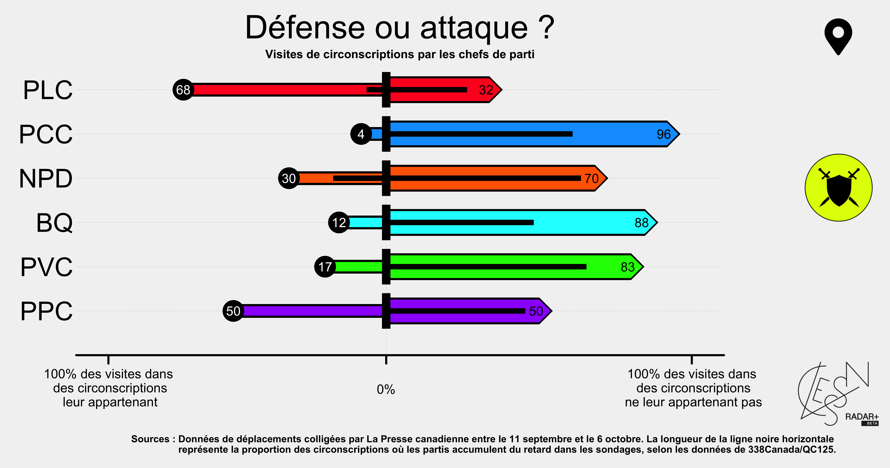

<style>
.list-group-item.active, .list-group-item.active:hover, .list-group-item.active:focus {
    z-index: 2;
    color: #ffffff;
    background-color: #4F2683;
    border-color: #4F2683;
}

a {
    color: #4F2683;
    text-decoration: none;
}
</style>

```{r setup, include=FALSE}
knitr::opts_chunk$set(echo = TRUE)
```

## 00. What we'll be doing:

0. Review;
1. Summary Statistics;
2. ggplot2.

## 0. Review

- `R` is a language `RStudio` is where we write it.
- Directories are how your computer organizes files.
- Change the working directory using `setwd()`
- Data is `R` has a few basic form: 1) Vectors, 2) Matrices, 3) Data Frames, 4) Lists.
- Data in `R` has a few basic classes: 1) Numeric; 2) Integer; 3) Character; 4) Logical; 5) Factor.
- The pipe `|>` is used between operations to take the output of what comes before and use it as the input of what comes next.
- Indexing (extracting a specific element of an object) can be done using:
  - `[i]` with vectors (one dimension);
  - `[i,j]` with matrices or data frames (two dimensions, row number i and column number j);
  - `mydf$aVariableName` in data frames, extracts the column of the corresponding name.
- You can change the structure of you data frame using different functions from `dplyr`:
  - `select()`: which columns do you want;
  - `rename()`: change name of a column; 
  - `mutate()`: add a new variable;
  - `filter()`: which rows do you want (based on a condition).
  

### 0.1 Last week's exercises

1. What is the `fertility` rate and `ppgdp` of the 4 country with highest female life expectancy (`lifeExpF`)? Make sure you are using no country where `region` is missing.
```{r}
library(tidyverse)
data(UN, package="carData")
UN <- as_tibble(UN,rownames="country")

UN |> 
  drop_na(region) |> 
  arrange(-lifeExpF) |> 
  select(country,fertility,ppgdp) |> 
  slice_head(n=4)
  
```

2. What is the `fertility` rate and `ppgdp` of the 2 most urbanised country (`pctUrban`) for each `region`? Make sure you are using no country where `region` is missing.
```{r}
UN |> 
  drop_na(region) |> 
  group_by(region) |> 
  arrange(-pctUrban) |> 
  select(country,fertility,ppgdp) |> 
  slice_head(n=2)
```

3. Create a variable called `fertility1000`, the result of this operation `fertility*1000-infantMortality`. What is the highest country on `fertility1000` in each region? Make sure to use only countries where both `fertility` and `infantMortality` are known.
```{r}
UN |> 
  drop_na(fertility,infantMortality) |> 
  mutate(fertility1000=fertility*1000-infantMortality) |> 
  group_by(region) |> 
  arrange(-fertility1000) |> 
  slice_head(n=1)
```

## 1. Summary Statistics

There's a bunch of them:

| Statistic | R function | Formula |
|:---------:|:----------:|:-------:|
| Mean | `mean()` | $\bar Y=\frac{\sum_{i=1}^n Y_i}{n}$|
| Variance | `var()`|$sd^2=\frac{\sum_{i=1}^n(Y_i-\bar Y)^2}{n-1}$|
| Standard Deviation | `sd()` | $sd=\sqrt\frac{\sum_{i=1}^n(Y_i-\bar Y)^2}{n-1}$|
| Median | `median()` | Middle value ($Q_2$) |
| Interquartile Range | `IQR()` | $iqr=Q_3-Q_1$|
| Minimum | `min()` | |
| Maximum | `max()` | |

Usefull functions:

- `summary(myVector)` will give you most of what's above.
- `DAMisc::sumStats(myVector)` will give you all of what's above in a formatted table.

### 1.1 Examples

1. What is the average `price` of diamonds in the dataset `diamonds` that ships with the tidyverse?
```{r}
#### Initialization ####
#install.packages("devtools")
#devtools::install_github("https://github.com/davidaarmstrong/damisc.git")
library(DAMisc)

mean(diamonds$price)
```

2. What is the standard deviation of the `carat` of the diamonds?

```{r}
sd(diamonds$carat)
```

3. What about the variance?
```{r}
var(diamonds$carat)

# You could also do this instead
sd(diamonds$carat)^2
```

4. What if you want all of the statistics for `clarity`?
```{r}
class(diamonds$clarity)
table(diamonds$clarity)

# Being a factor, summary will not be much help
summary(diamonds$clarity)

# Except if you do this
summary(as.numeric(diamonds$clarity))

# But sumStats does better
sumStats(diamonds, "clarity")
```

5. What is the mean and standard deviation of the price of diamonds with a clarity of VVS2 and carat between 2.0 and 2.1?
```{r}

```


## 2. ggplot2

- ggplot2 is a package from the tidyverse suit, written as part of Hadley Wickham PhD dissertation.
- gg stands for _Grammar of Graphics_.
- It works in **layers**.
- Best ressource [here](https://ggplot2.tidyverse.org/index.html).

General Setup: 
```{r}
library(tidyverse)

ggplot(diamonds,                                # 1. Data;
       aes(x=cut))+                             # 2. Axis variables;
  geom_bar()+                                   # 3. What you want to draw;
  scale_x_discrete("\nDiamond Quality")+        # 4. Specify x axis text;
  scale_y_continuous("Frequency\n",             # 5. Specify y axis text;
                     breaks=seq(0,20000,2500))+ #
  theme_minimal()+                             # 6. General Style;
  theme(panel.grid.minor = element_blank())     # 7. Specific Style.
```

With these notions, you can be quite creative:



### 2.1 Examples

1. Using the `diamonds` dataset, create a bar plot of the number of observations for each diamond quality (`cut`). Subset the data to only diamonds above the mean `price` from the dataset.

```{r}
diamonds %>% 
  filter(price > mean(diamonds$price)) %>% 
  ggplot()+
  geom_bar(aes(x=cut))+
  xlab("\nQuality")+
  ylab("Frequency\n")+
  theme_light()
```

2. Reorder the above from highest to lowest frequency.
```{r}
# Option 1
diamonds %>% 
  filter(price > mean(diamonds$price)) %>% 
  mutate(cut_rev=factor(cut,
                        levels=c("Ideal","Premium","Very Good","Good","Fair"))) %>% 
  ggplot()+
  geom_bar(aes(x=cut_rev))+
  xlab("\nQuality")+
  ylab("Frequency\n")+
  theme_light()

# Option 2
diamonds %>% 
  filter(price > mean(diamonds$price)) %>% 
  mutate(ones = 1) %>% 
  ggplot(aes(x=reorder(cut,ones,sum,decreasing = T)))+
  geom_bar()+
  xlab("\nQuality")+
  ylab("Frequency\n")+
  theme_light()

# Option 3
diamonds %>% 
  filter(price > mean(diamonds$price)) %>% 
  group_by(cut) %>% 
  summarise(freq=n()) %>% 
  ggplot(aes(x=reorder(cut,freq,decreasing = T),y=freq)) +
  geom_col()+
  xlab("\nQuality")+
  ylab("Frequency\n")+
  theme_light()
```

3. Plot a histogram of `price` per `cut` of diamonds.
```{r}
ggplot(diamonds,aes(x=price))+
  geom_histogram()+
  facet_wrap(~cut)+
  xlab("\nPrice in $")+
  ylab("Frequency\n")+
  theme_minimal()
```

4. Arrange the facets above in a single row in order of their respective medians. Make sure the x axis is readable.

```{r}
ggplot(diamonds,aes(x=price))+
  geom_histogram()+
  facet_wrap(~reorder(cut,price,median),nrow=1)+
  xlab("\nPrice in $")+
  ylab("Frequency\n")+
  theme_minimal()+
  theme(axis.text.x = element_text(angle=45,hjust=1))
```

5. Plot the average `price` of diamonds per `carat` as they relate to `clarity`

```{r}
diamonds %>% 
  group_by(clarity,carat) %>% 
  summarise(averagePrice=mean(price)) %>% 
  ggplot(aes(x=carat,y=averagePrice,color=clarity))+
  geom_point()+
  scale_color_brewer("Diamond Clarity",palette = "RdBu")+
  xlab("\nCarat")+
  ylab("Price in $\n")+
  theme_minimal()+
  theme(legend.position = "top")+
  guides(colour = guide_legend(nrow = 1))
```

## 3. Try it yourself

From the `carData::Salaries` data set of 2008-2009 nine-month academic salary for Assistant Professors, Associate Professors and Professors in a college in the U.S., create a graph that presents:

  1. The mean salary per years since PhD with regards to sex per discipline.
  2. Make sure that the axis, facets and legend are properly named. 
  3. Rescale the y axis to have salaries in increments of 25000 and the x axis to have years in increments of 5.
  4. Make sure the legend is on top of the graph.

```{r}

```

