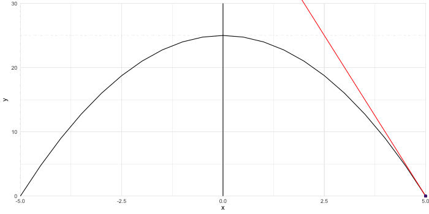

<style>
.list-group-item.active, .list-group-item.active:hover, .list-group-item.active:focus {
    z-index: 2;
    color: #ffffff;
    background-color: #4F2683;
    border-color: #4F2683;
}

a {
    color: #4F2683;
    text-decoration: none;
}
</style>

```{r setup, include=FALSE}
knitr::opts_chunk$set(echo = TRUE,message = FALSE,warning = FALSE)
```

## 0. What we'll be doing

1. Integration Exercises
2. Using LaTeX syntax for math in RMD
3. Differentials and Integrals 101
4. If we have time: Checking your work using simulations

## 1. Exercises

#### 1.1 Cleaning
I need your help with the attached V-DEM dataset. I've got some of the way there, but I don't know how to code the following variables:

| Var Name | Goal | New Name |
|:---------|:-------------------------|:---------:|
| exec_selbylegis,exec_responsible | 1 variable with 4 categories: 1) Presidential; 2) Parliamentary; 3) Hybrid; 4) Neither| system |
| e_v2x_api_5C | 1 variable with 5 categories: 1) Closed Autocratic; 2) Autocratic; 3) Ambivalent; 4) Minimally Democratic; 5) Democratic  | dem_poly_cat |
| e_regionpol_6C | 1 variable with 6 categories: 1) Eastern Europe and Central Asia; 2) Latin America and Caribbean; 3) Middle East and North Africa; 4) Sub-Saharan Africa; 5) Western Europe and North America + Australia and New Zealand; 6) Asia and Pacific | polregion |
| v2casoe_0 through 6 | 1 variable with 7 categories: 1) Not possible; 2) None; 3) Natural Disaster; 4) Terrorist Attack; 5) Armed Conflict; 6) Protests; 7) Other | state_emergency_cat |
| v2cademmob_ord | 1 variable with 5 categories: 1) None; 2) Several small; 3) Many small; 4) Several large; 5) Many large |mob_for_demo_cat|
| e_civil_war,e_miinteco, <br> e_miinterc,e_pt_coup_attempts, <br> e_pt_coup | 1 (binary) variable with 2 categories: 1) a conflict occured, 2) a conflicted did not occur | conflict|

```{r}
## Loading data
library(tidyverse)
library(rio)
setwd(dirname(rstudioapi::getActiveDocumentContext()$path))
vdem <- import("V-Dem-CY-FullOther-v14_rds/V-Dem-CY-Full+Others-v14.rds") 

## Coding variables
c <- vdem %>% 
  select(country_name,country_id,country_text_id,year,
         v2x_polyarchy,
         v2pepwrses_ord,v2pepwrsoc_ord,v2pepwrgen_ord,v2pepwrort_ord,
         e_gdppc,e_total_oil_income_pc,e_peedgini,
         v2ex_hogw,v2ex_hosw,v2expathhg,v2expathhs,v2exaphogp,v2exaphos,
         v2exhoshog,v2exremhog_ord,v2exremhsp_ord,
         e_v2x_api_5C,
         e_regionpol_6C,
         starts_with("v2casoe_"),
         v2cademmob_ord,
         e_civil_war,e_miinteco,e_miinterc,e_pt_coup_attempts,e_pt_coup) |>
  rename(pwr_ses=v2pepwrses_ord,
         pwr_grp=v2pepwrsoc_ord,
         pwr_gender=v2pepwrgen_ord,
         pwr_sxorient=v2pepwrort_ord) |> 
  mutate(exec_selbylegis=case_when(v2ex_hogw>v2ex_hosw & v2expathhg==7~1, #legis
                                   v2ex_hogw>v2ex_hosw & v2expathhg%in%c(1,6,9) & v2exaphogp==1~1, #hs with legis agreement
                                   v2ex_hogw>v2ex_hosw & v2expathhg==8~0, #direct vote
                                   v2ex_hogw<v2ex_hosw & v2expathhs==6~1, #legis
                                   v2ex_hogw<v2ex_hosw & v2expathhs%in%c(1,5,8) & v2exaphos==1~1,#hs with legis agreement
                                   v2ex_hogw<v2ex_hosw & v2expathhs==7~0, #direct vote
                                   v2ex_hogw==v2ex_hosw & v2exhoshog==1 & v2expathhs==6~1,
                                   v2ex_hogw==v2ex_hosw & v2exhoshog==1 & v2expathhs==7~0,
                                   v2ex_hogw==v2ex_hosw & v2expathhg==7~1, #legis
                                   v2ex_hogw==v2ex_hosw & v2expathhg%in%c(1,6,9) & v2exaphogp==1~1,
                                   v2ex_hogw==v2ex_hosw & v2expathhg==8~0, #direct vote
                                   TRUE~99),
         exec_responsible=ifelse(v2ex_hogw>v2ex_hosw,
                                 ifelse(v2exremhog_ord%in%c(2,3),1,0),
                                 ifelse(v2exremhsp_ord%in%c(2,3),1,0))) |>
  mutate(system=case_when(exec_selbylegis==1 & exec_responsible==1 ~ "Parliamentary",
                          exec_selbylegis==0 & exec_responsible==0 ~ "Presidential",
                          (exec_selbylegis==1 & exec_responsible==0) |
                          (exec_selbylegis==0 & exec_responsible==1) ~ "Hybrid",
                          TRUE ~ "Neither"),
         dem_poly_cat=case_when(e_v2x_api_5C==0.00~"Closed Autocratic",
                                e_v2x_api_5C==0.25~"Autocratic",
                                e_v2x_api_5C==0.50~"Ambivalent",
                                e_v2x_api_5C==0.75~"Minimally Democratic",
                                e_v2x_api_5C==1.00~"Democratic"),
         polregion=case_when(e_regionpol_6C==1~"Eastern Europe and Central Asia",
                             e_regionpol_6C==2~"Latin America and Caribbean",
                             e_regionpol_6C==3~"Middle East and North Africa",
                             e_regionpol_6C==4~"Sub-Saharan Africa",
                             e_regionpol_6C==5~"Western Europe and North America + Australia and New Zealand",
                             e_regionpol_6C==6~"Asia and Pacific"),
         western=ifelse(polregion==5,1,0),
         state_emergency_cat=case_when(v2casoe_0>0.5~"Not possible",
                                       v2casoe_1>0.5~"None",
                                       v2casoe_2>0.5~"Natural Disaster",
                                       v2casoe_3>0.5~"Terrorist Attack",
                                       v2casoe_4>0.5~"Armed Conflict",
                                       v2casoe_5>0.5~"Protests",
                                       v2casoe_6>0.5~"Other"),
         mob_for_demo_cat=case_when(v2cademmob_ord==0~"None",
                                    v2cademmob_ord==1~"Several small",
                                    v2cademmob_ord==2~"Many small",
                                    v2cademmob_ord==3~"Several large",
                                    v2cademmob_ord==4~"Many large"),
         conflict=ifelse(e_civil_war!=0 |
                         e_miinteco!=0 |
                         e_miinterc!=0 |
                         e_pt_coup_attempts!=0 |
                         e_pt_coup!=0,1,0))


```

Now that we have all the variables we want, let's look at some relationships:

#### 1.2  Show the mean polyarchy score (`v2x_polyarchy`) per year for each `polregion`.

```{r, fig.width=10}
gdat <- c |>
  group_by(year,polregion)|>
  summarise(mean=mean(v2x_polyarchy,na.rm=T))
ggplot(gdat,aes(x=year,y=mean,color=polregion))+
  geom_point()+
  geom_line()+
  ylab("Average Polyarchy Score\n")+
  theme_minimal()+
  theme(legend.position = "top",
        legend.title = element_blank(),
        axis.title.x=element_blank())
```

#### 1.3 Create a boxplot representing the distribution of the number of yearly conflicts (`conflict`) per `system`.

```{r,fig.width=10}
gdat <- c |>
  group_by(year,system)|>
  summarise(conflict=sum(conflict,na.rm=T)) |>
  DAMisc::sumStats("conflict",byvar = "system")
ggplot(gdat,aes(x=system))+
  geom_boxplot(aes(ymin=min,lower=q25,middle=q50,upper=q75,ymax=max),stat = "identity")+
  theme_minimal()+
  theme(axis.title.x = element_blank())
```

#### 1.4 What is the average power distribution across the four included in the data (variables begining with "pwr_") for each country of Western Europe, North America, Australia and New Zealand since 1950? Show the averages using a plot.

```{r,fig.width=10}
c |> 
  filter(polregion=="Western Europe and North America + Australia and New Zealand" &
         year>1950) |>
  mutate(across(starts_with("pwr_"),~4-.x))|>
  pivot_longer(starts_with("pwr_"),names_to = "type",names_pattern = "pwr_(.*)",values_to = "pwr") |>
  mutate(type=factor(type,
                     levels=c("sxorient","gender","ses","grp"),
                     labels=c("Sexual Orient. (Heterosexual)","Gender (Men)","SES (Wealthy)","Social Group")))|>
  group_by(type,country_name)|>
  summarise(mean=mean(pwr)) |>
  ggplot(aes(x=country_name,y=mean,color=type))+
  geom_point()+
  coord_flip(ylim=c(0,4))+
  scale_y_continuous("\nAverage Power Distribution Since 1950",
                     breaks = seq(0,4,1),
                     labels = c("Equal","Some","Strong","Dominant","Exclusive"))+
  theme_minimal() +
  theme(legend.position = "top",
        legend.title = element_blank(),
        axis.title.y = element_blank())

```

## 2. Using LaTeX syntax for math in RMD

- You can write nicely formatted equations in RMD using LaTeX syntax. 
- To write inline, use \$ your equation \$.
- To write as a separate paragraph, use \$ \$ your equation \$ \$

| Symbol | LaTeX code |
|:-------|:-----------|
| $+$    | \$\+\$     |
| $-$    | \$\-\$     |
| $\times$ | \$\\times$     |
| $\frac{A}{B}$    | \$\\frac\{A\}\{B\}$     |
| $\sum_{i=1}^N$    | \$\\sum\_\{i=1\}\^N$     |
| $P(A\cup B)$ | \$P(A\\cup B)$ |
| $P(A\cap B)$ | \$P(A\\cap B)$ |
| $P(\text{both red})=\frac{\binom{4}{2}}{\binom{5}{2}}$    | \$P(\\text\{both red\})=\\frac\{\\binom\{4\}\{2\}\}\{\\binom\{5\}\{2\}\}$     |
| $\alpha,\beta,\gamma,\delta, \epsilon, \varepsilon, ...$    | \$\\alpha,\\beta,\\gamma,\\delta, \\epsilon, \\varepsilon, ...$     |
| $A,B,\Gamma,\Delta, E, ...$    | \$A,B,\\Gamma,\\Delta, E, ...$     |

- To align equations like: $$\begin{aligned}P(A \cup B) &= P(A) + P(B) - P(A \cap B)\\ &= 0.5+0.65-0.85 = 0.3 \end{aligned}$$

write \$ \$ begin\{aligned\}P(A \\cup B) \&= P(A) + P(B) - P(A \\cap B)\\\\ \&= 0.5+0.65-0.85 = 0.3 end\{aligned\}\$ \$

## 3. Derivatives and Integrals 101

#### 3.1 Derivatives

Let's look at the quadratic function $f(x)=-x^2+25$
```{r}
x <- seq(-5,5,0.001)
y <- -x^2+25
gdat <- data.frame(x=x,y=y)
```

```{r,echo=F}
ggplot(gdat,aes(x=x,y=y))+
  geom_vline(xintercept = 0)+
  geom_line()+
  coord_cartesian(expand = F,clip="off",ylim=c(0,30)) +
  theme_minimal()
```

The derivative of $f(x)$ at point $x$ is the `slope` of the tangent line of $f(x)$ at $x$. So, the slope of $f(x)$ at $x=2.5$ would be the slope of the red tangent line below. But how do you find that tangent line? 

```{r,echo=F,eval=F}
x <- seq(-5,5,0.5)
y <- -x^2+25
slope_prime<-rep(-2*x,each=length(x))
y2<-rep(x^2,each=length(x))
x2<-rep(x,each=length(x))
tmp <- data.frame(x=rep(x,length(x)),
                   y=rep(y,length(x)),
                   slope_prime=slope_prime,
                   y2=y2,
                   x2=x2)
library(gganimate)
anim<-ggplot(tmp,aes(x=x,y=y))+
  geom_vline(xintercept = 0)+
  geom_line()+
  geom_line(aes(y=slope_prime*x+25+y2),color="red")+
  geom_point(aes(x=x2,y=slope_prime*x2+25+y2),color="#4F2683")+
  coord_cartesian(expand = F,clip="off",ylim=c(0,30)) +
  theme_minimal()+
    transition_states(
    slope_prime,
    transition_length = 1,
    state_length = 2
  )
animate(anim,height=350,width=700,fps = 20)
anim_save("derivative.gif")
```
```{r,echo=F}

```


```{r,echo=F}
ggplot(gdat,aes(x=x,y=y))+
  geom_vline(xintercept = 0)+
  geom_segment(x=2.5,y=0,xend=2.5,yend=-2.5^2+25,linetype = "dashed",color="#4F2683")+
  geom_segment(x=-Inf,y=-2.5^2+25,xend=2.5,yend=-2.5^2+25,linetype = "dashed",color="#4F2683")+
  annotate("text",x=-5,y=20,label="f(-2.5)=-6.25+25=18.75",hjust=0,color="#4F2683")+
  geom_line()+
  geom_line(aes(x=x,y=-5*x+25+2.5^2),color="red")+
  geom_point(x=2.5,y=-2.5^2+25,color="#4F2683")+
  coord_cartesian(expand = F,clip="off",ylim=c(0,30)) +
  theme_minimal()
```


You use the **Power Rule**: for $a$ and $n$ being constants $$\frac{d(ax^n)}{dx}=anx^{n-1}$$

So, for $f(x)=-x^2+25$, the derivative $f^\prime(x)$ would be: $$f^\prime(x)=\frac{dy}{dx}=-2x$$

If you have $a$ or $n$ or both not being constants, then you will need other rules. 

#### 3.2 Integrals

As we go from 1 to 5 by adding 4, we can go from 5 to 1 by substracting 4.

As we go from 2 to 20 by multiplying 10, we can go from 20 to 2 by dividing 10.

In a way, integrals are "antiderivatives", the opposite operation to derivatives. They are used to get the area under a curve. 

Looking back at our quadratic $f(x)=-x^2+25$, what if I want to know the area under the curve between 0 and 2.5? 

```{r}
ggplot(gdat,aes(x=x,y=y))+
  geom_vline(xintercept = 0)+
  geom_ribbon(data=gdat|>filter(x>=0&x<=2.5),aes(ymax=y),ymin=0,alpha=.5,fill="#4F2683")+
  geom_line()+
  coord_cartesian(expand = F,clip="off",ylim=c(0,30)) +
  theme_minimal()
```

You use the power rule but in reverse! $$\int ax^n dx=\frac{ax^{n-1}}{n}+C$$

Here, $C$ represent a constant that you might have lost due to the derivative.

But if we want to know the area between two points, we need to do: $$\int_a^bf(x) dx=F(b)-F(a)$$

So, since we are interested in the area under the curve $f(x)$ between 0 and 2.5, we need to do: $$\int_{0}^{2.5}f(x)dx=\int_{0}^{2.5}-x^2+25dx=\frac{-x^3}{3}+25x\Big|_0^{2.5}=$$
$$\left(\frac{-2.5^3}{3}+25\times 2.5\right)-\left(\frac{-0^3}{3}+25\times0\right)\approx57.29$$

## 4. Checking your work using simulations
  
**If two dice are rolled, what is the probability that the sum of the two numbers that appear will be even? Will be odd? What is the probability that the difference between the two numbers on the dice will be less than 3? Show your work.**

```{r,fig.height=8}
## Simulating 1000 dice rolls
set.seed(122)
n <- 1000
d1 <- sample(1:6,n,replace=T)
d2 <- sample(1:6,n,replace=T)

## Computing probabilities
dat <- data.frame(d1=d1,d2=d2) |>
  mutate(sum=d1+d2,
         is_odd=ifelse(sum%%2!=0,1,0), # One of the rare instance of modulo usage
         is_even=ifelse(sum%%2==0,1,0),
         diff=abs(d1-d2),
         diff_l3=ifelse(diff<3,1,0)) |>
  summarise(p_is_odd=mean(is_odd),
            p_is_even=mean(is_even),
            p_diff_l3=mean(diff_l3))

## Analytically, we are expecting:
# p_is_odd = p_is_even = .5; p_diff_l3 = 2/3 ~ 0.666666
dat

## Let's simulate multiple "1000 dice rolls" experiments
for (i in 1:1000){
  d1 <- sample(1:6,n,replace=T)
  d2 <- sample(1:6,n,replace=T)

  dat <- data.frame(d1=d1,d2=d2) |>
    mutate(sum=d1+d2,
           is_odd=ifelse(sum%%2!=0,1,0), # One of the rare instance of modulo usage
           is_even=ifelse(sum%%2==0,1,0),
           diff=abs(d1-d2),
           diff_l3=ifelse(diff<3,1,0)) |>
    summarise(p_is_odd=mean(is_odd),
              p_is_even=mean(is_even),
              p_diff_l3=mean(diff_l3)) |>
    mutate(sim=i)

  if(i==1){
    gdat <- dat
  }
  else{
    gdat <- rbind(gdat,dat)
  }
}

gdat <- gdat |>
  pivot_longer(starts_with("p_"),names_to = "test",values_to = "p",names_pattern = "p_(.*)")

means <- gdat |>
  group_by(test) |>
  summarise(mean=mean(p)) |>
  mutate(param=c(2/3,.5,.5))

ggplot(gdat,aes(x=p))+
  geom_density(color="#4F2683")+
  geom_vline(data=means,aes(xintercept=mean),color="#4F2683")+
  geom_vline(data=means,aes(xintercept=param),color="red",linetype="dashed") +
  scale_x_continuous("\nProbability",breaks = seq(0,1,.05))+
  facet_wrap(~test,nrow=3)+
  theme_minimal()
```

