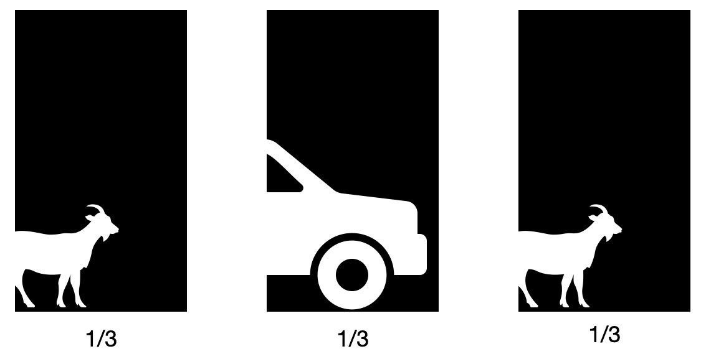

<style>
.list-group-item.active, .list-group-item.active:hover, .list-group-item.active:focus {
    z-index: 2;
    color: #ffffff;
    background-color: #4F2683;
    border-color: #4F2683;
}

a {
    color: #4F2683;
    text-decoration: none;
}
</style>

```{r setup, include=FALSE}
knitr::opts_chunk$set(echo = TRUE,message = FALSE,warning = FALSE)
```

## 0. What we'll be doing

1. A few words on assignment 2
2. Law of large numbers
3. Central limit theorem
4. The Monty Hall Problem

## 1. A few words on assignment 2
```{r}
library(tidyverse)
load("france.rda")
france <- france %>% 
  mutate(lr_group = case_when(lrself < 4 ~ "Left", lrself >= 4 & lrself < 8 ~ "Centre", lrself >= 8 ~ "Right", TRUE ~ NA_character_), 
         lr_group = factor(lr_group, levels=c("Left", "Centre", "Right")))
france %>% 
  group_by(lr_group) %>% 
  summarise(across(starts_with("rp"), ~mean(.x, na.rm=TRUE))) %>% 
  ungroup %>% 
  pivot_longer(-lr_group, names_pattern = "rplace_(.*)", names_to = "party", values_to = "place") %>% 
  mutate(party = ifelse(party == "green", "Green", toupper(party))) %>% 
  filter(!is.na(lr_group)) %>% 
  ggplot(aes(x=place, y=lr_group, colour=party)) + 
  geom_point() + 
  theme_bw() + 
  labs(x="Party Placement", y="Respondent Placement", colour="Party")
```

## 2. The Law of Large Numbers

### 2.1 Quick Review:
#### 2.1.1 Population and Sample Quantities
As a reference, for random variable $y$:

- Population^[Aronow, P. M., & Miller, B. T. (2019). _Foundations of agnostic statistics_. Cambridge University Press.]:
  - Size: $N$
  - Mean: $\mu=\frac{\sum_{i=1}^N y_i}{N}$
  - Standard deviation : $\sigma=\sqrt{\frac{\sum_{i=1}^N(y_i-\mu)^2}{N}}$
  - Covariance: $Cov[x,y]=E[(x-E[x])(y-E[y])]=\frac{\sum_{i=1}^{N}(x_i-\mu_x)(y_i-\mu_y)}{N}$
  - Correlation: $\rho[x,y]= \frac{Cov[x,y]}{\sigma[x]\sigma[y]}$
- Sample:
  - Size: $n$
  - Mean: $\bar Y=\frac{\sum_{i=1}^n Y_i}{n}$
  - Standard deviation: $sd=\sqrt{\frac{\sum_{i=1}^n(Y_i-\bar Y)^2}{n-1}}$
  - Covariance: $Cov[X,Y]=\frac{\sum_{i=1}^{n}(X_i-\bar X)(Y_i-\bar Y)}{n-1}$
  - Correlation: $\rho[X,Y]= \frac{\sum_{i=1}^{n}(X_i-\bar X)(Y_i-\bar Y)}{\sqrt{\sum_{i=1}^{n}(X_i-\bar X)^2\times\sum_{i=1}^{n}(Y_i-\bar Y)^2}}$

#### 2.1.2 Normal and t distributions

- **Normal distribution**: 
  - The _Bell curve_, characterized by two parameters: 
    1. Mean ($\mu$)
    2. Standard deviation ($\sigma$)
  - A Normal distribution of mean 0 and standard deviation 1 can be expressed by $N\sim(0,1)$
  - The shape of the distribution is given by the following: 
  
  $$f(x)=\frac{1}{\sqrt{2\pi\sigma^2}}e^{-\frac{(x-\mu)^2}{2\sigma^2}}$$
- **Student t distribution**:
  - Famously developed by William Sealy Gosset at the Guinness Brewery in Dublin to test for the quality of ingredients.
  - Essentially defined by the degrees of freedom (df).
  - As the df go to infinity, the distribution approximates a normal distribution.
  - Used for "small" samples.
  - Small sample theory allows us to model phenomena for which only a few realizations are available. It is not the case for all models though. But still, it is an important way in which we are able to understand the world.
  
```{r,message=FALSE}
makeNormal <- function(x,mu,sigma){
  out <- 1/(sqrt(2*pi*sigma^2))*exp(-(x-mu)^2/(2*sigma^2))
  return(out)
}

range <- seq(-4,4,0.001)
dist <- data.frame(x=range,
                   dist_Normal=dnorm(range,0,1),
                   dist_Normal_manual=makeNormal(range,0,1),
                   dist_t1=dt(range,1),
                   dist_t5=dt(range,5)) %>% 
  pivot_longer(-x,names_pattern = "dist_(.*)",names_to = "distribution",values_to = "y")

ggplot(dist,aes(x=x,y=y,color=distribution))+
  geom_line()+
  theme_minimal()+
  labs(title="",y="Density",color="")+
  theme(legend.position = "top")
```

### 2.2 The concept of inference

```{r,echo=F}
## Making cleaned data available
library(rio)
setwd(dirname(rstudioapi::getActiveDocumentContext()$path))
CES_raw <- import("2021 Canadian Election Study v2.0.dta") 

## A function to replace -99 by NA
remove99 <- function(x){
  out <- ifelse(x==-99,NA,x)
  return(out)
}

## Cleaning
CES <- factorize(CES_raw) %>% 
  rename(UUID=cps21_ResponseId,
         yob=cps21_yob,
         gender=cps21_genderid,
         prov=cps21_province,
         vote=pes21_votechoice2021,
         pplFeel_Americans=cps21_groups_therm_7,
         pplFeel_Francophones=cps21_groups_therm_3,
         pplFeel_LPC=cps21_party_rating_23,
         pplFeel_CPC=cps21_party_rating_24,
         pplFeel_NDP=cps21_party_rating_25,
         pplFeel_BQ=cps21_party_rating_26,
         pplFeel_GPC=cps21_party_rating_27,
         pplFeel_PPC=cps21_party_rating_29) %>% 
  select(UUID,yob,gender,prov,vote,
         pplFeel_Americans,pplFeel_Francophones,
         pplFeel_LPC,pplFeel_CPC,pplFeel_NDP,
         pplFeel_BQ,pplFeel_GPC,pplFeel_PPC) %>% 
  filter(!(prov %in% c("Northwest Territories","Nunavut","Yukon"))) %>% 
  mutate(age=2021-as.numeric(as.character(yob)),
         vt = case_when(
              vote == "Liberal Party" ~ "LPC",
              vote == "Conservative Party" ~ "CPC",
              vote == "ndp" ~ "NDP",
              vote == "Bloc Québécois" ~ "BQ",
              vote == "Green Party" ~ "GPC",
              vote == "People's Party" ~ "PPC",
              vote == "Another party (specify)" ~ "Other",
              vote %in% c("I spoiled my vote","Don't know / Prefer not to answer") ~ NA_character_
            ),
         prov=factor(prov,levels=c("British Columbia","Alberta","Saskatchewan","Manitoba",
                                   "Ontario","Quebec",
                                   "New Brunswick","Prince Edward Island","Nova Scotia",
                                   "Newfoundland and Labrador"))) %>% 
  mutate_at(vars(starts_with("pplFeel")),remove99) %>% 
  na.omit()
```

```{r}
# Population and sample size
N <- 41288599
n <- 1000

# Forming the population
Population <- sample(1:nrow(CES),N,replace = T)

# Taking a sample 
Sample <- sample(Population,n,replace=F)

# How far from the population is the sample?
## For the mean
mu <- mean(CES$pplFeel_Francophones[Population])
mean <- mean(CES$pplFeel_Francophones[Sample])
mu-mean

## For the standard deviation
sigma <- ((N-1)/N)*sd(CES$pplFeel_Francophones[Population])
sd <- sd(CES$pplFeel_Francophones[Sample])
sigma-sd

rm(mean,sd)
```


### 2.3 Weak Law of Large Numbers
- **Weak Law of Large Numbers**: $\bar X \overset{p}{\to} E[X]$, as $n$ gets large, the sample mean $\bar X$ becomes increasingly likely (converges in probability) to approximate the population average $E[X]$ (Aronow and Miller, 2019).
  - Coin flip example: Let's have two coins, one fair and one unfair. For heads=1 and tails=0, let's do 100 coin flips per coin. How will the proportion of _heads_ evolve across the filps?

```{r}
## Data to be filled in the loop
WLLN <- data.frame(x=1:100,
                   y1=NA,
                   y2=NA)

## Do 100 coin flips
for (i in 1:100){
  WLLN[i,2] <- sum(sample(c(0,1),i,replace=TRUE,prob = c(0.5,0.5)))/i
  WLLN[i,3] <- sum(sample(c(0,1),i,replace=TRUE,prob = c(1/3,2/3)))/i
}

## Plot the realized proportions of heads (1).
WLLN %>% 
  pivot_longer(-1,names_pattern = "y(.*)", names_to = "Coin",values_to = "y") %>% 
ggplot(aes(x=x,y=y,color=Coin))+
  geom_hline(yintercept=0.5,color="#4F2683",linetype="dashed")+
  geom_hline(yintercept=2/3,color="#F23030",linetype="dashed")+
  geom_line()+
  scale_color_manual(values=c("#4F2683","#F23030"))+
  labs(x="Coin flips",y="Proportion of heads")+
  theme_minimal()+
  theme(legend.position = "top")
```

## 3. Central Limit Theorem

- **Central Limit Theorem**: $\bar X \overset{d}{\to} N(0,\frac{\sigma}{\sqrt{n}})$, as $n$ gets larger, the sampling distribution of the sample mean will tend to be approximately normal (converges in distribution) **even when the population is not distributed normally** (Aronow and Miller, 2019).
  - Example using the CES feelings towards francophones. As we take samples from our population, the sampling distribution should start to approximate the normal distribution. 

```{r}
# Observe that the variable isn't normally distributed
ggplot(CES,aes(x=pplFeel_Francophones))+
  geom_histogram(fill="#4F2683",alpha=0.2)+
  theme_minimal()+
  labs(x="Feelings towards francophones",y="Frequency")

# Take 1000 sample of size n and compute their means
n <- 10000
set.seed(122)
for(i in 1:1000){
  if(i==1){
    means <- c()
  }
  Sample <- sample(Population,n,replace=F)
  means <- c(means,mean(CES$pplFeel_Francophones[Sample]))
}

# The expected standard error of the sampling distribution is:
standardError <- sigma/sqrt(n)

# We can then form the expected sampling distribution:
range <- seq(mu-standardError*4,mu+standardError*4,0.1)
normalData <- data.frame(x=range,
                         y=dnorm(range,mu,standardError))

# Graphing the obtained means on top of the expected values
data.frame(means) %>% 
  ggplot(aes(x=means))+
    geom_line(data=normalData,aes(x=x,y=y),color="#F23030",inherit.aes = F,size=1)+
    geom_vline(xintercept = mu,color="#F23030",size=1)+
    geom_histogram(aes(y=..density..),fill="#4F2683",alpha=0.2)+
    geom_density(color="#4F2683",linetype="dashed",size=1)+
    geom_vline(xintercept = mean(means),linetype="dashed",color="#4F2683",size=1)+
    scale_y_continuous("Density",expand = c(0,0))+
    scale_x_continuous("Sample means for feelings towards francophones")+
    theme_minimal()+
    coord_cartesian(clip = "off")
```


## 4. The Monty Hall Problem

- A game show where there were 3 doors, one with a car, and two with a goat;
- Participants had to choose one of those doors;
- Then, the host revealed a door with a goat;
- The question then is: What is the best strategy, **keep** or **switch** doors?

```{r, echo=F,fig.align='center'}

```


### 4.1 Analytical Solution (Boring)

- Following **Bayes Theorem**: $P(A|B)=\frac{P(B|A)P(A)}{P(B)}$
- We want $P(C_1|M_3)$, so : $P(C_1|M_3)=\frac{P(M_3|C_1)\times P(C_1)}{P(M_3)}$
- We know that:
  - $P(C_1)=P(C_2)=P(C_3)=1/3$;
  - $P(M_3|C_1)=1/2$;
  - $P(M_3|C_2)=1$;
  - $P(M_3|C_3)=0$;
  - $P(M_3)=P(M_3|C_1)P(C_1)+P(M_3|C_2)P(C_2)+P(M_3|C_3)P(C_3)=1/2\times1/3+1\times1/3+0\times1/3=1/2$
- Hence: $P(C_1|M_3)=\frac{P(M_3|C_1)\times P(C_1)}{P(M_3)}=\frac{1/2\times1/3}{1/2}=1/3$
- Therefore: $P(C_2|M_3)=1-P(C_1|M_3)=2/3$
- **SO YOU SHOULD ALWAYS SWITCH!**

### 4.2 Monte Carlo Based Solution

```{r}
# 0. Setting seed such that we all have the same results
set.seed(122)
n_episodes <- seq(10,1000,10)

for (n in 1:length(n_episodes)){
  # 1. Simulate a bunch of episodes
mh_dat <- data.frame(winning_door=sample(1:3,replace = T,n_episodes[n]))

# 2. Participant that always keeps
keep <- sample(1:3,replace=T,size=n_episodes[n])

# 3. Participant that always switches
switch1 <- sample(1:3,replace=T,size=n_episodes[n])
switch_loss <- apply(as.matrix(switch1), 1, function(x) sample(c(1,2,3)[-x],1))

# 4. Putting things together 
mh_dat <- mh_dat |>
  mutate(keep=keep,
         switch1=switch1,
         switch=ifelse(switch1==winning_door,switch_loss,winning_door),
         keep_win=ifelse(keep==winning_door,1,0),
         switch_win=ifelse(switch==winning_door,1,0))

if(n==1){
# 5. Results
out <- mh_dat |>
  summarise(keep_win_rate=mean(keep_win),
            switch_win_rate=mean(switch_win)) |>
  mutate(n=n_episodes[n])
}
else{
  tmp <- mh_dat |>
  summarise(keep_win_rate=mean(keep_win),
            switch_win_rate=mean(switch_win)) |>
  mutate(n=n_episodes[n])
  out <- rbind(out,tmp)
}

}

out |> pivot_longer(ends_with("_rate"),names_to = "strat",values_to = "rate",
                    names_pattern = "(.*)_win_rate") |>
ggplot(aes(x=n,y=rate,color=strat))+
  geom_hline(yintercept = 1/3,color="#4F2683",linetype="dashed")+
  geom_hline(yintercept = 2/3,color="#F23030",linetype="dashed")+
  geom_line()+
  scale_color_manual(values=c("#4F2683","#F23030"))+
  theme_minimal()+
  theme(legend.position = "top",
        legend.title = element_blank())+
  xlab("\nSample Size")+
  ylab("Winning Rate\n")
```

- **Mean Squared Error** $$MSE[x\text{ about } c]=E[(X-c)^2]=E[(\hat\theta-\theta)^2]$$
```{r}
n_episodes <- 100
for (j in 1:1000){
  # 1. Simulate a bunch of episodes
mh_dat <- data.frame(winning_door=sample(1:3,replace = T,n_episodes))

# 2. Participant that always keeps
keep <- sample(1:3,replace=T,size=n_episodes)

# 3. Participant that always switches
switch1 <- sample(1:3,replace=T,size=n_episodes)
switch_loss <- apply(as.matrix(switch1), 1, function(x) sample(c(1,2,3)[-x],1))

# 4. Putting things together 
mh_dat <- mh_dat |>
  mutate(keep=keep,
         switch1=switch1,
         switch=ifelse(switch1==winning_door,switch_loss,winning_door),
         keep_win=ifelse(keep==winning_door,1,0),
         switch_win=ifelse(switch==winning_door,1,0))

if(j==1){
# 5. Results
out <- mh_dat |>
  summarise(keep_win_rate=mean(keep_win),
            switch_win_rate=mean(switch_win)) |>
  mutate(iteration=j)
}
else{
  tmp <- mh_dat |>
  summarise(keep_win_rate=mean(keep_win),
            switch_win_rate=mean(switch_win)) |>
  mutate(iteration=j)
  out <- rbind(out,tmp)
}

}

gdat <- out |> pivot_longer(ends_with("_rate"),names_to = "strat",values_to = "rate",
                    names_pattern = "(.*)_win_rate")

mses <- out |>
  summarise(mse_keep=sum((keep_win_rate-1/3)^2)/1000,
            mse_switch=sum((switch_win_rate-2/3)^2)/1000)

ggplot(gdat,aes(x=rate, color=strat,fill=strat))+
  geom_vline(xintercept = 1/3,color="black")+
  geom_vline(xintercept = 2/3,color="black")+
  geom_vline(xintercept = mean(out$keep_win_rate),color="#4F2683",linetype="dashed")+
  geom_vline(xintercept = mean(out$switch_win_rate),color="#F23030",linetype="dashed")+
  geom_density(alpha=.2)+
  annotate("text",x = 1/3-.1,y=5,label=paste0("MSE=",round(mses$mse_keep,5)),color="#4F2683")+
  annotate("text",x = 2/3+.1,y=5,label=paste0("MSE=",round(mses$mse_switch,5)),color="#F23030")+
  scale_color_manual(values=c("#4F2683","#F23030"))+
  scale_fill_manual(values=c("#4F2683","#F23030"))+
  theme_minimal()+
  theme(legend.position = "top",
        legend.title = element_blank(),
        axis.title.y=element_blank())+
  xlab("Winning Rate\n")
```

