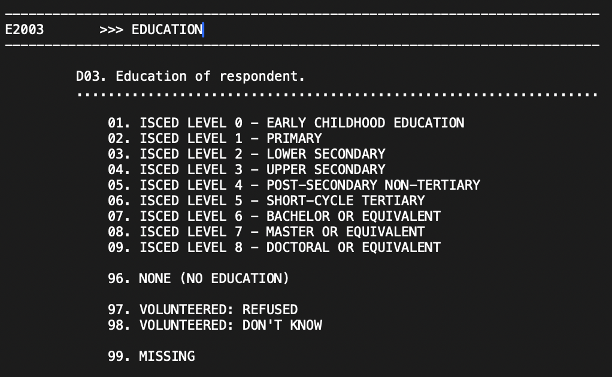
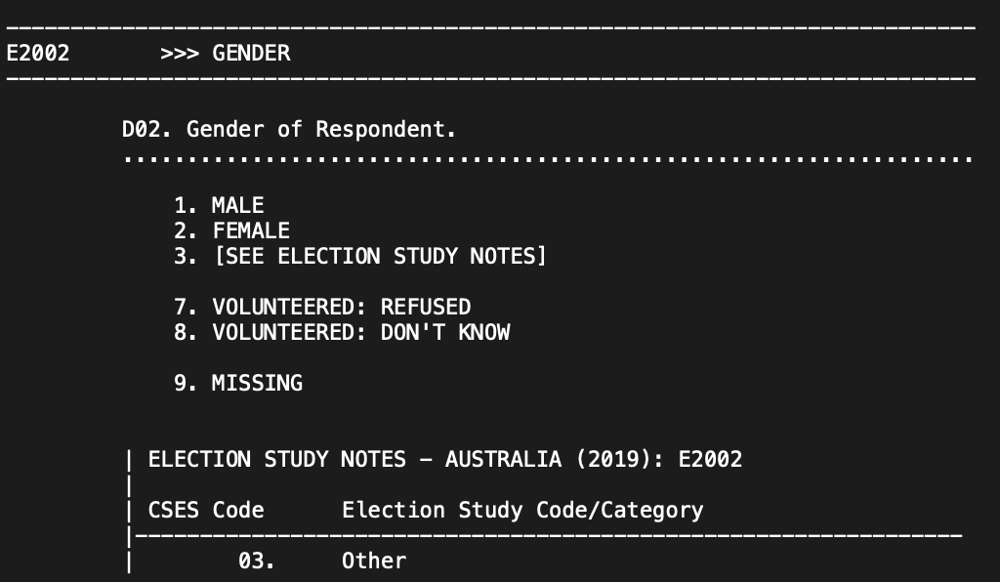

<style>
.list-group-item.active, .list-group-item.active:hover, .list-group-item.active:focus {
    z-index: 2;
    color: #ffffff;
    background-color: #4F2683;
    border-color: #4F2683;
}
:root {
    --incorrect: rgb(218, 165, 32);
    --incorrect_alpha: rgba(218, 165, 32, 0.25);
    --correct: rgb(160, 32, 240);
    --correct_alpha: rgba(160, 32, 240, 0.25);
    --highlight: #4F2683;
}

a {
    color: #4F2683;
    text-decoration: none;
}
</style>

```{r setup, include=FALSE}
knitr::opts_chunk$set(echo = TRUE,message = FALSE,warning = FALSE)
#install.packages("webexercises")
library(webexercises)
```


```{r,echo=F}
## Making cleaned data available
library(tidyverse)
library(rio)
setwd(dirname(rstudioapi::getActiveDocumentContext()$path))
CES_raw <- import("2021 Canadian Election Study v2.0.dta") 

## A function to replace -99 by NA
remove99 <- function(x){
  out <- ifelse(x==-99,NA,x)
  return(out)
}

## Cleaning
CES <- factorize(CES_raw) |> 
  rename(UUID=cps21_ResponseId,
         yob=cps21_yob,
         gender=cps21_genderid,
         prov=cps21_province,
         vote=pes21_votechoice2021,
         pplFeel_Americans=cps21_groups_therm_7,
         pplFeel_Francophones=cps21_groups_therm_3,
         pplFeel_LPC=cps21_party_rating_23,
         pplFeel_CPC=cps21_party_rating_24,
         pplFeel_NDP=cps21_party_rating_25,
         pplFeel_BQ=cps21_party_rating_26,
         pplFeel_GPC=cps21_party_rating_27,
         pplFeel_PPC=cps21_party_rating_29) |> 
  select(UUID,yob,gender,prov,vote,
         pplFeel_Americans,pplFeel_Francophones,
         pplFeel_LPC,pplFeel_CPC,pplFeel_NDP,
         pplFeel_BQ,pplFeel_GPC,pplFeel_PPC) |> 
  filter(!(prov %in% c("Northwest Territories","Nunavut","Yukon"))) |> 
  mutate(age=2021-as.numeric(as.character(yob)),
         vt = case_when(
              vote == "Liberal Party" ~ "LPC",
              vote == "Conservative Party" ~ "CPC",
              vote == "ndp" ~ "NDP",
              vote == "Bloc Québécois" ~ "BQ",
              vote == "Green Party" ~ "GPC",
              vote == "People's Party" ~ "PPC",
              vote == "Another party (specify)" ~ "Other",
              vote %in% c("I spoiled my vote","Don't know / Prefer not to answer") ~ NA_character_
            ),
         prov=factor(prov,levels=c("British Columbia","Alberta","Saskatchewan","Manitoba",
                                   "Ontario","Quebec",
                                   "New Brunswick","Prince Edward Island","Nova Scotia",
                                   "Newfoundland and Labrador"))) |> 
  mutate_at(vars(starts_with("pplFeel")),remove99) |> 
  na.omit()
```

## 0. What we'll be doing

1. Hypothesis Tests
2. Cleaning Data Take 2

## 1. Hypothesis Testing

### 1.1 Confidence intervals

- **There can only be ONE!!!** How do we know where our sample stand in the sampling distribution???
- **Confidence intervals**: created such that $(1-\alpha)\%$ of the intervals we could make from different samples will cover the true, but unknown population value.
  - Hence, the only thing we can say is that, if $alpha$ is small enough, we are _willing to bet_ that we are in one of the good samples. 
  - Can be computed following $\bar X\pm z_{crit}\frac{sd_x}{\sqrt{n}}$

```{r,echo=F}
library(uwo4419)
set.seed(123)
# Population and sample size
N <- 1000000
# Forming the population
Population <- sample(1:nrow(CES),N,replace = T)
mu <- mean(CES$pplFeel_Francophones[Population])
# Take 1000 sample of size n and compute their means and CI
n <- 100
alpha <- .05
for(i in 1:100){
  if(i==1){
    means <- c()
    lwr <- c()
    upr <- c()
  }
  Sample <- sample(Population,n,replace=F)
  out <- confidenceInterval(CES$pplFeel_Francophones[Sample], distr = "normal",confidence = (1-alpha))
  means <- c(means,out[1])
  lwr <- c(lwr,out[2])
  upr <- c(upr,out[3])
}

data.frame(sample=1:100,means,lwr,upr) |> 
  mutate(Type=ifelse(lwr>mu | upr < mu,"Bad","Good")) |> 
  ggplot(aes(x=sample,y=means,ymin=lwr,ymax=upr,color=Type))+
  geom_hline(yintercept=mu)+
  geom_pointrange(size=0.1)+
  scale_color_manual("Type of sample",values=c("#F23030","#4F2683"))+
  labs(y="Sample means for feelings towards francophones",
       x="Sample id")+
  theme_minimal()+
  theme(legend.position = "top")
```

### 1.2 P-values and Hypothesis tests

- We know from the Weak Law of Large Numbers that our sample mean converges to the population mean as $n$ increases.
- We know from the Central Limit Theorem that our sampling distribution will be Normal (or Student's t for small samples).
- Setting our null hypothesis as $\mu_0=0$, we know that either: 
$$\bar Y \sim N(\mu,\frac{sd_Y}{\sqrt{n}})~~\text{or}~~\bar Y \sim t_{n-1}(\mu,\frac{sd_Y}{\sqrt{n}})$$
- Therefore, we can compute $z$ or $t$ scores depending on our sample size: $$z=\frac{\bar Y-\mu_0}{\sigma}~~\text{or}~~t=\frac{\bar Y-\mu_0}{\frac{sd_Y}{\sqrt{n}}}$$
  - Essentially how many standard deviations below or above $\mu_0$ an observation $\bar Y$ is.
  - We use the $z$ or $t$ scores to compute our p-values.

```{r,echo=F}
ybar <- 0.5
mu0 <- 0
sdy <- 3
n <- 100

GraphData <- tibble(x=seq(-1,1,0.01),
                        y=dt(x/(sdy/sqrt(n)),n-1))

shadeleft <- GraphData |> filter(x<=ybar) |> mutate(shade="list(H[A]: mu<0,~p(T<t)==0.951)")
shaderight <- GraphData |> filter(x>=ybar) |> mutate(shade="list(H[A]: mu>0,~p(T>t)==0.049)")
shadeboth1 <- GraphData |>  filter(x<=-ybar) |> mutate(shade="list(H[A]: mu!=0,~p(symbol('|')~T~symbol('|')<symbol('|')~t~symbol('|'))==0.099)")
shadeboth2 <- GraphData |>  filter(x>=ybar) |> mutate(shade="list(H[A]: mu!=0,~p(symbol('|')~T~symbol('|')<symbol('|')~t~symbol('|'))==0.099)",
                                                        shade=factor(shade,levels=c("list(H[A]: mu<0,~p(T<t)==0.951)","list(H[A]: mu!=0,~p(symbol('|')~T~symbol('|')<symbol('|')~t~symbol('|'))==0.099)","list(H[A]: mu>0,~p(T>t)==0.049)")))

Shade <- rbind(shadeleft,shaderight,shadeboth1) |> 
  mutate(shade=factor(shade,levels=c("list(H[A]: mu<0,~p(T<t)==0.951)","list(H[A]: mu!=0,~p(symbol('|')~T~symbol('|')<symbol('|')~t~symbol('|'))==0.099)","list(H[A]: mu>0,~p(T>t)==0.049)"))) 

ggplot(Shade)+
  geom_line(data=GraphData,aes(x=x,y=y))+
  geom_ribbon(aes(x=x,ymax=y),ymin=0,alpha=0.2,fill="#4F2683")+
  geom_ribbon(data=shadeboth2,aes(x=x,ymax=y),ymin=0,alpha=0.2,fill="#4F2683")+
  facet_wrap(~shade,labeller=label_parsed) +
  scale_y_continuous("Density",breaks = seq(0,10,0.1))+
  xlab(parse(text="bar(Y)"))+
  theme_minimal()+
  labs(title=parse(text="For~H[0]: mu==0"))

```

- For **proportion**, we use the $z$ distribution where $se=sd_Y=\sqrt{\frac{p(1-p)}{n}}$.
  - But, we need $np\geq5$ AND $n(1-p)\geq5$ for the normal approximation to work.
  - Where $n$ is the sample size and $p$ is the hypothesized population proportion (our $\mu_0$ from above).
- For **difference of means**:
  - Usually we have $H_0: \mu_0=0$. 
  - For two means we have $H_0=\mu_1=\mu_2$ or $H_0=\mu_1-\mu_2=0$, hence:
    - $H_A:\mu_1\neq\mu_2 \rightarrow H_A:\mu_1-\mu_2\neq0$
    - $H_A:\mu_1<\mu_2 \rightarrow H_A:\mu_1-\mu_2<0$
    - $H_A:\mu_1>\mu_2 \rightarrow H_A:\mu_1-\mu_2>0$
  - So, our $z-$ or $t-$statistic: $\frac{Estimate~-~H_0Value}{SE}$, with $SE=\sqrt{\frac{\sigma^2_1}{n_1}+\frac{\sigma^2_2}{n_2}}$.
  - **Paired** t-tests imply that you have the same observations but different variables for both means.

### 1.3 R functions
- For usual hypothesis tests:
  - One sided `t.test(x, mu = 0, alternative="less")` OR `t.test(x, mu = 0, alternative="greater")`
  - Two sided `t.test(x, mu = 0, alternative="two")`
- For hypothesis tests regarding proportions: 
  - `prop.test(x,n,p="NULL",alternative=c("two.sided", "less", "greater"))`, with `x` our vector of successes, `n` our total nb of observations and `p` our tested probability of success.
- For differences in means:
  - You can use `t.test(dat$group1,dat$group2,alternative="two",paired=F/T)`, but `tTest("group1","group2",data=dat,var.equal=F)` is more flexible.
  
### 1.4 Translation and Interpretation

- For the following, define the null and the alternative hypothesis, and compute the result with the appropriate test.
  1. Is the mean of `pplFeel_Francophones` for PEI folks different from 50? 
  2. Is the mean of `pplFeel_Francophones` for PEI folks greater than 50?
  3. Is the mean of `pplFeel_Francophones` for PEI folks smaller than 50?
  
`r hide("Answers")`

1. $H_0: \text{pplFeel_Francophones}_{PEI}=50$, $H_A: \text{pplFeel_Francophones}_{PEI} \neq 50$
2. $H_0: \text{pplFeel_Francophones}_{PEI}=50$, $H_A: \text{pplFeel_Francophones}_{PEI} > 50$
3. $H_0: \text{pplFeel_Francophones}_{PEI}=50$, $H_A: \text{pplFeel_Francophones}_{PEI} < 50$
  
```{r}
PEI <- CES |> filter(prov=="Prince Edward Island")
# 1. 
t.test(PEI$pplFeel_Francophones,mu=50,alternative="two")
# 2. 
t.test(PEI$pplFeel_Francophones,mu=50,alternative="greater")
# 3. 
t.test(PEI$pplFeel_Francophones,mu=50,alternative="less")
```
  
`r unhide()`


- For the following, define the null and the alternative hypothesis, and compute the result with the appropriate test.
  1. Is the mean of `pplFeel_Francophones` for PEI folks different than the one for folks from Alberta? 
  2. Is the mean of `pplFeel_Francophones` for PEI folks greater than the one for folks from Alberta?
  3. Is the mean of `pplFeel_Francophones` for PEI folks smaller than the one for folks from Alberta?

`r hide("Answers")`

1. $H_0: \text{pplFeel_Francophones}_{PEI}-\text{pplFeel_Francophones}_{AB}=0$, $H_A: \text{pplFeel_Francophones}_{PEI}-\text{pplFeel_Francophones}_{AB} \neq 0$
2. $H_0: \text{pplFeel_Francophones}_{PEI}-\text{pplFeel_Francophones}_{AB}=0$, $H_A: \text{pplFeel_Francophones}_{PEI}-\text{pplFeel_Francophones}_{AB} > 0$
3. $H_0: \text{pplFeel_Francophones}_{PEI}-\text{pplFeel_Francophones}_{AB}=0$, $H_A: \text{pplFeel_Francophones}_{PEI}-\text{pplFeel_Francophones}_{AB} < 0$
```{r}
CES <- CES |> 
  mutate(PEIvAB =case_when(prov=="Prince Edward Island"~"PEI",
                           prov=="Alberta"~"AB",
                           TRUE~NA_character_),
         PEIvAB=factor(PEIvAB,levels=c("PEI","AB")))
# 1. 
DAMisc::tTest("PEIvAB","pplFeel_Francophones",data=CES,alternative="two")
# 2. 
DAMisc::tTest("PEIvAB","pplFeel_Francophones",data=CES,alternative="greater")
# 3. 
DAMisc::tTest("PEIvAB","pplFeel_Francophones",data=CES,alternative="less")
```

`r unhide()`

- Is there a difference in the proportion of men and women voting concervative? 

```{r}
Sub <- CES |> 
  filter(gender %in% c("A man","A woman")) |> 
  mutate(voteCPC=ifelse(vt=="CPC",1,
                        ifelse(is.na(vt),NA,0)))

Proportions <- Sub |> 
  group_by(gender) |> 
  drop_na(gender,voteCPC) |> 
  summarise(freqCPC=sum(voteCPC),
            freq=n())
prop.test(Proportions$freqCPC,Proportions$freq)
```

### 1.5 Exercises

1. Do a paired t-test of the difference in means of `pplFeel_LPC` and `pplFeel_CPC`, what do you find? 
```{r}
t.test(CES$pplFeel_LPC,CES$pplFeel_CPC,paired=T)

```

2. In rating Americans, is there a difference between people age 50+ and everyone else? 
```{r}
CES <- CES |> 
  mutate(fifty=ifelse(age>=50,1,0))

t.test(CES$pplFeel_Americans[CES$fifty==1],CES$pplFeel_Americans[CES$fifty==0])
tTest("fifty","pplFeel_Americans",data=CES)
```

3. Do people who vote for the LPC rank the BQ (`pplFeel_BQ`) above 50 at a higher rate than people who vote for the CPC?

```{r}
Sub <- CES |> 
  filter(vt %in% c("LPC","PPC")) |> 
  drop_na(pplFeel_BQ) |> 
  mutate(goodBQ=ifelse(pplFeel_BQ>50,1,0)) |> 
  group_by(vt) |> 
  summarise(freqGoodBQ=sum(goodBQ),
            n=n())

prop.test(Sub$freqGoodBQ,Sub$n,alternative = "greater")

Sub
```


## 2. Data Cleaning Take 2

### 2.1 Going through the codebook

- The codebook of a dataset is your **best friend** and **worse enemy**!!
- Making sure that you understand what the variables mean and what their values are is **Essential**!
- Be carefull not to jump to conclusions.
- For example:

```{r, echo=F}

```


### 2.2 R functions

Going back to lab 1:

There are two ways to create new variables:

1. Using `mutate()` from `dplyr`;
2. Using `$` and assigning the new values.

Here are a few functions that come in handy in a `mutate()` call when you want to change the structure of a variable:

- `ifelse()`;
- `case_when()`.

For example: Create a dummy variable (binary 0,1) for sex:

```{r, echo=F}

```

```{r}
cses <- import("cses5.rdata")

table(cses$E2002)

# Base R
cses$female <- NA
cses$female[cses$E2002==2] <- 1
cses$female[cses$E2002 %in% c(1,3)] <- 0


# dplyr 1
cses <- cses |> 
  mutate(female = ifelse(E2002==2,1,ifelse(E2002 %in% c(1,3),0, NA)))

# dplyr 2
cses <- cses |> 
  mutate(female = case_when(E2002 == 2 ~ 1,
                            E2002 %in% c(1,3) ~ 0,
                            TRUE ~ NA))

```

### 2.3 Checking your work

- It is of utmost importance to check your work! 
- If I did not emphasize this enough in other labs, let me do it now! 

**USE** `table()` **to check frequencies before and after cleaning**, you can even do crosstabs:

```{r}
# Let's say I do this (DON'T EVER DO THIS, DON'T YOU DARE!!!!)
tmp <- cses |> 
  mutate(female = case_when(E2002 == 2 ~ 1,
                            TRUE ~ 0))

table(cses$E2002,tmp$female,useNA = "ifany")

# If you want to use case_when, then assign every value.
tmp <- cses |> 
    mutate(female = case_when(E2002 == 2 ~ 1,
                              E2002 %in% c(1,3) ~ 0,
                              TRUE ~ NA))

table(cses$E2002,tmp$female,useNA = "ifany")

# Still, ifelse is much safer in its clunkyness
tmp <- cses |> 
    mutate(female = ifelse(E2002==2,1,ifelse(E2002 %in% c(1,3),0, NA)))

table(cses$E2002,tmp$female,useNA = "ifany")
```

### 2.4 Question 2.1

In the codebook, identify the following variables, and replicate the following table (only print a dataframe with the corresponding values): country; year; gender; education level; employement status; age; place of residence (urban/rural); interest in politics; ideology (self); ideology of the party the respondent voted for; income.

**Note**: 

  - `female` was coded 1 for female and 0 for non-female.
  - `educ_low` was coded 1 for early childhood education, primary, lower secondary, or none; and 0 otherwise.
  - `educ_mid` was coded 1 for upper secondary or post-secondary; and 0 otherwise.
  - `educ_hig` was coded 1 for anything above post-secondary; and 0 otherwise.
  - `income_low` was coded 1 for income below or equal to the first tercile of the variable by country and year; and 0 otherwise.
  - `income_mid` was coded 1 for income above the first tercile and below or equal to the second tercile; and 0 otherwise.
  - `income_hig` was coded 1 for income above the second tercile and 0 otherwise.
  - `urban` was coded 1 for residence in a small or middle town, suburbs, or large town or city; 0 otherwise.
  - `int_pol`, `ideo_lr_self`, `ideo_vote` were all rescaled to vary between 0 and 1, with one corresponding to right in the ideology variables, and to very interested for `int_pol`.


```{r, echo=T,message=F,warning=F}
library(tidyverse)
library(rio)
dat <- import("cses5.rdata") |>
  rename(country=E1006_NAM,
         year=E1008) |>
  mutate(female=ifelse(E2002==2,1,
                       ifelse(E2002 > 3, NA, 0)),
         educ_low=ifelse(E2003 %in% c(1:3,96),1,ifelse(E2003 >96,NA,0)),
         educ_mid=ifelse(E2003 %in% 4:5,1,      ifelse(E2003 >96,NA,0)),
         educ_hig=ifelse(E2003 %in% 6:9,1,      ifelse(E2003 >96,NA,0)),
         employed=ifelse(E2006 %in% c(1,2,3),1,
                         ifelse(E2006 %in% c(97,98,99),NA,0)),
         age_25less=ifelse(E2001_A<=25,1,ifelse(E2001_A >120,NA,0)),
         age_26to35=ifelse(E2001_A>25 & E2001_A<=35,1,ifelse(E2001_A >120,NA,0)),
         age_36to45=ifelse(E2001_A>35 & E2001_A<=45,1,ifelse(E2001_A >120,NA,0)),
         age_46to55=ifelse(E2001_A>45 & E2001_A<=55,1,ifelse(E2001_A >120,NA,0)),
         age_56to65=ifelse(E2001_A>55 & E2001_A<=65,1,ifelse(E2001_A >120,NA,0)),
         age_66plus=ifelse(E2001_A>65,1,ifelse(E2001_A >120,NA,0)),
         urban=ifelse(E2022 %in% c(2,3,4),1,
                      ifelse(E2022 >=7,NA,0)),
         int_pol=ifelse(E3001>=7,NA,1-((E3001-1)/3)),
         ideo_lr_self=ifelse(E3020>10,NA,E3020/10),
         ideo_vote=ifelse(E3013_LR_CSES==9,NA,(E3013_LR_CSES-1)/2)) |>
  group_by(country,year) |>
  mutate(income_low=ifelse(E2011<=quantile(E2011,c(1/3,2/3),na.rm=T)[1],1,ifelse(E2011>=99999997,NA,0)),
         income_mid=ifelse(E2011>quantile(E2011,c(1/3,2/3),na.rm=T)[1] & 
                           E2011<=quantile(E2011,c(1/3,2/3),na.rm=T)[2],1,ifelse(E2011>=99999997,NA,0)),
         income_hig=ifelse(E2011>quantile(E2011,c(1/3,2/3),na.rm=T)[2],1,ifelse(E2011>=99999997,NA,0))) |>
  select(country,year,female,starts_with(c("educ","age","income")),urban,int_pol,ideo_lr_self,ideo_vote) |>
  na.omit() |>
  ungroup()


table <- DAMisc::sumStats(dat,names(dat)[c(-1,-2)])

table
```