class: inverse,middle,center
```{css echo=FALSE}
.purpleb {
  font-weight: bold;
  color: #4F2683;
  font-size: 1.25em;
}

.small {
  font-size:.75rem;
}
.tiny {
  font-size:.25rem;
}
.shift { 
  position:relative; 
  top: -40px;
  }

.plot-callout {
  height: 225px;
  width: 450px;
  bottom: 5%;
  right: 5%;
  position: absolute;
  padding: 0px;
  z-index: 100;
}
.plot-callout img {
  width: 100%;
  border: 4px solid
  #  23373B;
}
```


```{r setup, include=FALSE}
options(htmltools.dir.version = FALSE)
knitr::opts_chunk$set(
  fig.width=9, fig.height=3.5, fig.retina=3,
  out.width = "100%",
  cache = FALSE,
  echo = FALSE,
  message = FALSE, 
  warning = FALSE,
  hiline = TRUE
)
xaringanExtra::use_panelset()
```

```{r xaringan-themer, include=FALSE, warning=FALSE}
library(xaringanthemer)
style_duo_accent(
  primary_color = "#4F2683",
  secondary_color = "#201436",
  inverse_header_color = "#ffffff",
  inverse_background_color = "#4F2683",
  inverse_text_color = "#ffffff"
)
```

# GAPS R Workshop 2025

### William Poirier

2025-08-27

Please go to 

### williampo1.github.io/lab/

And download the material for this year's workshop

<i>Thank you to Western Research, the Society of Graduate Students, and the School of Graduate & Postdoctoral Studies for their support!</i>

```{r  fig.align="center", out.width="30%",include=TRUE}

```

---
## What will we be doing today? 

.pull-left[
**Main Objective**: Getting familiar with R & RStudio.

**Schedule**:
- 10:00-12:00: First Steps
- 12:00-13:00: Lunch
- 13:00-15:00: Working with R

**ASK QUESTIONS!**

Katy and Noah will be roaming the room to troubleshoot.
]
.pull-right[
```{r out.width="65%", fig.align="center"}
knitr::include_graphics("gifs/giphy.gif")
```
]

---

class: inverse,middle,center

## Session 1: First Steps

---

## Session 1: First Steps

1. What is R?

2. Managing anxieties

3. Software installation

4. RStudio interface

5. Replication: <i>Why do majoritarian systems benefit the right?</i> (Liñeira and Riera, 2024)


---

## What is R?

.pull-left[
```{r  fig.align="center", out.width="50%",include=TRUE}
knitr::include_graphics("images/Rlogo.png")
```

- A programming language
]
.pull-right[
```{r  fig.align="center", out.width="100%",include=TRUE}
knitr::include_graphics("images/RStudio_logo_flat.svg")
```

- A place to write stuff
]

---

## What is R?

.pull-left[
- French; English; Spanish; Mandarin; Japanese; Arabic.

- Are "arguably" programming languages
]
.pull-right[
```{r  fig.align="center", out.width="50%",include=TRUE}
knitr::include_graphics("images/Microsoft_Office_Word.svg")
```

- A place to write stuff
]

---

## What is R?

**A programming language made by statisticians for statisticians.**

It will help you to:

- domesticate (or clean) raw data;
- perform statistical analyses;
- graph your results;
- scrape the web;
- become cooler than folks who use Stata.

--

Why R?

- Free;
- Active research community developping packages;
- Handles any data format;
- Great point of entry for "real" programming languages. 

---

## Managing anxieties

.pull-left[
- Learning how to code is learning how to talk to your computer.

- R is stupid, it does exactly what you tell it to do.

- You're going to make mistakes and that's great!

- Don't focus on the syntax, focus on the principles.

- Time and effort are the only things you need.

- You'll go from hating it to loving it in no time.

- Google is your best friend!
]
.pull-right[
```{r  fig.align="center", out.width="100%",include=TRUE}
knitr::include_graphics("gifs/eye.gif")
```
]

--

I'll say this again: **Don't try to learn the syntax by heart, focus on the principles!** 

You'll learn the syntax as you go.

---

## Sofware installation — R

.pull-left[
Go to CRAN: .purpleb[https://cloud.r-project.org]

- Comprenhensive R Archive Network;
- Used to distribute both R and R packages.
]
.pull-right[
```{r  fig.align="center", out.width="50%",include=TRUE}
knitr::include_graphics("images/Rlogo.png")
```
]

---

## Sofware installation — R

.pull-left[
.purpleb[Mac]
```{r  fig.align="center", out.width="100%",include=TRUE}
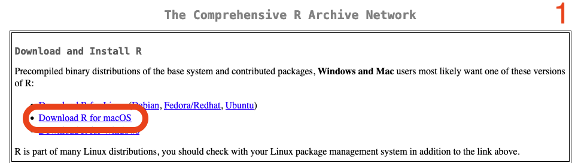
```
```{r  fig.align="center", out.width="100%",include=TRUE}
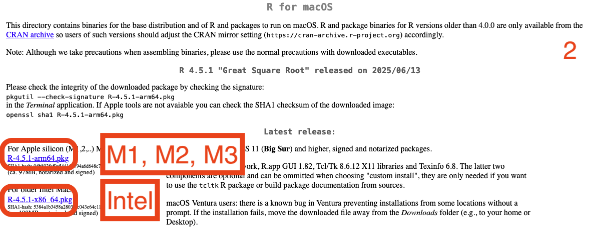
```
]
.pull-right[
.purpleb[Windows]
```{r  fig.align="center", out.width="100%",include=TRUE}
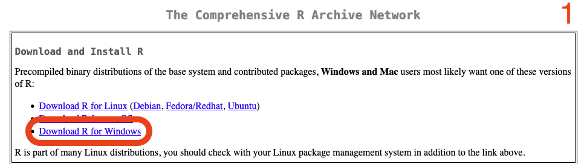
```
```{r  fig.align="center", out.width="100%",include=TRUE}
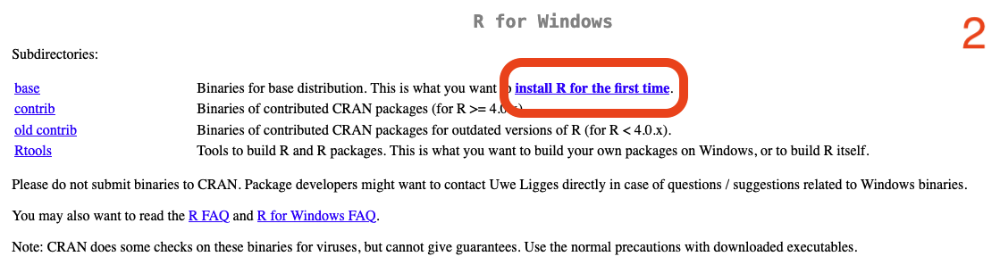
```
```{r  fig.align="center", out.width="100%",include=TRUE}
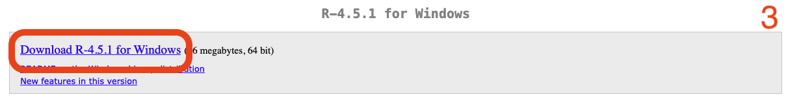
```
]

---

## Sofware installation — R Studio

.pull-left[
Go to Posit: .purpleb[https://posit.co/download/rstudio-desktop/]
]
.pull-right[
```{r  fig.align="center", out.width="100%",include=TRUE}
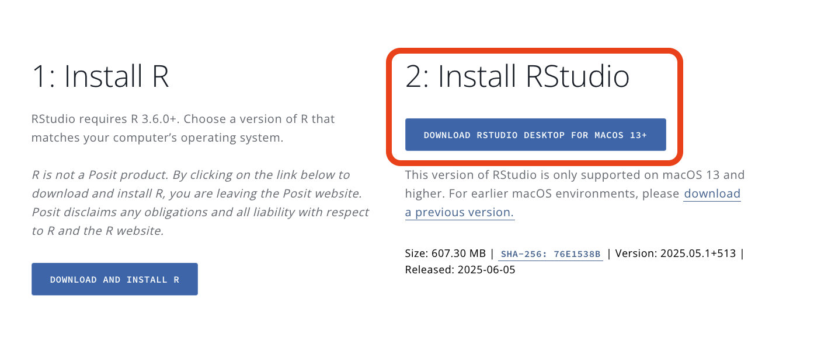
```
]

---

## RStudio interface

.purpleb[OPEN RSTUDIO AND FOLLOW ME!!!]

The next few slides are here as a reference.

---

## RStudio interface — Overview

```{r  fig.align="center", out.width="80%",include=TRUE}
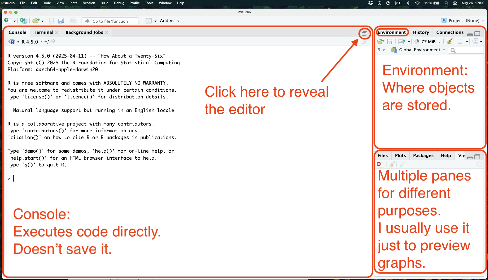
```

---

## RStudio interface — Editor

```{r  fig.align="center", out.width="80%",include=TRUE}
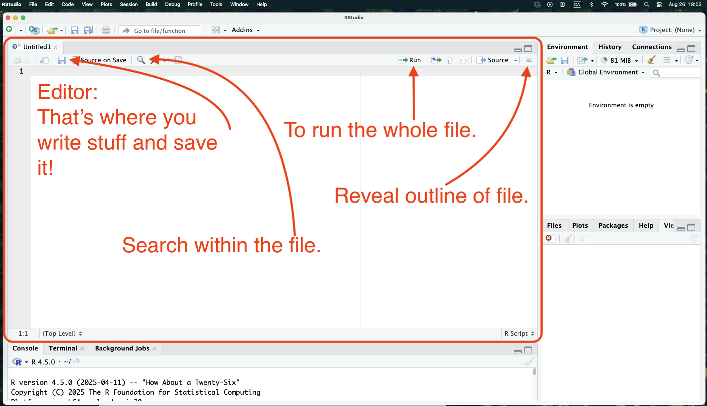
```

---

## RStudio interface — Hello World

```{r  fig.align="center", out.width="80%",include=TRUE}
knitr::include_graphics("images/HelloWorld.png")
```

---

## RStudio interface — Hello World

- To run a line of code:
  1. Put cursor anywhere on line and press `cmd + enter`/`ctrl + enter`.
  2. Select line or multiple lines and press `cmd + enter`/`ctrl + enter`.
  2. Select line or multiple lines and click on `Run` button at top of screen.

---
## RStudio interface — Housekeeping

```{r  fig.align="center", out.width="80%",include=TRUE}
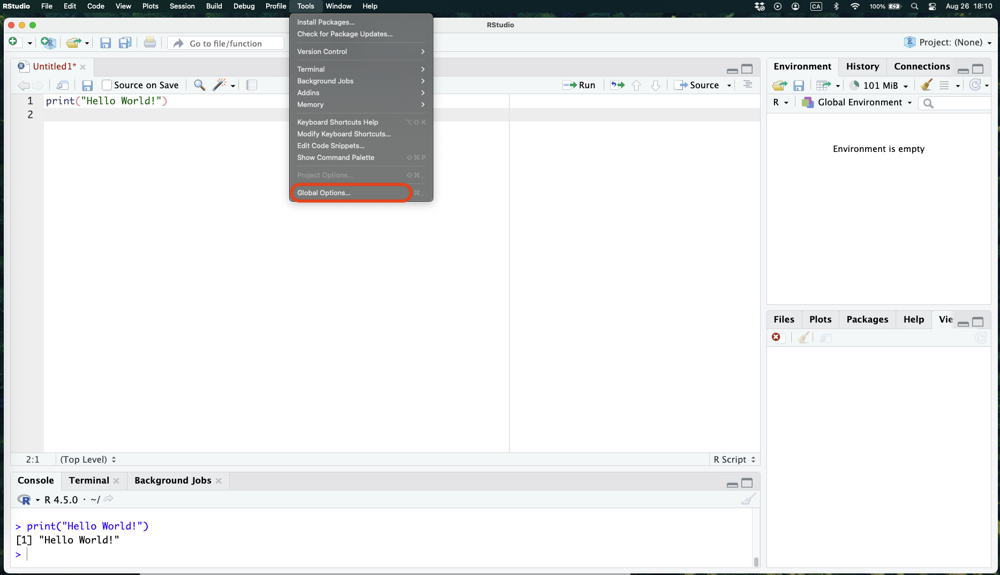
```

---
## RStudio interface — Housekeeping

```{r  fig.align="center", out.width="80%",include=TRUE}
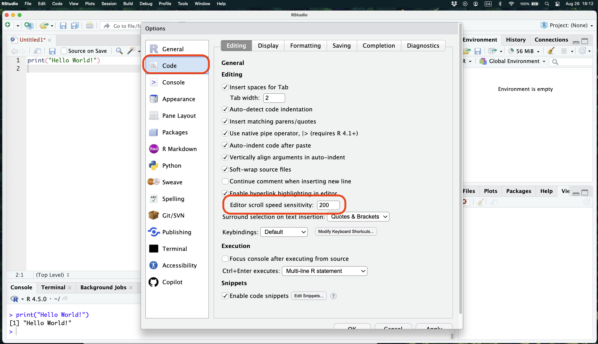
```

---
## RStudio interface — Housekeeping

```{r  fig.align="center", out.width="80%",include=TRUE}
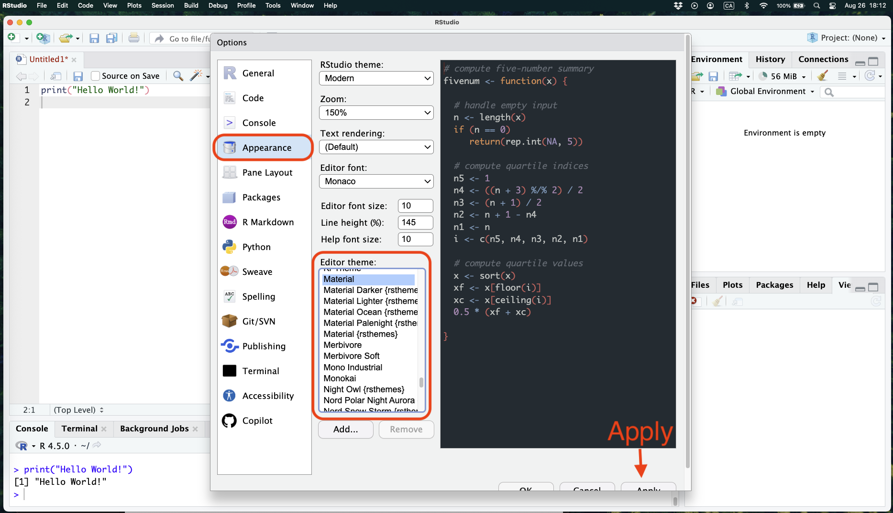
```

---

## Basics — Directories

.pull-left[
- **Directory** = How your computer organizes files and folders.
  - From now own, you need to be a neat freak when it comes to this!
- **Working directory** = Where R is pointing to
  - Most errors of beginners comes from wrong working directories.
- Shortcut, use when folder/file selected:
  - Mac: `option + command + c`
  - PC: `shift + right click > Copy as Path`

]
.pull-right[
```{r  fig.align="center", out.width="50%",include=TRUE}
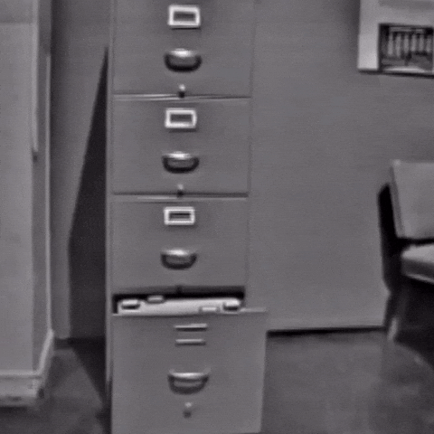
```
]

```{r, eval=FALSE, echo=TRUE}
# Option 1: where you want
setwd("/Users/williampoirier/Dropbox/Website/files/uwo/R_Workshop_2025/rcode") # Mac
setwd("C:\Users\williampoirier\Dropbox\Website\files\uwo\R_Workshop_2025\rcode") # PC

# Option 2: where the R file is saved
setwd(dirname(rstudioapi::getSourceEditorContext()$path))
```

---

## Basics — Packages

.pull-left[
- R ships with a suite of basic functions, i.e. base R.
- Packages contain extra functions that other users have created.
- 2 things to note:
  - You only need to install them once.
  - But, you need to load them each time you open a new session.
- The Tidyverse is a suite of multiple packages.
]
.pull-right[
```{r  fig.align="center", out.width="30%",include=TRUE}
knitr::include_graphics("images/tidyverse.png")
```
]

```{r, eval=FALSE, echo=TRUE}
# Install from CRAN
install.packages("tidyverse")
# Load in your session
library(tidyverse)
```

---

## Replication Exercise

.pull-left[
```{r  fig.align="center", out.width="100%",include=TRUE}

```
]
.pull-right[
```{r  fig.align="center", out.width="100%",include=TRUE}
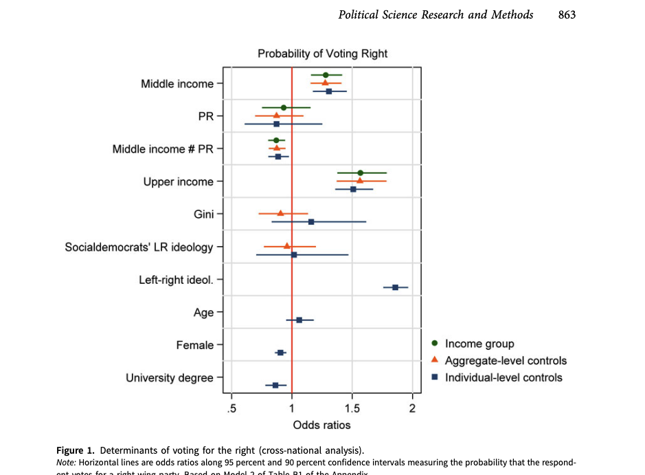
```
]

.purpleb[OPEN RSTUDIO AND FOLLOW ME!!!]

---

## Basics — Assignment

```{r, echo=TRUE}
# The right way
banana <- 3

# The wrong way
banana = 3

# Global assigner
banana <<- 3

# FOR ENGLISH KEYBOARDS
# PC: alt + - 
# MAC: option + -

banana
```

---

## Basics — Assignment
.pull-left[
```{r, echo=TRUE}
# The right way
banana <- 3

# The wrong way
banana = 3

# Global assigner
banana <<- 3

# FOR ENGLISH KEYBOARDS
# PC: alt + - 
# MAC: option + -

banana
```
]
.pull-right[
```{r  fig.align="center", out.width="100%",include=TRUE}

```
]

---

## Basics — Data types

.pull-left[
```{r, echo=TRUE}
# Integer
Apple <- 13L
class(Apple)

# Numeric
Banana <- 13
class(Banana)

# Character
Cherry <- "13"
class(Cherry)
```
]
.pull-right[
```{r, echo=TRUE}
# Logical
Durian <- TRUE
class(Durian)

# What happens when you add Apple and Banana? 
# What about Apple and Durian?
# What about Apple and Cherry?
```
]

---

## Basics — Data types

.pull-left[
```{r, echo=TRUE}
# Integer
Apple <- 13L
class(Apple)

# Numeric
Banana <- 13
class(Banana)

# Character
Cherry <- "13"
class(Cherry)
```
]
.pull-right[
```{r, echo=TRUE}
# Logical
Durian <- TRUE
class(Durian)

# What happens when you add Apple and Banana? 
# What about Apple and Durian?
# What about Apple and Cherry?

Apple + Banana
Apple + Durian
```
]


---

## Basics — Data structures

.panelset[
  .panel[.panel-name[Vectors 1/3]
```{r, echo=T}
# One data type allowed. R's basic data structure.

# A vector
stuff <- "Kumquat"
stuff

# Also a vector
stuff <- c("Knickknacks","Kerfuffle","Kumquat")
stuff

# Also a vector
(otherStuff <- c(T,F,T,T,T,F)) # Parenthesis around assignment prints the new object.
```
  ]
  .panel[.panel-name[2/3]
```{r, echo=T}
#### Why c() ? 

stuff <- c("Knickknacks","Kerfuffle","Kumquat")
(scoreOfWordsThatStartsWithK_1 <- 8:10) 
# OR 
(scoreOfWordsThatStartsWithK_2 <- c(8,9,10))

#### What if I want the score from 0 to 100 instead of 0 to 10?
(scoreOfWordsThatStartsWithK_3 <- 10*scoreOfWordsThatStartsWithK_2)

```
  ]
.panel[.panel-name[3/3]
```{r, echo=T}
#### What if I want to relate the names to the score?
names(scoreOfWordsThatStartsWithK_1) <- stuff

# Like adding a second dimension to the data!
scoreOfWordsThatStartsWithK_1
```
  ]
  .panel[.panel-name[Matrices 1/2]
```{r, echo=T}
# Again, only one data type. 2 dimensions of it this time.

(myMatrix <- matrix(1:9,nrow=3,ncol=3))

# Accepts all operations that matrices accept in math
# Like transpose for example
t(myMatrix)

```
  ]
  .panel[.panel-name[2/2]
```{r, echo=T}
# Works with characters as well!
letterMatrix <- matrix(letters,ncol=2)
t(letterMatrix)

#### What if I want multiple data types? 
```
  ]
  .panel[.panel-name[Data Frames 1/]
```{r, echo=T}
# One data type per column, essentially a collection of vectors, i.e. an excel sheet.

(wordData <- data.frame(stuff,scoreOfWordsThatStartsWithK_2))

```
  ]
  .panel[.panel-name[2/2]
```{r, echo=T}
#### How do I change the column names?
colnames(wordData) <- c("word","score")
# OR
(wordData <- data.frame(word=stuff,
                        score=scoreOfWordsThatStartsWithK_2))
#### What happens if I do this?
# class(wordData)
```
  ]
  .panel[.panel-name[Lists]
```{r, echo=T}
# Anything you want. Can mix object type and data structures.

(myList <- list(stuff,t(letterMatrix),wordData))
```
  ]
]

---

## Basics — Functions
```{r, echo=T}
#### What is a function?

myFunction <- function(stuff_in){
  # Some operation
  return(stuff_out)
}

my_mean <- function(vector){
  tmp <- sum(vector)
  n <- length(vector)
  out <- round(tmp/n,2)
  return(out)
}

normalVec <- rnorm(1000,mean=0,sd=1)
mean(normalVec)
my_mean(normalVec)
```

---

class: inverse,middle,center
name: lit

# LUNCH!

---

## Session 2: Working with R

1. Brief review of first session;

2. Importing data;

3. Looking at our data;

4. Indexing;

5. Operators;

6. Diving into the replication file.

---
## Review

```{r, echo=T}
library(tidyverse)
library(rio)
setwd(dirname(rstudioapi::getSourceEditorContext()$path))
dat <- import("../data/MajBenRight_clean_2010plus.dta")

class(dat$polity)
class(dat)
```

---
## Importing data

- Some data formats can readily be openned by R:
  - .RData `load()`
  - .csv `read.csv()` or `read_csv()` from tydiverse
- Others need specialized packages, there are a ton of them, just use `rio`!
  - .csv
  - .psv
  - .tsv
  - .sas7bdat/.xpt (SAS)
  - .sav/.zsav/.por (SPSS)
  - .dta (Stata)
  - .xls/xlsx (Excel)
  - .RData/.rda/.rds/.qs (R)
  - And a ton more!

---
## Looking at our data 1/2

.pull-left[
```{r, echo=T}
# Check number of rows and columns
dim(dat)

# Check number of rows
nrow(dat)

# Check number of columns
ncol(dat)

# For vector length
length(scoreOfWordsThatStartsWithK_1)
```
]
.pull-right[
```{r, echo=T, eval=F}
# Check first or last few rows of data
head(dat)
tail(dat,n=2)
```

```{r, echo=T}
# Check unique values of a vector
head(unique(dat$polity))
```
]

---
## Looking at our data 2/2

```{r, echo=T}
# Check unique values of a vector and how often they appear
table(dat$leftright)

# Can create crosstabs from it!
table(dat$female,dat$leftright)
```

---
## Indexing — Vectors

```{r, echo=T}
# Let's start with a vector.
# I create one by sampling from the years of dat.
# Notice that I used $ to select the column year, I'll come back to this.
(years <- dat$year[sample(1:nrow(dat),10)])

# Remember, a vector has one dimension
# So if I want to know what the second value is, I only need one position.
years[2]

# But I can also select multiple elements from the vector
years[c(1,5,10)]
```

---
## Indexing — Data Frames/Matrices 1/2

```{r, echo=T}
# Matrices and dataframes have 2 dimensions, so you need two things to find
# what you are looking for, a row and a column number!
# In that order [r,c]
# Let's create as toy example from dat
(sub <- dat[sample(1:nrow(dat),3),] |> select(polity,proportional,year))

# If I only want to know about the first column
sub[,1]
# If I only want to know about the third row
sub[3,]
# Or what is in the second row of the first column
sub[2,1]
```

---
## Indexing — Data Frames/Matrices 2/2

```{r, echo=T}
# Or what is in the second row of the first column
sub[2,1]
# If I know the names of the columns however
names(sub)
# Then I can do this
sub$polity[2]
```

---
## Operators — Math
.pull-left[
```{r, echo=T}
2+3
2-3
2*3
2/3
```
]
.pull-right[
```{r, echo=T}
# Modulo
2%%3
4%%2

# Can do this with objects as well
sub$year[1]-sub$year[2]
```
]

---
## Operators — Logic 1/2

.pull-left[
```{r, echo=T}
sub$year
# A is equal to B
sub$year[1] == sub$year[2]
# A is not equal to B
sub$year[1] != sub$year[2]
```
]
.pull-right[
```{r, echo=T}
# A is higher than B
sub$year[1] > sub$year[2]
# A is lower than B
sub$year[1] < sub$year[2]
# A is higher or equal to B
sub$year[1] >= sub$year[2]
# A is lower or equal to B
sub$year[1] <= sub$year[2]
```
]

---
## Operators — Logic 2/2

```{r, echo=T}
sub$year

# OR
sub$year[1] == sub$year[2] | sub$year[1] > sub$year[3]
# AND
sub$year[1] == sub$year[2] & sub$year[1] > sub$year[3]
```

---
## Exercise 

Subset the data (`dat`) such that:
  1. Only columns 390 (`polity`), 391 (`year`), and 633 (`proportional`) appear;
  2. Only data on the `year` 2015 for which `proportional` = 0

How many unique values are there in `polity`?

---
## Exercise — A solution

```{r, echo=T}
tmp <- dat[,c(390,391,633)]
subset <- tmp[tmp$year==2015 & tmp$proportional==0,]
unique(subset$polity)

# In tidyverse world
dat |>
  select(polity,year,proportional) |>
  filter(year==2015 & proportional == 0) |>
  distinct(polity)
```

---
class: inverse,middle,center
name: lit

## Diving into the replication file
